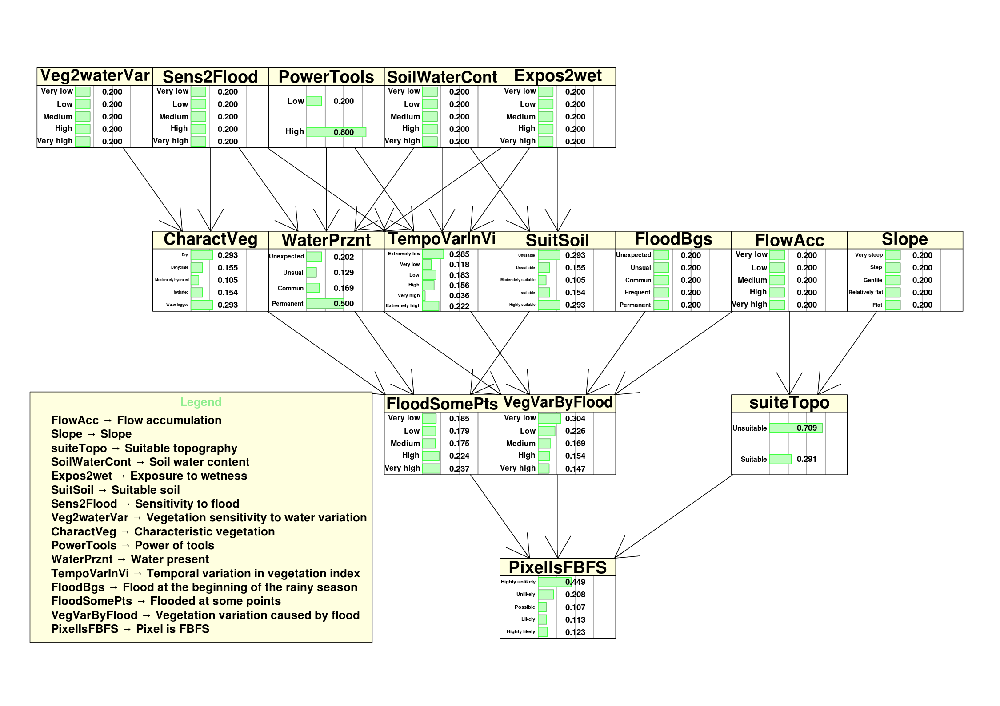
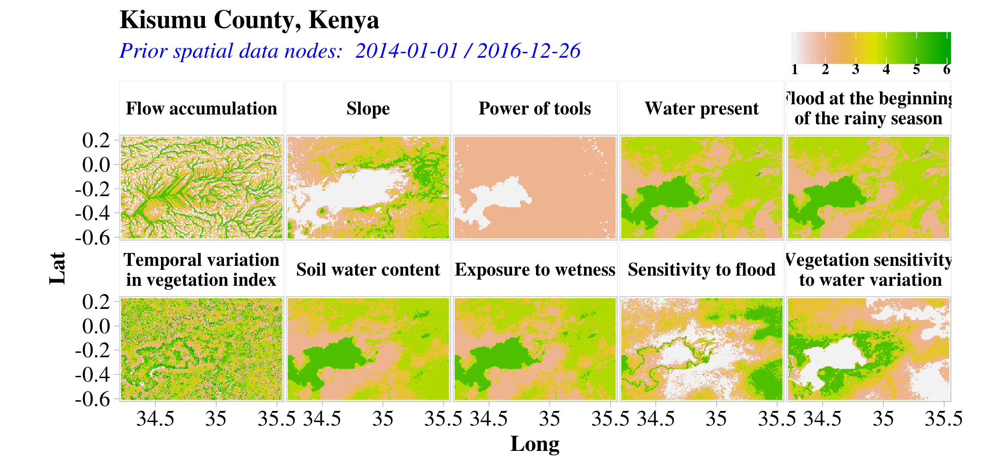
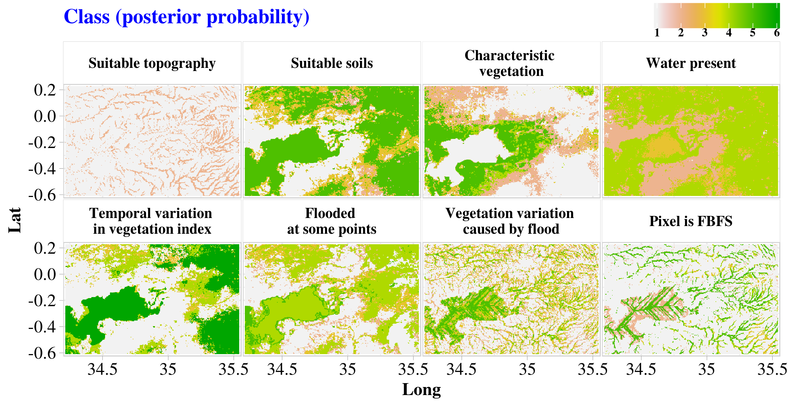
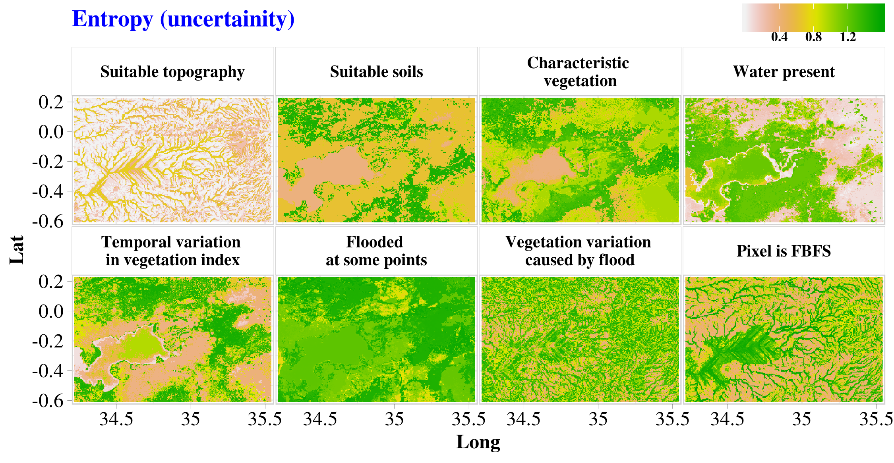

```{r setup, include=FALSE}
knitr::opts_chunk$set(echo = TRUE, tidy = 'formatR', cache = TRUE, dpi = 300)
```


# Introduction {#intro}

Flood-based farming systems (FBFS) are rainfed farming systems occurring in drylands areas and receiving extra irrigation from various type of non-harmful floods that share the properties of being unpredictable, of short duration, of low annual frequency and occurring in relatively lowlands areas with gentile local topography where various social and institutional arrangements govern the water access and sharing [@Puertas_et_al_2011; @VanSteenbergen_et_al_2010; @Varisco_1983]. By making flood water available for use in agriculture, these farming systems contribute to food security along with many other benefits for drylands’ society [@VanSteenbergen_et_al_2010; @Xing_et_al_2014]. They are mostly extensive subsistence-based but support millions of farmers especially in East Africa where they also provide income and various other intangible services [@Puertas_et_al_2011]. Many countries across Africa and Asia endorsed their development through a common framework for research, policy and action (i.e. Flood-based Livelihood Network (FBLN) foundation) mandated for knowledge sharing, filling critical knowledge gaps and improving their productivity of these farming systems [@FBLN_2018; @Puertas_et_al_2011].

Despite their promises and importance,  FBFS have been the topic of surprisingly few studies [@VanSteenbergen_et_al_2010] focusing on aspects related to hydrology and sedimentation, design and maintenance, or sociology attuned to specific contexts [@Haile_2010; @VanSteenbergen_et_al_2010]. Consequently, there is a general lack of information to answer relevant questions for FBLN countries. For example, little effort has been made to provide reliable estimates of their coverage [@VanSteenbergen_et_al_2010].  Despite the existing country-specific area estimates, it is often unclear how these were derived resulting in large uncertainties across these estimates [@VanSteenbergen_et_al_2010]. Most FBLN countries’ reports expressed the need for mapping FBFS, yet only few attempts [e.g. @Ghebreamlak_et_al_2018; @Khalid_et_al_2016; @Theilen-Willige_et_al_2015] are available towards this end in our knowledge. While most aspects related to FBFS are unpredictable [@Puertas_et_al_2011; @VanSteenbergen_et_al_2010], these approaches seems to rely on the assumption that agronomic flooding can be clearly detected on a satellite image in the near time of flooding event and sometimes imply that the areas to be mapped and the timing of the flooding is already known and matches a remote sensing scene in space and time. Furthermore, some of these approaches rely on the derivation of some kind of thresholds based on which FBFS can be discriminated. Threshold-based methods may be impractical considering the complexity of FBFS, the communalities they share with both forests, open water, rainfed and irrigated systems [@Puertas_et_al_2011; @VanSteenbergen_et_al_2010], and particularly when discriminating between different type of FBFS [@Boschetti_et_al_2014]. Moreover, some of these methods rely on visual interpretations which are hard to upscale and may require a keen knowledge of the area. While it is challenging to map these FBFS, accurate information is needed to monitor them, assess their contribution to food security, biodiversity conservation and other intangible benefits at various scales, urging the need for standard methodologies for mapping them. We argue such a surveillance can be best achieved using Geoinformation.

@Wegmann_et_al_2016 covered a range of capabilities and applications of remote sensing in development research, including the use of spectral vegetation indices, and digital elevation models in ecological studies which have potentials in mapping FBFS. Even though satellite remote sensing provides a framework for comprehensive mapping of these farming systems [@Konecny_2014; @Wegmann_et_al_2016], traditional methods may fail to discriminate them due to their complexity and diversity across different settings [@Boschetti_et_al_2014]. The complexity arises from their similarities with both rainfed and irrigated systems [@Puertas_et_al_2011; @VanSteenbergen_et_al_2010] along with a number of their biophysical attributes that could exhibit different signatures and can, therefore, only provide partial information for discriminating them. In flood-based agriculture, one may expect, for instance, an open water followed by rapid increase in vegetation or a combination of thereof [@Boschetti_et_al_2014]. The sequence open water-vegetation, though, can be misleading because the flood event can take place without leaving detectable trace of inundation not only because the sensor can miss to capture the flood event but also because many FBFS have deep soils capable of storing large amount of water. The flood event may also occur after the planting date in which case it can be confused with other flood hazards. The diversity of flood-based agriculture may pose another challenge for mapping FBFS because locally adopted thresholds may be required [@Bashari_et_al_2008] due to the diversity of conditions under which they are practiced [@Puertas_et_al_2011; @VanSteenbergen_et_al_2010]. In addition, the areas under the practice may be unstable over time because of changes in the water courses, water flow, etc. [@VanSteenbergen_et_al_2010]. There is clearly a need for generic approaches for mapping FBFS which can be applied to several contexts given their diversity and the diversity of crops grown under them [@Puertas_et_al_2011].

Mapping such complex systems, where events can be causally related in a context of data uncertainty may require multivariate approaches that are able to leverage on both available information and expertise [@Hubbard_2014; @Kuhnert_et_al_2010; @Kuhnert_et_al_2005; @Whitney_et_al_2018]. Considering the data uncertainty for remote sensing of FBFS, Such an approach, conversely, needs to be able to combine knowledge from domain experts with learning from all available data, be suitable for incomplete information while accounting for the sources of uncertainties [@Kuhnert_2011; @Luedeling_et_al_2015; @Whitney_et_al_2018a]. These expectations can be achieved using [BNs](https://en.wikipedia.org/wiki/Bayesian_network)  [@Whitney_et_al_2018a; @Yet_et_al_2016]. The technicalities along with the many real-world applications of [BNs](https://en.wikipedia.org/wiki/Bayesian_network) are beyond the scope of this paper and are extensively documented elsewhere [see @Pourret_et_al_2008].

The objective of this paper is to provide an affordable mapping routine that could be used to comprehensively estimate the coverage of FBFS. However, the concept is reproducible in other contexts where spatial data are available. Based on the definition and characteristics of FBFS [@Puertas_et_al_2011; @VanSteenbergen_et_al_2010; @VanSteenbergen_et_al_2011 see also paragraph 1], examining a number of biophysical surface states related to their characteristic hydrology, vegetation, and topography, preferably in forms of time series where possible, are clearly relevant for mapping them. With this assumption, we used open source satellite remote sensing data and software to capture various FBFS attributes following a conceptual model developed by experts using various normalized difference spectral indices (NDSI) and topographic structures [@Arge_et_al_2003; @Gao_1996; @Hunt_and_Rock_1989; @Jenson_and_Domingue_1988; @Ji_et_al_2009; @McFeeters_1996; @Rouse_et_al_1973; @Roy_et_al_2014; @Tarboton_2003; @Tucker_1979; @Wegmann_et_al_2016; @Yang_et_al_2006] specific to FBFS to ultimately derive their probability of occurrence for each pixel across Kisumu County in Kenya. We argue that threshold-based methods may be unsuitable to mapping such complex systems and demonstrate the versatility of probabilistic methods. Despite the ranges of data uncertainty under such complex systems, we elaborate on the existence of some sort of spatio-temporal pattern in the general landscape that can be described using causality and from which fuzzy metrics can be derived to describe distinctives sub-entities. We described how this can be achieved and by deriving the required inputs for [BNs](https://en.wikipedia.org/wiki/Bayesian_network) from raw spatial data. The approach was tested across the Tigray region in Ethiopia (not presented here); an area with different settings; and seems to perform incredibly well. The core data used in the study include three years (2014-2016) of high-level Moderate Resolution Imaging Spectroradiometer ([MODIS](https://terra.nasa.gov/about/terra-instruments/modis)) version VI products acquired in the forms of NDSI, the Shuttle Radar Topographic Mission (STRM) [void-filled Digital Elevation Model](http://srtm.csi.cgiar.org/) (DEM). Data analysis were conducted using the [`R`](https://cran.r-project.org/) programming language [@RCoreTeam_2018] and software packages are referred to as such unless otherwise specified. 

# Material and methods {#I}

## Study area {#I1}

The study took place in two regions of Kenya and Ethiopia, the Kisumu county and the Tigray region respectively. Both areas have long history in terms of the practice of flood-based agriculture and have different ways of managing agronomic flooding. However, this paper specifically focuses on the case of Kisumu to provide the backbones of the methodology. Kisumu is one of the largest of Kenya’s counties, located in the western Kenya [@KisumuCountyGovernment_2013]. It is bordered by the Homa Bay County to the South, Nandi County to the North East, Kericho County to the East, Vihiga County to the North West and Siaya County to the West. Kisumu County extends between 33° 20’E and 35° 20’E and 0° 20’S and 0° 50’S covering an area of 2576.5 km2 of which 567 km2 (4.5%) is covered by water [@KisumuCountyGovernment_2013]. Common topographic features are the Winam Gulf of Lake Victoria and the Rift valley. The central part of the county is relatively flat lands surrounded by higher altitudinal ridges reaching up to 1835 m. The relief of the county can be described by 3 main topographical features, the Kano lowlands plains, the Maseno midlands, and the highlands of Nyabondo Plateau making most of the central part prone to flooding, particularly during periods of heavy rains [@KisumuCountyGovernment_2013]. Kisumu county is endowed in surface water with three main rivers flowing into Lake Victoria [@KisumuCountyGovernment_2013]. The floodplains are good for agriculture due to their relatively rich soils resulting from recurrent alluvial deposits and potential for irrigation. 

## Sensor Characteristics {#I2}

### SRTM {#I21}

[SRTM](https://www2.jpl.nasa.gov/srtm/) is an collaborative project between the US National Aeronautics and Space Administration (NASA) and the National Imagery and Mapping Agency (NIMA), the National Geospatial-Intelligence Agency, and the German and Italian Space Agencies providing the most complete highest resolution and public domain DEM between 56° S and  60° N [@Farr_et_al_2000; @Farr_et_al_2007; @Nikolakopoulos_et_al_2006]. It uses a dual radar antennas interferometry to produce high resolution topographic data and carries over 300 high-density tapes storing these data. several spatial resolutions (e.g. 30m, 90m, 1000m) are available [@Farr_et_al_2007; @Jarvis_et_al_2008]. A list of available [SRTM](https://www2.jpl.nasa.gov/srtm/) data and their sources along with various other information can be found in Farr et al. [-@Farr_et_al_2007] and the accuracy of the [SRTM](https://www2.jpl.nasa.gov/srtm/) data is extensively discussed in Falorni et al. [-@Falorni_et_al_2005]. In this study, we used the 30 m spatial resolution DEM on which further processing were applied to ultimately compute the spatial data nodes used in the [BNs](https://en.wikipedia.org/wiki/Bayesian_network).

### MODIS {#I22}

[MODIS](https://terra.nasa.gov/about/terra-instruments/modis) is a key remote sensing sensor on both Earth Observing System (EOS)-AM1 and EOS-PM1 operating onboard Terra and Aqua satellites respectively [@King_et_al_1995]. [MODIS](https://terra.nasa.gov/about/terra-instruments/modis) acquires data in the visible and infrared regions of the electromagnetic spectrum to provide 36 spectral bands with a viewing swath width of 2,330 km for studying various aspects of terrestrial ecosystems. [MODIS](https://terra.nasa.gov/about/terra-instruments/modis) scenes are geo-localised using a sinusoidal projection system and therefore identified using their specific horizontal (h) and vertical (v) tiles number. These data are provided in different spatial (250 m, 500 m, and 1 Km) and temporal (e.g. daily, 8 days, 16 days) resolutions. In this study, we used the [MODIS](https://terra.nasa.gov/about/terra-instruments/modis) product `MOD09A1` (Terra Surface Reflectance 8-Day L3 Global 500m SIN Grid V006 [@Vermote_2015] which provides an 8-day composite atmospherically corrected land surface reflectance across bands 1 to 7 along with other additional quality indicators layers assessing the quality of the acquisition at pixel level.

## Data acquisition and pre-processing {#I3}

### The BNs {#I31}

[BNs](https://en.wikipedia.org/wiki/Bayesian_network) are reasoning engine and knowledge engineering tools that can be used to model partially known events in forms of probability, incorporate causal uncertainty in the analysis [@Pourret_et_al_2008], and therefore allow reasoning under uncertainty. On the one hand, they are causal probabilistic models, on the other hand, they are ways of decomposing large joint probability distributions [@Pearl_2000; @Pourret_et_al_2008] and specifying complex heuristics that go beyond a simple regression model [@Whitney_et_al_2018]. In Bayesian analysis, scientific reasoning starts with the current state of knowledge and subsequently assesses the contribution of further new information to that knowledge [@Pearl_2000]. [BNs](https://en.wikipedia.org/wiki/Bayesian_network) become more exciting and have proven to give incredibly remarkable results when there is a need to incorporate many variables in a model and determine their effects on an outcome.

In this study, the ultimate outcome variable (`PixelIsFBFS`) determining whether a given pixel qualify for FBFS is described using causal relationships among several other variables specified in a [BNs](https://en.wikipedia.org/wiki/Bayesian_network) model (Figure \@ref(fig:fig1)). The conceptual model described pixels’ potential for FBFS (`PixelIsFBFS`) to be jointly defined by the amount of flood water received (`FloodSomePts`), the topographic suitability, and the extent of vegetation variation due to flood (`VegVarFlood`) at that pixel. A pixel may record important run-on without experiencing flood because the water may run-off without a suitable topography (`suiteTopo`). This is, vegetation variation in space and time can be due to either flood or non-flood water but each pixel can be profiled in terms of its amount of flood water.


```{r fig1, echo=FALSE, out.width = '100%', fig.cap="Bayesian Network describing the causal reasoning used for mapping FBFS in Kisumu, Kenya."}

```

The topographic suitability of a pixel (`suiteTopo`) depends largely on its slope (`Slope`) and the number of pixels draining into it (`FlowAcc`). While the accumulation of flow (`FlowAcc`) is important to the amount of flood reaching the pixels, it is rather the slope (`Slope`) and the gravity that determine whether the water will be kept or transmitted by that pixel.

The extent to which vegetation variation is caused by flood water (`VegVarFlood`) can be a straightforward indicator for mapping flood-based agriculture but also difficult to measure. Vegetation variation caused by flood (`VegVarFlood`) was therefore assessed via proxy variables. For the temporal variation in vegetation indices (`TempoVarInVi`) to be attributed to flood to some extent (`VegVarFlood`) at a given pixel, one may expect a certain degree of flow accumulation (`FlowAcc`), and a certain likelihood of flood events near the beginning of the growing season (`FloodBgs`). Then, the temporal variation in vegetation (`TempoVarInVi`) of the pixel is assumed to be influenced by a number of factors such as its soil water content (`SoilwaterCont`), its exposure (`Expos2wet`) and sensitivity to flood (`Sens2Flood`), or even the quality of the data in relation with the type of algorithm used in processing these data (`PowerTools`).

For a given pixel to be flooded at some points (`FloodSomePts`), there must be water presence on the ground (`WaterPrznt`). This is moderated by the soils suitability (`SuitSoil`) resulting in specific type of vegetation (`CharactVeg`). Therefore, the extent to which a pixel is flooded (`FloodSomePts`) can be deduced from its typical vegetation (`CharactVeg`), the soil suitability (`SuitSoil`), and the presence of water (`WaterPrznt`). Soil suitability to FBFS is defined by its exposure to wetness (`Expos2wet`) and more importantly its water content (`SoilWaterCont`). Water presence (`WaterPrznt`) may depend on soil water content (`soilWaterCont`), the power of tools (`PowerTools`), and the sensitivity to flood (`Sens2Flood`). Characteristic FBFS’ vegetations are assumed to be due to vegetation sensitivity to water variation (`Veg2waterVar`) and the sensitivity of the area to flood (`Sens2Flood`).

### The shapefiles data {#I32}

The shapefiles of the study areas were acquired from the [global administrative boundaries database](https://gadm.org/) [@GADM_2018] as level 1 product, using the string country name as argument to [`getData`](https://www.rdocumentation.org/packages/raster/versions/2.8-19/topics/getData) function from the `raster` package [@Hijmans_2019], from which we extracted the shapefile of the area of interest. These shapefiles were latter used to identify the [MODIS](https://terra.nasa.gov/about/terra-instruments/modis) H/V titles corresponding to the area. Other shapefiles used are the spatial polygons representing well known selected surface features (land use/ land cover) used to understand the behaviour of the spectral response in the area. These were either collected during field works using handheld GPS devices or digitized on Google Earth to be used to query the spectral response of pixels they match spatially. The surfaces features considered here include different depth water bodies, settlements, FBFS fields, rainfed agricultural fields, riparian forests, forests with varying degree of density, and sugarcane fields having relatively extended growing season.

### MODIS Tera {#I33}

We considered a period of three years (2014 - 2016) and queried all available [MODIS](https://terra.nasa.gov/about/terra-instruments/modis) `Tera` data overlapping the acquired shapefiles of the area of interest (section \@ref(I32)). We first determined the Horizontal and Vertical tiles corresponding to the spatial coverage of the shapefiles and used these to define the appropriate geo-locations of the study area relative to the [MODIS](https://terra.nasa.gov/about/terra-instruments/modis) Sinusoidal grid systems using the [`getTiles`](https://www.rdocumentation.org/packages/MODIS/versions/1.1.4/topics/getTile) function from the `MODIS` package [@Mattiuzzi_and_Detsch_2018]. As result, the Kisumu County falls in-between the `h21v09` and `h21v08`. Based on these tiles and the temporal window of interest, we mosaiced the images and calculated the NDSIs after filtering and downloading the data from MODIS global online database (i.e. LP DAAC, LAADS) using the machine-to-machine routines embedded in the [`MODIStsp`](https://www.rdocumentation.org/packages/MODIStsp/versions/1.3.2) function from the package of the same name [@Busetto_and_ranghetti_2016]. Since the [MODIS](https://terra.nasa.gov/about/terra-instruments/modis) data are provided in hierarchical data format (hdf), they were re-projected to World Geodetic System 1984 (`WGS 84`) and subsequently translated into Geotiff format using [`GDAL 2.2.3`](https://www.gdal.org/) [@GDAL_OGRcontributors_2018].

## Making sense of data in the context {#I4}

Prior to processing the data acquired, preliminary analyses were conducted to understand the behavior of the spectral response with regards to water and vegetation in the study area. These analyses include the boxplot of the time series to understand the temporal variability and the principal component analysis to depict the spatio-temporal pattern. The results are presented in the supplementary materials.

## Derivation of spatial data nodes {#I5}

### General Procedure {#I51}

#### Time series data {#I511}

The boxplots and the comparative analysis of the NDSIs shows different patterns but these can only be hardly separated making it difficult to threshold the different NDSIs across land use / land cover. An approach based on rigid thresholding was clearly not the best option to demarcate the nature of the spectral response, at least not without making complicated statistical assumptions. A simpler way would be to approach the problem using imprecise quantifiers where fuzzy logic can be used in forms of Likert-type scales [@Likert_1932] describing the scores of the spectral responses along a range; supporting the use of [BNs](https://en.wikipedia.org/wiki/Bayesian_network). We therefore make use of the different ranges of the boxplot (i.e. lowest outliers – lower Whisker, lower Whisker - 1st quartile,  1st quartile – 3rd quartile, 3rd quartile -  upper Whisker , upper Whisker – highest outliers) to separate the data and estimate the probability of each pixel falling within each of these ranges at each time step in the time series.  Although rarely use for deriving variable states, boxplot has been used in all kind of statistics for the last 40 years. Beyond their incredible simplicity, boxplots use robust statistics to summarise data in terms of five-numbers while being particularly handy when comparing the distributions of these data across groups [@Wickham_and_Stryjewski_2012]. To estimate the probability for a given range, we first recoded all values outside of that range to 0 whereas the values falling within the range were recorded to 1. This way, all the real-valued time series was reclassified into presence - absence time series data. Thereafter, the final probability of a pixel belonging to a range can be easily estimated using the ratio between the presence and absence of that pixel in the range throughout the time series (Equation \@ref(eq:eq1)).

\begin{equation} 
P(p_i \in range_j) = \frac{n_{p_i \in range_j}}{N}
(\#eq:eq1)
\end{equation}

Where $P(p_i \in range_j)$ is the probability of the pixel $p_i$ belonging to the range $range_j$, $n_{p_i \in range_j}$ is the number of time the pixel $p_i$ belonged to the range $range_j$, and $N$ is the sample space (total size of the time series). 

After estimating the probabilities for each boxplot range, these ranges were mapped into fuzzy linguistic quantifiers in forms of low, medium, high etc. (depending on the number of states identify by the boxplot algorithm) to provide vegetation states in a spatially explicit manner. For example, in situation where all the five boxplot ranges are present, lower outlier values were mapped to very low, the lower Whisker to low, the interquartile range to medium, the upper Whisker to high and the upper outliers to very high. These states, computed in separated raster layers, were then merged into one single layer to provide discrete states on which the [BNs](https://en.wikipedia.org/wiki/Bayesian_network) can be easily operationalized.

The decision to assign a state value to a given pixel was made transparently using fully probabilistic heuristics in 3 sequential steps. The first step consisted in assigning a particular state to a given pixels if that state scored the highest probability and only if that highest probability is exclusive. Thus, all cases where 2 or more highest probability co-exist are considered as unknown and ignore until the second step. Such cases having equal probability states were commonly encountered at the edges where two consecutive states spatially meet. In the second step, these confusing pixels having 2 or more maximal probability of state occurrence are filled in using majority rule. Herein, since spatial feature are geographically auto-correlated in general, we applied a 3 by 3 moving window (eight-way connectedness) centred on each of these uncertain state value pixels and estimate their state value based on the values of the 8 neighbourhood pixels. Similarly, to the first step, a particular value among the values of the 8 neighbours is chosen when and only when it is the only value that occurs the most. Whenever 2 or more states happen to be the most probable at the same time, the pixel is left out and handled at the third step.  In the third step, the rest of these confusing pixels, where the first and second steps heuristics failed, were modelled using decision tree recursive partitioning classification algorithm. We first extracted the maximal values which correspond to the highest probability across all these remaining confusing pixels to fit a classification regression tree (CART) model and used that model to conditionally infer their state values. Therefore, after this third step all pixel state value were estimated, and the resulting raster can be used as spatial data node in the [BNs](https://en.wikipedia.org/wiki/Bayesian_network) model. The boxplot statistics were computed using our own defined function (see `get_boxplot_1d` in the technical material) based on [`boxplot.stats`](https://www.rdocumentation.org/packages/grDevices/versions/3.5.3/topics/boxplot.stats) function from the `grDevices` package [@RCoreTeam_2018]. We used the [`reclassify`](https://www.rdocumentation.org/packages/raster/versions/2.8-19/topics/reclassify) and the [`calc`](https://www.rdocumentation.org/packages/raster/versions/2.8-19/topics/calc) functions both from the `raster` package [@Hijmans_2019] to recode the pixel values and to estimate the probability respectively. The second step confusing pixels were handled using [`modal`](https://www.rdocumentation.org/packages/raster/versions/2.8-19/topics/modal) function from within the [`focal`](https://www.rdocumentation.org/packages/raster/versions/2.8-19/topics/focal) function also from the `raster` package [@Hijmans_2019]. The CART model was fitted using the [`ctree`](https://www.rdocumentation.org/packages/party/versions/1.3-3/topics/Conditional%20Inference%20Trees) function from the `party` package [@Hothorn_et_al_2006] whereas the third step confusing pixels’ inference was achieved by supplying an anonymous function wrapping the [`predict`](https://www.rdocumentation.org/packages/stats/versions/3.5.2/topics/predict) function from the `stats` package [@RCoreTeam_2018] as argument to [`calc`](https://www.rdocumentation.org/packages/raster/versions/2.8-19/topics/calc) function [@Hijmans_2019].

#### Single layer data {#I512}

In the case of single layer data where time series does not make sense (e.g. slope and flow accumulation) or where nodes were derived from times series as single layer (e.g. exposure to wetness, vegetation sensitivity to water), a slightly different procedure compared to that adopted for time series data was adopted for [BNs](https://en.wikipedia.org/wiki/Bayesian_network) nodes making. We rather used the boxplot’s five-numbers approach in a much straightforward way by exploiting the spatial variability across cell values since the temporal component of this variability no longer exists. We first extracted all pixel values and computed the five-numbers from which ranges corresponding to discrete states were computed. These ranges were then directly recoded into unique values mapping to fuzzy linguistic quantifiers. The process is somewhat a simple raster reclassification task except that the reclassification matrix was derived directly from the natural breaks of the data.

### Specific procedure {#I52}

Specific processing procedures were applied to derive each spatial data node considered in the [BNs](https://en.wikipedia.org/wiki/Bayesian_network). These are described in detail in the supplementary material. We explained the meaning of each node, provided the rational of its usage and described how it is causally related to other nodes in the [BNs](https://en.wikipedia.org/wiki/Bayesian_network). Some nodes (e.g. Soil water content) were indirectly estimated as composite variable involving several NDSIs. Other (Exposure to wetness) were simply computed using single metric time series. In some other cases, the computation involved complex algorithm applied either to time series data (Temporal variation in vegetation) or to single layer (Flow accumulation) depending on the nature of the data.

# Results and discussion {#II}

## Prior spatial distribution of the spatial data node states {#II4}

The results of the processed spatial data nodes used to feed the [BNs](https://en.wikipedia.org/wiki/Bayesian_network) model are presented in Figure \@ref(fig:fig11). As it can be seen, the topographic characteristics of the area are captured in both slope and flow accumulation nodes. In Kisumu county, run-off flows from East to West with most of the flow converging to Lake Victoria which is the flattest land located in vast low laying lands. In the East of the Lake basin are the steepest lands of Kisumu causing the essential of surface water to flow Westwards. Most poor-quality data are located around the water bodies where the node power of tools scored the lowest values to an extent that most water bodies are clearly visible. The chance of encountering water on the ground (water present node), either in forms of floods water or water body, is high in most area of Kisumu. This seems to be frequent towards the beginning of the growing season since there is no big difference between the map of the node water present and that of the node flood at the beginning of the rainy season.  In general, vegetation in Kisumu experiences high intra-annual variation with, unexpectedly, the highest variability associated with Lake Victoria. While vegetation is high in the littoral zone, there seems to be a permanent mixture of vegetation and water in the deep water suggesting possible Eutrophication of Lake Victoria. As expected, the spatial pattern of soil water content mimic that of the exposure to wetness (also water present and flood at the beginning of the rainy season) with the Lake Victoria scoring the highest values.  In general, there a drastic moisture within the flat area beyond the lake water; which moisture increases towards the eastern and the northern parts of the county. The highest sensitivity to flood is encountered in the Lake shore. Some forested areas are wrongly detected as high flood sensitivity spots in the north and west eastern of the county towards the neighboring Nandi and Kericho counties. Vegetation sensitivity to water variation, which seems to be negatively correlated with forest and open water, decrease from the literal Lake Victoria outwards.

```{r fig11, echo=FALSE, out.width = '100%', fig.cap="Prior spatial data used to feed the BNs for mapping FBFS in Kisumu county, Kenya."}

```
 
The importance of vegetation infestation in the Kenyan part of Lake Victoria has been reported in previous studies [@Cavalli_et_al_2009]. The high vegetation along with its low sensitivity to water variation in littoral zone can be explained by the permanence of water. Gikuma-Njuru et al. [-@Gikuma-Njuru_et_al_2005] reported higher Chlorophyll concentrations in the  littoral compared to the pelagic zones due to nutrients additions from tributaries [@World_Bank_1996].  The highest vegetation variability associated with the lake water may be explained by a sequence of proliferation and decline of aquatic plants (e.g. algae) at certain periods of the year. Another explanation could be the periods of active mixing resulting in water-vegetation mixtures [@Cavalli_et_al_2009; @Gikuma-Njuru_et_al_2005]. The confusion with regards to the spectral response of open water and forest is a testimonies of uncertainty sources. Care must be taken when dealing with remote sensing data to avoid such errors, particularly in studies dealing with water and vegetation [see @Cavalli_et_al_2009]. In general, water indices are sensitive to vegetation liquid water [see @Boschetti_et_al_2014].

## Posterior spatial distribution of the spatial data node states {#II5}

The output maps from the [BNs](https://en.wikipedia.org/wiki/Bayesian_network) model are shown in Figure \@ref(fig:fig12) and their respective uncertainties in Figure \@ref(fig:fig13). The suitable topography for FBFS, resulting from the interaction between the slope and flow accumulation nodes, is generally high in area having high flow accumulation which are not necessarily water body. The soil suitability (suitable soils node) is even more misleading showing forests and open waters as having highest suitable in soil for FBFS. Intuitively, permanently waterlogged areas may not be suitable for agriculture. Characteristic vegetation, in contrast, is rather accurate excluding most open waters and forests from typical vegetation for FBFS.  Interestingly, the pattern of the characteristic vegetation is depicted with most vegetation exposed to waterlogging close to open water. Clearly, there is a change in the characteristic vegetation at a certain distance from Lake Victoria with the closed area to the Lake showing vegetation exposed to waterlogging and most of the areas near rivers Mogus, Awach, Sondu Miriu, Nyando and Kibos exhibiting hydrated vegetation.
 
```{r fig12, echo=FALSE, out.width = '100%', fig.cap="Posterior FBFS maps and other important FBFS metrics in Kisumu county, Kenya."}

```

Important changes were introduced from the prior to the posterior maps of water present node. One important change is related to the appearance of a sort-of islands or at least a tendency to drying in certain parts of the Lake shores leading to the conclusion that water may be not be present all the yearlong in that area. Another important change is the increase in the areas where water can be expected on the ground. Probably due to vegetation liquid water, most forests have shown important water presence. The variable temporal variation in vegetation index ranked higher on forests and open waters with most central areas resulting in the lowest. This high vegetation variability over the Lake support the idea of the sequential increase / decrease of aquatic vegetation at certain period of the year (see section \@ref(#II4)), particularly looking at the map of the node vegetation variation caused by flood. The highest chance of flood is recorded near the lake shore and river Nyando, but most floodplains scored high values. As expected, vegetation variation attributed to flood (vegetation variation caused by flood node) seems to be positively correlated with flow accumulation and suitable topography for FBFS. In general, most of the posterior maps are not conclusive enough to be considered as standalone decision support with regards the potential area for FBFS. The target map (pixel is FBFS) seems to also be strongly correlated with flow accumulation and suitable topography and support the idea of vegetation presence inside the Lake which certain parts appears among the very likely areas for FBFS. As expected, most riverbanks are detected as having high potential for FBFS; which potential declines with distance.

```{r fig13, echo=FALSE, out.width = '100%', fig.cap="Spatially explicit uncertainity maps derived as part of FBFS mapping in Kisumu county, Kenya."}

```

The spatial explicit uncertainty (Figure \@ref(fig:fig13)), expressed as shannon entropy, revealed that the lowest level of uncertainty seems to be achieved with the suitable topography. This may be explained by the simplicity of the causality specified in this node but also the relative accuracy of the data (radar versus optical sensor) used to feed the parents nodes (slope and flow accumulation). Regarding this node, the highest uncertainty spot seems to be located around high flow accumulation areas where water is potentially present, but the topography is not necessarily flat. As stated earlier, the node suitable soils might be misleading, and this can be seen in the uncertainty map where most areas having either relatively low vegetation or water ranked amongst the highest uncertainty spots. Most open water seems to have the lowest uncertainty with regards to characteristic vegetation node contrary to water presence. The uncertainty map related to temporal variation in vegetation index has captured the drying spot inside the Lake as discussed earlier. High uncertainty regarding flood seems be ubiquitous and this seems to be propagated into the node vegetation variation caused by flood. Coming to the target node, there is high uncertainty on most pixels associated with open water. As it can be seen, the water in the Lake is associated with the highest level of uncertainty supporting the ideas that these areas are not suitable. In a nutshell, the posterior maps are to be used with consideration to the associated uncertainty maps.

\clearpage

# References
