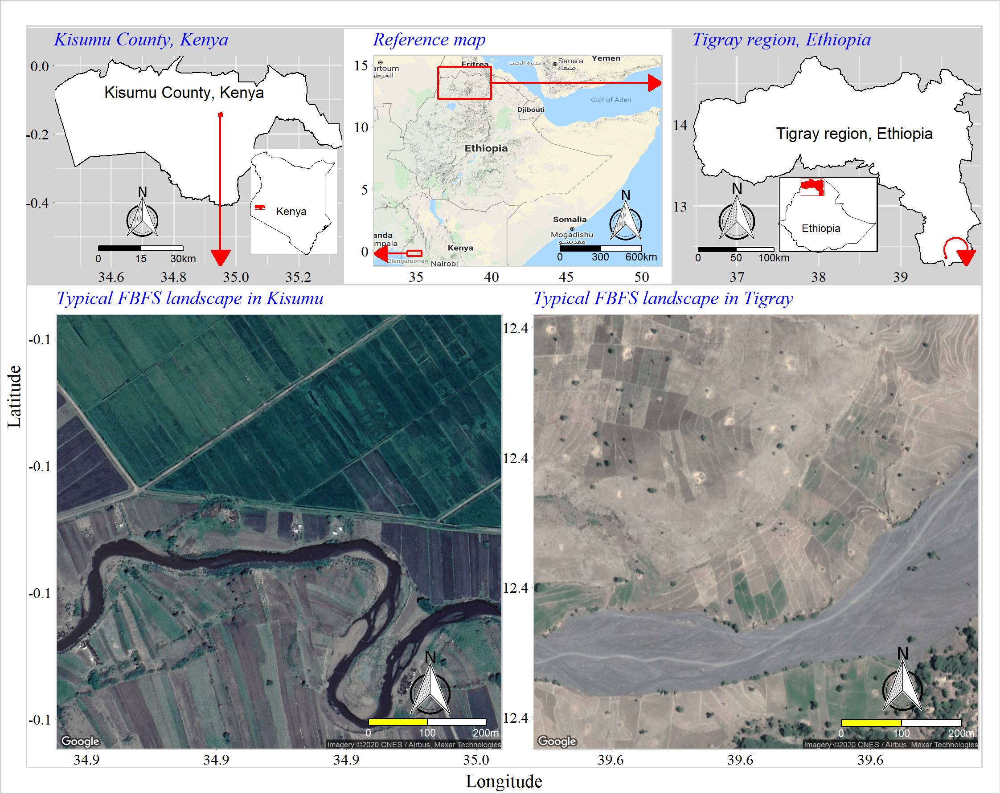
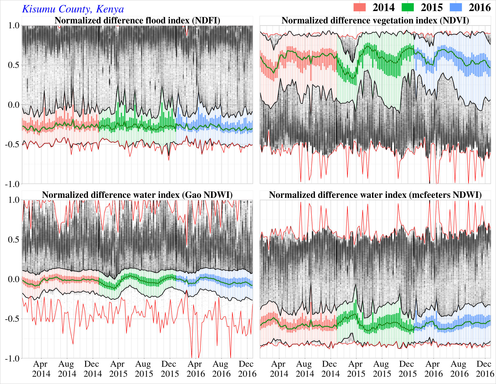
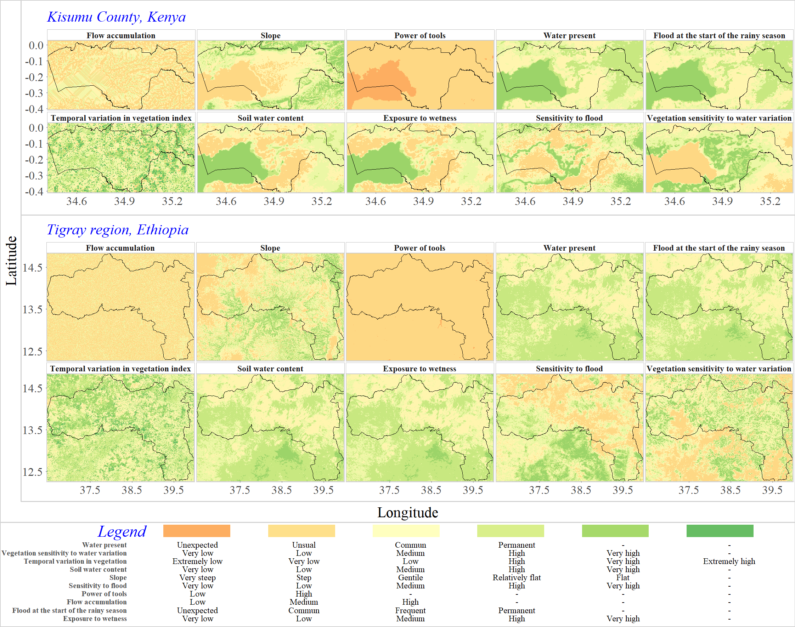
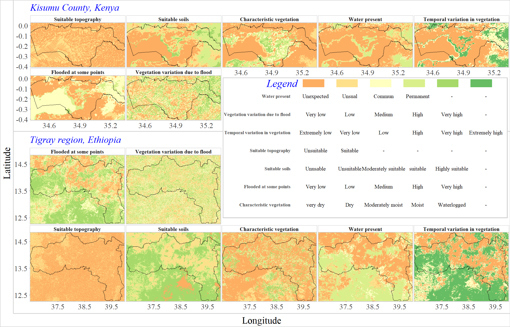
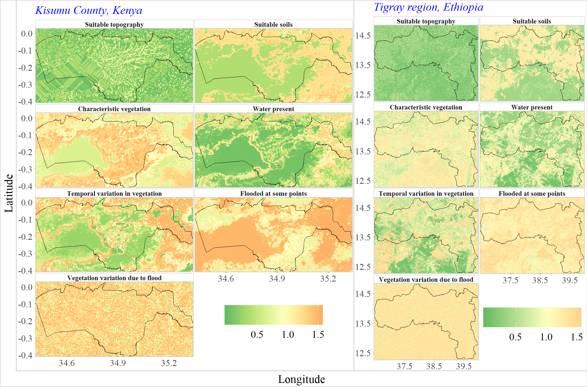
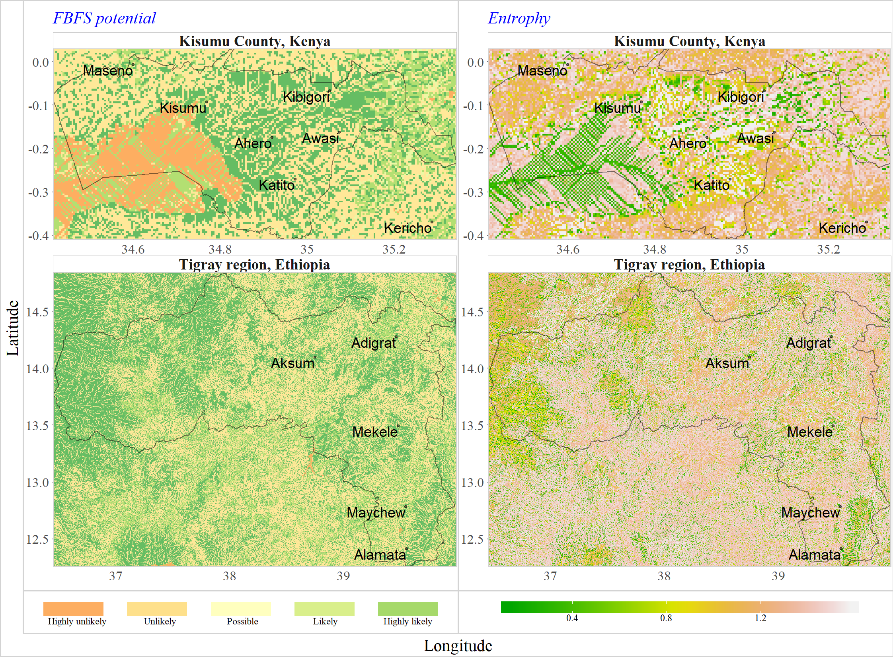
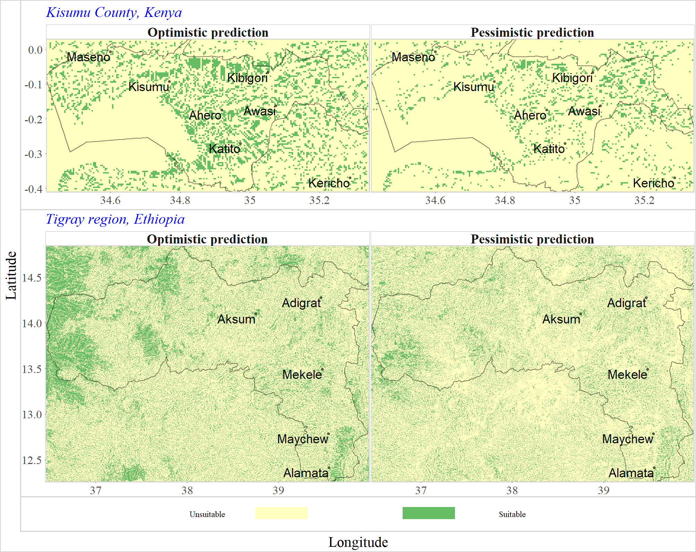

```{r,include=FALSE}
options(tinytex.engine='xelatex')
pdf.options(useDingbats = TRUE)
```

```{r setup,include=FALSE}
knitr::opts_chunk$set(echo=TRUE,out.extra='',fig.align='center',fig.pos='!h',cache=TRUE,echo=FALSE,warning=FALSE,message=FALSE)
```

```{r Setting-the-Scene,include=FALSE,echo=FALSE,cache=FALSE}

set.seed(123)
### Forcing the use of gRain 1.3-0 because higher versions seems to introduce changes that break certain parts of this works
if (!require("gRain")) {
  install.packages('https://cran.r-project.org/src/contrib/Archive/gRain/gRain_1.3-0.tar.gz',repo=NULL,type = 'source')
} else {
  if(packageVersion("gRain") > '1.3.0'){
    stop("gRain version 1.3-0 is required to reproduce this work. Higher version introduced important changes that are not compatible.")
  }
}

### Installing devtools package to get decisionSupportExtra from github ####
if (!require("devtools")) {
  install.packages("devtools")
}
## Installing decisionSupportExtra SpatialProbs growingSeason and RTauDEM packages from github ####
if (!require("decisionSupportExtra")) {
  devtools::install_github("Issoufou-Liman/decisionSupportExtra", build = TRUE, force = TRUE,
                           upgrade = "never")
}

if (!require("SpatialProbs")) {
  devtools::install_github("Issoufou-Liman/SpatialProbs", build = TRUE, force = TRUE,
                           upgrade = "never")
}

if (!require("growingSeason")) {
  devtools::install_github("Issoufou-Liman/growingSeason", build = TRUE, force = TRUE,
                           upgrade = "never")
}

if (!require("RTauDEM")) {
  devtools::install_github("Issoufou-Liman/RTauDEM", build = TRUE, force = TRUE,
                           upgrade = "never")
}
## loading required packages ####
if (!require("pacman")) install.packages("pacman")
pacman::p_load(rgdal,
               raster,
               MODIStsp,
               ggplot2,
               grid,
               gridExtra,
               caret,
               party,
               decisionSupportExtra,
               SpatialProbs,
               growingSeason,
               xts,
               fields,
               bnlearn,
               bnspatial,
               knitr,
               kableExtra,
               
)
if (!require("bookdown")) install.packages("bookdown")
if (!require("rticles")) install.packages("rticles")
if (!require("pdftools")) install.packages("pdftools")
if (!require("pdftools")) install.packages("psych")


## Loading dedicated own packages written for this analysis ####
library(decisionSupportExtra)
library(growingSeason)
library(SpatialProbs)
library(RTauDEM)

ifelse(!dir.exists(file.path(getwd(), 'data_files/hdf')), dir.create(file.path(getwd(), 'data_files/hdf')), FALSE)
ifelse(!dir.exists(file.path(getwd(), 'data_files/ndsi')), dir.create(file.path(getwd(), 'data_files/ndsi')), FALSE)
ifelse(!dir.exists(file.path(getwd(), 'data_files/shapefiles')), dir.create(file.path(getwd(), 'data_files/shapefiles')), FALSE)
ifelse(!dir.exists(file.path(getwd(), 'modis_opts')), dir.create(file.path(getwd(), 'modis_opts')), FALSE)
ifelse(!dir.exists(file.path(getwd(), 'figures')), dir.create(file.path(getwd(), 'figures')), FALSE)
# ifelse(!dir.exists(file.path(getwd(), 'data_files')), dir.create(file.path(getwd(), 'data_files')), FALSE)
ifelse(!dir.exists(file.path(getwd(), 'data_files/dem')), dir.create(file.path(getwd(), 'data_files/dem')), FALSE)
ifelse(!dir.exists(file.path(getwd(), 'data_files/dem/Kisumu')), dir.create(file.path(getwd(), 'data_files/dem/Kisumu')), FALSE)
ifelse(!dir.exists(file.path(getwd(), 'data_files/dem/Tigray')), dir.create(file.path(getwd(), 'data_files/dem/Tigray')), FALSE)
ifelse(!dir.exists(file.path(getwd(), 'output_files')), dir.create(file.path(getwd(), 'output_files')), FALSE)

```

```{r Shp-data-acquisition,include=FALSE,eval=TRUE,echo=FALSE,cache=FALSE}
Kenya_L1 <- getData("GADM", country="ken", level=1, path = 'data_files/shapefiles')
Kisumu <- Kenya_L1 [Kenya_L1$NAME_1 == "Kisumu", ]
writeOGR(Kisumu, 'data_files/shapefiles', "Kisumu", driver="ESRI Shapefile", overwrite_layer=TRUE)

Ethiopia_L1 <- getData("GADM", country="eth", level=1, path = 'data_files/shapefiles')
Tigray <- Ethiopia_L1 [Ethiopia_L1$NAME_1 == "Tigray", ]
writeOGR(Tigray, 'data_files/shapefiles', "Tigray", driver="ESRI Shapefile", overwrite_layer=TRUE)
```

```{r Modis-data-acquisition-and-preprocessing,include=FALSE,eval=FALSE,echo=FALSE,cache=FALSE}
opts_file <- 'modis_opts/modistsp_opts.json'
# opts_file <- "C:/Users/LIssoufou/Documents/Papers/ICRAF/190912_papers/modis_opts/modis_opts.json"

shp_files <- list("data_files/shapefiles/Kisumu.shp", "data_files/shapefiles/Tigray.shp")

for(i in shp_files) {
  MODIStsp(gui = FALSE, options_file = opts_file, spatial_file_path = i)
}

```

```{r Kisumu data fetching and gap filling,eval=FALSE,include=FALSE,echo=FALSE,cache=FALSE}

beginCluster(n=3)

f <- function(x) {
  x[x < -10000] <- NA
  x[x > 10000] <- NA
  chillR::interpolate_gaps(x)$interp
}

ficher <- 'output_files/Kisumu_ndvi_ts.grd'
if(!file.exists(ficher)){
  ndvi_ts <- "data_files/ndsi/Kisumu/Surf_Ref_8Days_500m_v6/Time_Series/RData/Terra/NDVI/MOD09A1_NDVI_1_2014_361_2016_RData.RData"
  ndvi_ts <-get(load(ndvi_ts))
  noms <- getZ(ndvi_ts)
  # ndvi_ts <- calc(ndvi_ts, fun = f)
  ndvi_ts <- clusterR(x=ndvi_ts, fun = calc, args = list(fun=f))
  names(ndvi_ts) <- noms
  writeRaster(ndvi_ts, filename = ficher)
} else {
  ndvi_ts <- brick(ficher)
}

ficher <- 'output_files/Kisumu_GAO_NDWI_ts.grd'
if(!file.exists(ficher)){
  GAO_NDWI_ts <- "data_files/ndsi/Kisumu/Surf_Ref_8Days_500m_v6/Time_Series/RData/Terra/Gao NDWI/MOD09A1_Gao NDWI_1_2014_361_2016_RData.RData"
  GAO_NDWI_ts <-get(load(GAO_NDWI_ts))
  noms <- getZ(GAO_NDWI_ts)
  # GAO_NDWI_ts <- calc(GAO_NDWI_ts, fun = f)
  GAO_NDWI_ts <- clusterR(x=GAO_NDWI_ts, fun = calc, args = list(fun=f))
  names(GAO_NDWI_ts) <- noms
  writeRaster(GAO_NDWI_ts, filename = ficher)
} else {
  GAO_NDWI_ts <- brick(ficher)
}

ficher <- 'output_files/Kisumu_mcfeeters_NDMI_ts.grd'
if(!file.exists(ficher)){
  mcfeeters_NDMI_ts <- "data_files/ndsi/Kisumu/Surf_Ref_8Days_500m_v6/Time_Series/RData/Terra/Mcfeeters_NDWI/MOD09A1_Mcfeeters_NDWI_1_2014_361_2016_RData.RData"
  mcfeeters_NDMI_ts <-get(load(mcfeeters_NDMI_ts))
  noms <- getZ(mcfeeters_NDMI_ts)
  # mcfeeters_NDMI_ts <- calc(mcfeeters_NDMI_ts, fun = f)
  mcfeeters_NDMI_ts <- clusterR(x=mcfeeters_NDMI_ts, fun = calc, args = list(fun=f))
  names(mcfeeters_NDMI_ts) <- noms
  writeRaster(mcfeeters_NDMI_ts, filename = ficher)
} else {
  mcfeeters_NDMI_ts <- brick(ficher)
}

ficher <- 'output_files/Kisumu_Boschetti_NDFI_ts.grd'
if(!file.exists(ficher)){
  Boschetti_NDFI_ts <- "data_files/ndsi/Kisumu/Surf_Ref_8Days_500m_v6/Time_Series/RData/Terra/NDFI/MOD09A1_NDFI_1_2014_361_2016_RData.RData"
  Boschetti_NDFI_ts <-get(load(Boschetti_NDFI_ts))
  noms <- getZ(Boschetti_NDFI_ts)
  # Boschetti_NDFI_ts <- calc(Boschetti_NDFI_ts, fun = f)
  Boschetti_NDFI_ts <- clusterR(x=Boschetti_NDFI_ts, fun = calc, args = list(fun=f))
  names(Boschetti_NDFI_ts) <- noms
  writeRaster(Boschetti_NDFI_ts, filename = ficher)
} else {
  Boschetti_NDFI_ts <- brick(ficher)
}

ficher <- 'output_files/Kisumu_ndii6_ts.grd'
if(!file.exists(ficher)){
  ndii6_ts <- "data_files/ndsi/Kisumu/Surf_Ref_8Days_500m_v6/Time_Series/RData/Terra/NDII6/MOD09A1_NDII6_1_2014_361_2016_RData.RData"
  ndii6_ts <-get(load(ndii6_ts))
  noms <- getZ(ndii6_ts)
  # ndii6_ts <- calc(ndii6_ts, fun = f)
  ndii6_ts <- clusterR(x=ndii6_ts, fun = calc, args = list(fun=f))
  names(ndii6_ts) <- noms
  writeRaster(ndii6_ts, filename = ficher)
} else {
  ndii6_ts <- brick(ficher)
}

ficher <- 'output_files/Kisumu_ndii7_ts.grd'
if(!file.exists(ficher)){
  ndii7_ts <- "data_files/ndsi/Kisumu/Surf_Ref_8Days_500m_v6/Time_Series/RData/Terra/NDII7/MOD09A1_NDII7_1_2014_361_2016_RData.RData"
  ndii7_ts <-get(load(ndii7_ts))
  noms <- getZ(ndii7_ts)
  # ndii7_ts <- calc(ndii7_ts, fun = f)
  ndii7_ts <- clusterR(x=ndii7_ts, fun = calc, args = list(fun=f))
  names(ndii7_ts) <- noms
  writeRaster(ndii7_ts, filename = ficher)
} else {
  ndii7_ts <- brick(ficher)
}

ficher <- 'output_files/Kisumu_p_tools.grd'
if(!file.exists(ficher)){
  p_tools <-"data_files/ndsi/Kisumu/Surf_Ref_8Days_500m_v6/Time_Series/RData/Terra/QA_bits/MOD09A1_QA_bits_1_2014_361_2016_RData.RData"
  p_tools <-get(load(p_tools))
  # p_tools <- calc(p_tools, fun = function(x) {
  #   out <- length(x[x==0])/length(x)
  #   ifelse(out==1, 1, 0)
  # })
  f <- function(x) {
    out <- length(x[x==0])/length(x)
    ifelse(out==1, 1, 0)
  }
  p_tools <- clusterR(x=p_tools, fun = calc, args = list(fun=f))
  writeRaster(p_tools, filename = ficher)
} else {
  p_tools <-  raster(ficher)
}
```

```{r NDSI-profile,eval=FALSE,include=FALSE,echo=FALSE,cache=FALSE}
valid_poly <- list.files(path = 'data_files/surface_features_validation_polygons/Kisumu', pattern = '.shp', full.names = TRUE)
valid_poly <- sapply(X=valid_poly, FUN = readOGR)

f <- function(ndsi, poly){
  sapply(poly, function (i){
    out <- extract(ndsi, i)
    if(inherits(out, 'list')){
      out <- do.call(rbind, out)
    }
    return(out)
  }
  )
}

ndsi <- list(
  NDVI = f(ndvi_ts, valid_poly),
  NDII6 = f(ndii6_ts, valid_poly),
  NDII7 = f(ndii7_ts, valid_poly),
  'NDWI (Gao, 1996)' = f(GAO_NDWI_ts, valid_poly),
  'NDWI (McFeeters, 1996)' = f(mcfeeters_NDMI_ts, valid_poly),
  NDFI = f(Boschetti_NDFI_ts, valid_poly)
)

ndsi <- reshape2::melt(ndsi)
colnames(ndsi) <- c("Var1", "date", "value", "feature", "ndsi")
ndsi$date <- as.Date(gsub(pattern = "[.]", replacement = "-", substring(ndsi$date, 2)))

ndsi$feature <- gsub(".shp|data_files/surface_features_validation_polygons/Kisumu/", '', ndsi$feature)
ndsi$feature <- gsub("_", ' ', ndsi$feature)


## ggplotting (using geom_line)
theme_this <- theme_minimal() +
  theme(text = element_text(family = 'serif', face = 'plain'),
        panel.spacing=unit(0.075, "lines"),
        panel.border = element_rect(color = "lightgrey", fill = NA, size = 0.5),
        #axis.text = element_text(size=7),
        axis.ticks = element_line(colour = 'black', size = 0.05),
        legend.title = element_blank(),
        legend.position="top",
        legend.justification = 'right',
        legend.margin=margin(0, 0, 0, 0),
        legend.box.margin=margin(-22, 0, -10, 0),
        strip.background = element_rect(color = "gray", size = 0.075),
        plot.subtitle=element_text(size=9.5, face="italic", color="blue")
  )

p <- ggplot(data = ndsi,aes(x=date, y=value/10000, col=ndsi))+
  geom_line()+
  theme_this + 
  theme(axis.title = element_blank())+
  facet_wrap(~feature)+
  guides(colour = guide_legend(nrow = 2))+
  scale_color_manual(values = c('red2','saddlebrown', 'darkmagenta','darkolivegreen4', 'lightblue','royalblue'))+
  scale_x_date(date_breaks = "6 months", date_minor_breaks = "1 month", date_labels =  "%b \n%Y", expand = c(0,0),
               labels=function(x) sub(" ","d",x,fixed=TRUE))+
  labs(title='Kisumu County, Kenya', 
       subtitle=paste0('MODIS', ' : ', '2014-01-01', ' ', '/', ' ', '2016-12-26'))

p <- grid.arrange(p, ncol=1)
p <- gTree(children = gList(p, gb))
ggsave(plot=p, device = 'png', filename = "figures/features_line_plot.png", width = 190/25.4, height = 140/25.4, dpi = 300)
ggsave(plot=p, device = 'tiff', filename = "figures/features_line_plot.tif", width = 190/25.4, height = 140/25.4, dpi = 300)
ggsave(plot=p, device = 'pdf', filename = "figures/features_line_plot.pdf", width = 190/25.4, height = 140/25.4, dpi = 300)

p <- ggplot(ndsi,aes(x=feature, y=value/10000, col=feature))+
    stat_boxplot(geom = "errorbar", width = 0.8)+
    geom_boxplot(outlier.size = 0.3, lwd=0.3)+
    theme_this +
    theme(axis.title = element_blank(), axis.text.x=element_blank(), axis.ticks.x=element_blank(),
          strip.text = element_text(size = 8))+
    facet_wrap(~ndsi, nrow=1)+
    guides(colour = guide_legend(nrow = 3))+
    # coord_flip()+
    scale_color_manual(values = c("cornflowerblue","darkgreen", "red",  "aquamarine",   "chartreuse3", "lightgreen","lightblue", "saddlebrown", "black"))+
    labs(title='Kisumu County, Kenya', 
         subtitle=paste0('MODIS', ' : ', '2014-01-01', ' ', '/', ' ', '2016-12-26'))

p <- grid.arrange(p, ncol=1)
p <- gTree(children = gList(p, gb))
ggsave(plot=p, device = 'png', filename = "figures/features_boxplot.png", width = 190/25.4, height = 140/25.4, dpi = 300)
ggsave(plot=p, device = 'tiff', filename = "figures/features_boxplot.tif", width = 190/25.4, height = 140/25.4, dpi = 300)
ggsave(plot=p, device = 'pdf', filename = "figures/features_boxplot.pdf", width = 190/25.4, height = 140/25.4, dpi = 300)
  
```

```{r scree-plot,eval=FALSE,include=FALSE,echo=FALSE,cache=FALSE}
bart_data <- reshape2::melt(as.data.frame(getValues(ndvi_ts)))
bart_test <- bartlett.test(value~variable, data= bart_data)
KMO_test <- psych::KMO(cor(getValues(ndvi_ts), use = "complete.obs"))

# the scree plot, NDVI
# generate scree data for ggplot
parallel_data <- getValues(ndvi_ts)
parallel_data <- na.omit(parallel_data)
#parallel_data = psych::fa.parallel(parallel_data, fa="pc", plot=FALSE)

parallel_data = psych::fa.parallel(parallel_data,
                                   fm = 'ml',
                                   fa = 'pc',
                                   n.iter = 20,
                                   SMC = TRUE,
                                   quant = .95, 
                                   plot=FALSE)

# taken from https://rdrr.io/github/Lingtax/graphTemplate/src/R/parPlot.R

#' parPlot 
#'
#' Generates a ggplot of a parallel analysis
#'
#' @param x a list of output from the psych::fa.parallel function
#'
#' @examples
#'df <- psych::bfi
#'parallel <- psych::fa.parallel(df, fa= "fa", quant = .95)
#'p <- parPlot(parallel)
#'p
#'ggsave('parallel.png', p, width=6, height=6, unit='in', dpi=300)

#'@export
parPlot <- function(x, ncomps2plot=1:10){
  if(!is.list(x)){stop("parPlot() expects list of output from parallel analysis")}
  
  pos <- seq_along(x$fa.values)
  len <-  length(x$fa.values)
  
  eigendat <- data.frame(
    eigenvalue = c(x$pc.values[ncomps2plot], x$pc.sim[ncomps2plot]),
    type = as.character(c(rep("Actual Data",len)[ncomps2plot], rep("Simulated Data",len)[ncomps2plot])),
    num = c(pos[ncomps2plot],pos[ncomps2plot]),
    stringsAsFactors = FALSE
  )
  eigendat
  ggplot(eigendat, aes(x=num, y=eigenvalue, col=type, shape=type)) +
    #Add lines connecting data points
    geom_line() +
    #Add the data points.
    geom_point(size=2) +
    #Label the y-axis 'Eigenvalue'
    scale_y_continuous(name='Eigen values') +
    #Label the x-axis 'Factor Number', and ensure that it ranges from 1-max # of factors, increasing by one with each 'tick' mark.
    scale_x_continuous(name='Principal components', breaks=min(eigendat$num):max(eigendat$num)) +
    #Manually specify the different shapes to use for actual and simulated data, in this case, white and black circles.
    scale_shape_manual(values=c(16,1)) +
    #Add vertical line indicating parallel analysis suggested max # of factors to retain
    geom_vline(xintercept = x$ncomp, linetype = 'dashed', color = "red", size = 0.2) 
  #+
  #Apply our apa-formatting theme
  #apatheme
}

p <- parPlot(parallel_data)
p <- p+theme_minimal() +
  #theme(legend.position="none", axis.title = element_blank())+
  theme(axis.title.x = element_blank(),
        text = element_text(family = 'serif', face = 'plain'),
        panel.spacing=unit(0, "lines"),
        panel.border = element_rect(color = "lightgrey", fill = NA, size = 0.5),
        #axis.text = element_text(size=7),
        axis.ticks = element_line(colour = 'black', size = 0.05),
        plot.subtitle=element_text(size=9.5, face="italic", color="blue"),
        legend.title = element_blank(),
        legend.position="top",
        legend.justification = 'right',
        legend.margin=margin(0, 0, 0, 0),
        legend.box.margin=margin(-22, 0, -10, 0))+
  labs(title='Kisumu County, Kenya',
       subtitle=paste('MODIS NDVI', ' : ', '2014-01-01', ' ', '/', ' ', '2016-12-26'))

test_data <- c('K-squared' = as.numeric(bart_test$statistic), df  = as.numeric(bart_test$parameter), 'p.value' = bart_test$p.value, KMO=NA)
# test_data <- rbind('Measure of \nsampling adequacy' = test_data, 
#                    'bartlett test of \nhomogeinity of variances' = test_data)
test_data <- rbind('MSA' = test_data, 
                   'Bartlett' = test_data)

test_data <- as.data.frame(test_data)
test_data
test_data <- format(round(test_data, 2), nsmall=2, big.mark=",")
test_data[1, ] <- c('-', '-', '-', format(round(as.numeric(KMO_test$MSA), 2), nsmall=2)) 
test_data[2, 4] <- '-'
test_data
# p+ annotation_custom(tableGrob(test_data), xmin=7, xmax=8, ymin=90, ymax=120)
p = p+ annotation_custom(tableGrob(test_data, 
                                   theme = ttheme_default(base_size = 12, base_family = 'serif', 
                                                          padding = unit(c(2.5, 2.5), "mm"))), 
                         xmin=6.4, xmax=10, ymin=90, ymax=120)

# exporting the result to file
p <- grid.arrange(p, ncol=1)
p_ndvi <- gTree(children = gList(p, gb))


# bartlett test, NDFI

bart_data <- reshape2::melt(as.data.frame(getValues(Boschetti_NDFI_ts)))
bart_test <- bartlett.test(value~variable, data= bart_data)
KMO_test <- psych::KMO(cor(getValues(Boschetti_NDFI_ts), use = "complete.obs"))

# the scree plot, NDFI
# generate scree data for ggplot
parallel_data <- getValues(Boschetti_NDFI_ts)
parallel_data <- na.omit(parallel_data)
#parallel_data = psych::fa.parallel(parallel_data, fa="pc", plot=FALSE)

parallel_data = psych::fa.parallel(parallel_data,
                                   fm = 'ml',
                                   fa = 'pc',
                                   n.iter = 20,
                                   SMC = TRUE,
                                   quant = .95, 
                                   plot=FALSE)

p <- parPlot(parallel_data, ncomps2plot = 1:20)
p <- p+theme_minimal() +
  #theme(legend.position="none", axis.title = element_blank())+
  theme(text = element_text(family = 'serif', face = 'plain'),
        panel.spacing=unit(0, "lines"),
        panel.border = element_rect(color = "lightgrey", fill = NA, size = 0.5),
        #axis.text = element_text(size=7),
        axis.ticks = element_line(colour = 'black', size = 0.05),
        plot.subtitle=element_text(size=9.5, face="italic", color="blue"),
        legend.title = element_blank(),
        legend.position="none",
        legend.justification = 'right',
        legend.margin=margin(0, 0, 0, 0),
        legend.box.margin=margin(-22, 0, -10, 0))+
  labs(title=' ',
       subtitle=paste('MODIS NDFI', ' : ', '2014-01-01', ' ', '/', ' ', '2016-12-26'))


test_data <- c('K-squared' = as.numeric(bart_test$statistic), df  = as.numeric(bart_test$parameter), 'p.value' = bart_test$p.value, KMO=NA)
# test_data <- rbind('Measure of \nsampling adequacy' = test_data, 
#                    'bartlett test of \nhomogeinity of variances' = test_data)
test_data <- rbind('MSA' = test_data, 
                   'Bartlett' = test_data)

test_data <- as.data.frame(test_data)
test_data
test_data <- format(round(test_data, 2), nsmall=2, big.mark=",")
test_data[1, ] <- c('-', '-', '-', format(round(as.numeric(KMO_test$MSA), 2), nsmall=2)) 
test_data[2, 4] <- '-'
test_data
# p+ annotation_custom(tableGrob(test_data), xmin=7, xmax=8, ymin=90, ymax=120)
p = p+ annotation_custom(tableGrob(test_data, 
                                   theme = ttheme_default(base_size = 12, base_family = 'serif', 
                                                          padding = unit(c(2.5, 2.5), "mm"))), 
                         xmin=12, xmax=20.5, ymin=34, ymax=55)

# exporting the result to file
# exporting the result to file
p <- grid.arrange(p, ncol=1)
p <- gTree(children = gList(p, gb))

p <- grid.arrange(p_ndvi, p)

```

```{r PCA,eval=FALSE,include=FALSE,echo=FALSE,cache=FALSE}

theme_this <- theme_minimal() + theme(
  text = element_text(family = 'serif', face = 'plain'),
  panel.spacing=unit(0.075, "lines"),
  panel.border = element_rect(color = "lightgrey", fill = NA, size = 0.5),
  #axis.text = element_text(size=7),
  axis.text = element_text(size = 8),
  axis.title = element_blank(),
  axis.ticks = element_line(colour = 'black', size = 0.25),
  axis.ticks.length = unit(0.1, "mm"),
  # legend.text = element_text(family = 'serif', face = 'bold', size = 7),
  legend.title = element_blank(),
  # legend.box.margin=margin(l = -12),
  # legend.spacing.x = unit(0.5,"mm"),
  # plot.margin = margin(l=0),
  strip.background = element_rect(color = "gray", size = 0.075),
  strip.text = element_text(size = 5.75, face = "bold"),
  strip.text.x = element_text(margin = margin(t = 1, b=1)),
  
  plot.margin = margin(t=0, r=5, b=0, l=1),
  plot.title=element_blank(),
  plot.subtitle = element_text(size = 10, face = 'italic', color = 'blue',
                               vjust = 0)
)

## a function based on RStoolbox::rasterPCA to make raster principal components ####

test_rasterPCA <- function (img, nSamples = NULL, n = ceiling(ncell(img)*0.2), nComp = nlayers(img), spca = FALSE, 
                            maskCheck = TRUE,na.action=na.exclude, scale. = TRUE, sampling_type="regular", ...) 
{
  set.seed(25)
  img <- scale(img, center = T, scale = T)
  
  if (nlayers(img) <= 1) 
    stop("Need at least two layers to calculate PCA.")
  ellip <- list(...)
  if ("norm" %in% names(ellip)) {
    warning("Argument 'norm' has been deprecated. Use argument 'spca' instead.\nFormer 'norm=TRUE' corresponds to 'spca=TRUE'.", 
            call. = FALSE)
    ellip[["norm"]] <- NULL
  }
  if (nComp > nlayers(img)) 
    nComp <- nlayers(img)
  if (!is.null(nSamples)) {
    trainData <- sampleRandom(img, size = nSamples, na.rm = TRUE)
    trainData <- t(trainData)
    trainData <- trainData[ , apply(X=trainData, MARGIN=2, FUN=var, na.rm = TRUE) != 0]
    #trainData <- trim
    colnames(trainData) <- paste0("x", col(trainData)[1, ])
    trainData <- scale(trainData, center = TRUE, scale = scale.)
    trainData <- data.frame(t(na.omit(t(trainData))))
    
    
    if (nrow(trainData) < nlayers(img)) 
      stop("nSamples too small or img contains a layer with NAs only")
    model <- prcomp(~., data = trainData, na.action=na.action, scale. = scale.)
    
  }
  else {
    if (maskCheck) {
      totalMask <- !sum(calc(img, is.na))
      if (cellStats(totalMask, sum) == 0) 
        stop("img contains either a layer with NAs only or no single pixel with valid values across all layers")
      img <- mask(img, totalMask, maskvalue = 0)
    }
    sp_trainer <- as(extent(img), "SpatialPolygons"); crs(sp_trainer) <- crs(img); sp_trainer <- crop(sp_trainer, img)
    sp_trainer <- spsample(sp_trainer, n=n, type=sampling_type)
    trainData_sp <- extract(img, sp_trainer, method='bilinear', fun=mean, na.rm=T, sp=TRUE)
    trainData <- trainData_sp@data
    #colnames(trainData) <- paste0("x", col(trainData)[1, ])
    trainData <- as.data.frame(trainData)
    trainData <- scale(trainData, center = TRUE, scale = scale.)
    #trainData <- data.frame(t(na.omit(t(trainData))))
    trainData <- data.frame(na.omit(trainData))
    
    model <- prcomp(trainData, retx = TRUE)
    #model <- prcomp(~., data=trainData, na.action=na.action, scale. = scale.)
    # formule <- as.formula(paste("~", paste(names(trainData), collapse = " + ")))
    # model <- prcomp(formule, data=trainData, na.action=na.action, scale. = scale.)
    # 
    
  }
  .paraRasterFun <- function(raster, rasterFun, args = list(), wrArgs = list()){
    if (isTRUE( getOption('rasterCluster'))) {
      do.call("clusterR", args = c(list(x = raster, fun = rasterFun, args=args), wrArgs))
    } else {
      do.call("rasterFun", args=c(raster, args, wrArgs))
    }
  }
  # img <- t(img)
  # names(img) <- colnames(trainData)
  
  out <- .paraRasterFun(img, rasterFun = raster::predict,
                        args = list(model = model, na.rm = TRUE, index = 1:nComp),
                        wrArgs = ellip)
  rownames(model$rotation) <- as.character(as.Date(substring(rownames(model$rotation), 2), "%Y.%m.%d"))
  structure(list(call = match.call(), model = model, map = out),
            class = "test_rasterPCA")
  # model
}


## Case of vegetation  using NDVI ####

x <- test_rasterPCA (ndvi_ts, n=ncell(ndvi_ts), sampling_type = "regular")

## Panel-ploting the temporal variability of the PCs ####
# considered the first 4 other 3 are enought looking at the screeplot
xts_pcs <- x$model$rotation[, 1:4]

x <- as.xts(xts_pcs)
y <- apply.monthly (x ,mean)
y <- reshape2::melt(data.frame(index=as.Date(index(y)),as.data.frame(coredata(y))), id='index')
y$fill <- rep(0, nrow(y))
y$fill[y$value > 0] = 1

x <- reshape2::melt(data.frame(index=as.Date(index(x)),as.data.frame(coredata(x))), id='index')

# xx <- test_rasterPCA (ndvi_ts, n=ceiling(ncell(ndvi_ts)*0.20), sampling_type = "regular")
xx <- test_rasterPCA (ndvi_ts, n=ncell(ndvi_ts), sampling_type = "regular")


labeller = c('PC1', 'PC2','PC3','PC4')
names(labeller) <- names(xx$map[[1:4]])
labeller = as_labeller(labeller)

pcs = ggplot(data=x, aes(x = index, y = value)) +
  geom_line()+
  facet_wrap(~variable, nrow = 1)+
  scale_x_date(date_breaks = "7 month", date_minor_breaks = "1 month", date_labels =  "%b \n%Y", expand = c(0,0),
               labels=function(x) sub(" ","d",x,fixed=TRUE))+
  theme_this +
  labs(title=paste0('Kisumu County, Kenya', ' - ', "2014-01-01", ' ', '/', ' ', "2016-12-26"),
       # x = 'Time', y = 'Normalized difference vegetation index',
       subtitle = expression(italic('Temporal variability / Principal components (PC)'), col = "red"))

fmt_dcimals <- function(decimals=0){
  # return a function responpsible for formatting the 
  # axis labels with a given number of decimals 
  function(x) as.character(round(x,decimals))
}

map_pcs <- rasterVis::gplot(xx$map[[1:4]])+
  geom_raster(aes(fill = value)) +
  facet_wrap(~ variable, labeller = labeller, nrow = 1) +
  scale_fill_gradientn(colours=rev(terrain.colors(225)))+
  coord_equal()+
  scale_x_continuous(labels = fmt_dcimals(1), breaks = c(34.6, 34.9, 35.2), expand = c(0, 0)) +
  scale_y_continuous(expand = c(0, 0))+
  guides(fill=guide_colourbar(barwidth=10, barheight = 0.35, label.position="top"))+
  theme_this+
  theme(
    legend.position = 'top',
    legend.justification = 'right',
    legend.margin = margin(t=0,r=0,b=0,l=0),
    legend.box.margin = margin(t=-13,b=-11,l=-13),
    legend.text = element_text(margin = margin(b=-5), size=8)
    )+
    labs(
      # x = "Longitude", y = "Latitude",
      subtitle = expression(italic('Spatial variability / Principal components'), col = "red")
         )

pcs_monthly = ggplot(data=y, aes(x = index, y = value)) +
  geom_bar(stat = "identity", aes(fill=factor(fill)))+
  facet_wrap(~variable, nrow = 1)+
  scale_y_continuous(expand = c(0,0))+
  scale_x_date(date_breaks = "7 month", date_minor_breaks = "1 month", date_labels =  "%b \n%Y", expand = c(0,0),
               labels=function(x) sub(" ","d",x,fixed=TRUE))+
  scale_fill_manual(values = c("red", "green"))+
  theme_this+
  theme(legend.position="none")+
  labs(
    # x = 'Time', y = 'Normalized difference vegetation index',
    subtitle = expression(italic('Monthly agregate / Temporal variability'), col = "red")
       )


pcs <- gTree(children = gList(ggplotGrob(pcs), gb))
pcs_monthly <- gTree(children = gList(ggplotGrob(pcs_monthly), gb))
map_pcs <- gTree(children = gList(ggplotGrob(map_pcs), gb))

p <- arrangeGrob(pcs, pcs_monthly,
                  bottom = grid::textGrob("Time",
                            rot = 0,
                            gp = gpar(fontfamily='serif',fontsize=10,fontface="plain", col="black")),
                  left = grid::textGrob("Normalized difference vegetation index",
                          rot = 90,
                          gp = gpar(fontfamily='serif',fontsize=10,fontface="plain", col="black"))
)
p <- gTree(children = gList(p, gb))

map_pcs <- arrangeGrob(map_pcs, 
                       bottom = grid::textGrob("Longitude", rot = 0, gp = gpar(fontfamily='serif',fontsize=10,fontface="plain", col="black")),
                       left = grid::textGrob("Latitude", rot = 90, gp = gpar(fontfamily='serif',fontsize=10,fontface="plain", col="black"))
                       )

p <- arrangeGrob(p, map_pcs, nrow=2, heights=c(.8, 0.3),ncol=1)

p <- gTree(children = gList(p, gb))

ggsave(plot=p, device = 'png', filename = "figures/NDVI_PCA_plot.png", width = 190/25.4, height = 149.606/25.4, dpi = 300)
ggsave(plot=p, device = 'tiff', filename = "figures/NDVI_PCA_plot.tif", width = 190/25.4, height = 149.606/25.4, dpi = 300)
ggsave(plot=p, device = 'pdf', filename = "figures/NDVI_PCA_plot.pdf", width = 190/25.4, height = 149.606/25.4, dpi = 300)


## case of water  using NDFI #####

x <- test_rasterPCA (Boschetti_NDFI_ts, n=ncell(Boschetti_NDFI_ts), sampling_type = "regular")

## Panel-ploting the temporal variability of the PCs ####
# considered the first 4 other 3 are enought looking at the screeplot
xts_pcs <- x$model$rotation[, 1:4]

x <- as.xts(xts_pcs)
y <- apply.monthly (x ,mean)
y <- reshape2::melt(data.frame(index=as.Date(index(y)),as.data.frame(coredata(y))), id='index')
y$fill <- rep(0, nrow(y))
y$fill[y$value > 0] = 1

x <- reshape2::melt(data.frame(index=as.Date(index(x)),as.data.frame(coredata(x))), id='index')

# xx <- test_rasterPCA (Boschetti_NDFI_ts, n=ceiling(ncell(Boschetti_NDFI_ts)*0.20), sampling_type = "regular")
xx <- test_rasterPCA (Boschetti_NDFI_ts, n=ncell(Boschetti_NDFI_ts), sampling_type = "regular")


labeller = c('PC1', 'PC2','PC3','PC4')
names(labeller) <- names(xx$map[[1:4]])
labeller = as_labeller(labeller)

pcs = ggplot(data=x, aes(x = index, y = value)) +
  geom_line()+
  facet_wrap(~variable, nrow = 1)+
  scale_x_date(date_breaks = "7 month", date_minor_breaks = "1 month", date_labels =  "%b \n%Y", expand = c(0,0),
               labels=function(x) sub(" ","d",x,fixed=TRUE))+
  theme_this +
  labs(title=paste0('Kisumu County, Kenya', ' - ', "2014-01-01", ' ', '/', ' ', "2016-12-26"),
       x = 'Time', y = 'Normalized difference vegetation index',
       subtitle = expression(italic('Temporal variability / Principal components (PC)'), col = "red"))

fmt_dcimals <- function(decimals=0){
  # return a function responpsible for formatting the 
  # axis labels with a given number of decimals 
  function(x) as.character(round(x,decimals))
}

map_pcs <- rasterVis::gplot(xx$map[[1:4]])+
  geom_raster(aes(fill = value)) +
  facet_wrap(~ variable, labeller = labeller, nrow = 1) +
  scale_fill_gradientn(colours=rev(terrain.colors(225)))+
  coord_equal()+
  scale_x_continuous(labels = fmt_dcimals(1), breaks = c(34.6, 34.9, 35.2), expand = c(0, 0)) +
  scale_y_continuous(expand = c(0, 0))+
  guides(fill=guide_colourbar(barwidth=10, barheight = 0.35, label.position="top"))+
  theme_this+
  theme(
    legend.position = 'top',
    legend.justification = 'right',
    legend.margin = margin(t=0,r=0,b=0,l=0),
    legend.box.margin = margin(t=-13,b=-11,l=-13),
    legend.text = element_text(margin = margin(b=-5), size=8)
    )+
    labs(subtitle = expression(italic('Spatial variability / Principal components'), col = "red"),
       x = "Longitude", y = "Latitude")

pcs_monthly = ggplot(data=y, aes(x = index, y = value)) +
  geom_bar(stat = "identity", aes(fill=factor(fill)))+
  facet_wrap(~variable, nrow = 1)+
  scale_y_continuous(expand = c(0,0))+
  scale_x_date(date_breaks = "7 month", date_minor_breaks = "1 month", date_labels =  "%b \n%Y", expand = c(0,0),
               labels=function(x) sub(" ","d",x,fixed=TRUE))+
  scale_fill_manual(values = c("red", "green"))+
  theme_this+
  theme(legend.position="none")+
  labs(
    x = 'Time', y = 'Normalized difference vegetation index',
    subtitle = expression(italic('Monthly agregate / Temporal variability'), col = "red")
    )


pcs <- gTree(children = gList(ggplotGrob(pcs), gb))
pcs_monthly <- gTree(children = gList(ggplotGrob(pcs_monthly), gb))
map_pcs <- gTree(children = gList(ggplotGrob(map_pcs), gb))

p <- arrangeGrob(pcs, pcs_monthly,
                  bottom = grid::textGrob("Time",
                            rot = 0,
                            gp = gpar(fontfamily='serif',fontsize=10,fontface="plain", col="black")),
                  left = grid::textGrob("Normalized difference flood index",
                          rot = 90,
                          gp = gpar(fontfamily='serif',fontsize=10,fontface="plain", col="black"))
)
p <- gTree(children = gList(p, gb))

map_pcs <- arrangeGrob(map_pcs, 
                       bottom = grid::textGrob("Longitude", rot = 0, gp = gpar(fontfamily='serif',fontsize=10,fontface="plain", col="black")),
                       left = grid::textGrob("Latitude", rot = 90, gp = gpar(fontfamily='serif',fontsize=10,fontface="plain", col="black"))
                       )

p <- arrangeGrob(p, map_pcs, nrow=2, heights=c(.8, 0.3),ncol=1)

p <- gTree(children = gList(p, gb))

ggsave(plot=p, device = 'png', filename = "figures/NDFI_PCA_plot.png", width = 190/25.4, height = 149.606/25.4, dpi = 300)
ggsave(plot=p, device = 'tiff', filename = "figures/NDFI_PCA_plot.tif", width = 190/25.4, height = 149.606/25.4, dpi = 300)
ggsave(plot=p, device = 'pdf', filename = "figures/NDFI_PCA_plot.pdf", width = 190/25.4, height = 149.606/25.4, dpi = 300)
```

```{r Kisumu spatial data nodes,echo=FALSE,include=FALSE}
##  Soil water content node: soil_water_content ####
# this is somehow removing the water in vegetation and water on the ground (flood) from a mixture of water in both 
# vegetation and soil. so, we get an idea of the water in soil
# soil_water_content <- (calc(ndii7_ts, function(i) sum(i, na.rm = T))+
#                          calc(ndii6_ts, function(i) sum(i, na.rm = T))+
#                          2*calc(Boschetti_NDFI_ts, function(i) sum(i, na.rm = T))-
#                          2*calc(ndvi_ts, function(i) sum(i, na.rm = T)))/2
# 

ficher <- 'output_files/Kisumu_soil_water_content.grd'
if(!file.exists(ficher)){
  p <- calc(ndii7_ts, function(i) sum(i, na.rm = T))
  p1 <- calc(ndii6_ts, function(i) sum(i, na.rm = T))
  p2 <- calc(Boschetti_NDFI_ts, function(i) 2*(sum(i, na.rm = T)))
  p3 <- calc(ndvi_ts, function(i) -2*(sum(i, na.rm = T)))
  p <- brick(p, p1, p2, p3)
  soil_water_content <- calc(p, function(i) sum(i, na.rm = T)/2, filename = ficher)
  rm(p, p1,p2,p3)
} else {
  soil_water_content <- raster(ficher)
}

soil_water_content <- discretize_raster(soil_water_content, split_IQR = TRUE)

##  Exposure to wetness node:exposure2wetness ####
## this is the total flood recorded over the time series.
ficher <- 'output_files/Kisumu_exposure2wetness.grd'
if(!file.exists(ficher)){
  exposure2wetness <- calc(Boschetti_NDFI_ts, function(x) sum(x, na.rm = T), filename = ficher)
# plot(exposure2wetness)
} else {
  exposure2wetness <- raster(ficher)
}

exposure2wetness <- discretize_raster(exposure2wetness, split_IQR = TRUE)

## Sensitivity to flood node: sensitivity2flood ####
# This is just the absolute standard error, somewhat how fast the flood index is changing throughout the time. 

ficher <- 'output_files/Kisumu_sensitivity2flood.grd'
if(!file.exists(ficher)){
  sensitivity2flood <- calc(Boschetti_NDFI_ts, function(i) abs(sd(i, na.rm = T)/mean(i, na.rm = T)),
                            filename=ficher)
} else {
  sensitivity2flood <- raster(ficher)
}
sensitivity2flood <- discretize_raster(sensitivity2flood, split_IQR = TRUE)

##  Vegetation sensitivity to water node: veg_sensitivity2water ####
# similar to  Sensitivity to flood node 
# vegetation/soil water using the ndii6
# >>> ndii6_var <- calc(ndii6_ts, function(i) abs(sd(i, na.rm = T)/abs(mean(i, na.rm = T))))
# vegetation/soil water using the ndii7
# >>> ndii7_var <- calc(ndii7_ts, function(i) abs(sd(i, na.rm = T)/abs(mean(i, na.rm = T))))
# vegetation density using ndvi
# >>> veg_variability <- calc(ndvi_ts, function(i) abs(sd(i, na.rm = T)/abs(mean(i, na.rm = T))))
# vegetation sensitivity to water adding the water content (in soil/vegetation) from SWIR2 and SWIR3 
# and dividing 2*ndvi. therefore this is just the ratio water-vegetation. 2*ndvi because of the use of the 
# 2 SWIR chanels.

ficher <- 'output_files/Kisumu_veg_sensitivity2water_var.grd'
if(!file.exists(ficher)){
veg_sensitivity2water_var <- (calc(ndii6_ts, function(i) abs(sd(i, na.rm = T)/mean(i, na.rm = T)))+
                                calc(ndii7_ts, function(i) abs(sd(i, na.rm = T)/mean(i, na.rm = T))))/
  (2*calc(ndvi_ts, function(i) abs(sd(i, na.rm = T)/mean(i, na.rm = T))))

veg_sensitivity2water_var <- writeRaster(veg_sensitivity2water_var, filename = ficher)
} else {
  veg_sensitivity2water_var <- raster(ficher)
}

veg_sensitivity2water_var <- discretize_raster(veg_sensitivity2water_var, split_IQR = TRUE)

ficher <- 'data_files/dem/Kisumu/Kisumu_dem_mosaic_cropped_flow_acc.tif'

if(!file.exists(ficher)){
RTauDEM::getDEM(shp=Kisumu, path = "data_files/dem/Kisumu")
.wd <- getwd()
setwd('data_files/dem/Kisumu')
dem <- list.files(pattern = '.tif')
dem <- dem[grepl(pattern = 'srtm', dem)]
dem <- paste(dem, collapse = ' ')
cmd <- paste("gdalbuildvrt Kisumu_dem_mosaic.vrt", dem)
system (cmd)
dem <- 'Kisumu_dem_mosaic_cropped.tif'
cmd <- paste(c('-te', as.numeric(as.matrix(extent(veg_sensitivity2water_var)))), collapse = ' ')
cmd <- paste('gdalwarp -of GTiff  -overwrite', cmd, 'Kisumu_dem_mosaic.vrt', dem)
system(cmd)

resample(raster('Kisumu_dem_mosaic_cropped.tif'), veg_sensitivity2water_var, filename = 'Kisumu_dem_mosaic_cropped_resampled.tif', overwrite=TRUE)

# Pitremove(fun = 'pitremove', demfile = dem)
system('mpiexec -n 8 pitremove -z Kisumu_dem_mosaic_cropped_resampled.tif -fel Kisumu_dem_mosaic_cropped_pitremoved.tif')

system ('mpiexec -n 8 d8flowdir -p Kisumu_dem_mosaic_cropped_flow_dir.tif -sd8 Kisumu_dem_mosaic_cropped_slope.tif -fel Kisumu_dem_mosaic_cropped_pitremoved.tif')
system ('mpiexec -n 8 aread8 -p Kisumu_dem_mosaic_cropped_flow_dir.tif -ad8 Kisumu_dem_mosaic_cropped_flow_acc.tif -nc')
# system ('mpiexec -n 8 areadinf -ang Kisumu_dem_mosaic_cropped_flow_dir.tif -sca Kisumu_dem_mosaic_cropped_flow_acc.tif -nc')

ficher <- 'Kisumu_dem_mosaic_cropped_flow_acc.tif'
f_acc <- raster(ficher)
setwd(.wd)
} else {
  f_acc <- raster(ficher)
}
# downgrading the resolution the modis resolution
# f_acc <- resample(f_acc, ndvi_ts)
f_acc <- discretize_raster(f_acc, split_IQR = FALSE)
f_acc <- focal (f_acc, w=matrix(1,9,9), fun=modal, 
                na.rm=TRUE, NAonly=TRUE, pad=TRUE)

slope <- raster('data_files/dem/Kisumu/Kisumu_dem_mosaic_cropped_slope.tif')
slope <- calc(x = slope, fun = function(x) atan(x)*180/pi)
# slope <- resample(slope, ndvi_ts)
slope <- discretize_raster(slope, split_IQR = TRUE)
slope <- focal (slope, w=matrix(1,9,9), fun=modal, 
                   na.rm=TRUE, NAonly=TRUE, pad=TRUE)

## Temporal variation vegetation indices ####

## we calculated the lenght of the growing season from the onset and cessation dates
## interpolate relative to a mean surface and use the anomalies

ficher <- 'output_files/Kisumu_tempo_var_vi.grd'

if(!file.exists(ficher)){
  beginCluster(10)
ndvi_var <- par_stack_season_dates(ndvi_ts, valid_range = c(-10000, 10000), filename = 'output_files/Kisumu_lgs.grd', overwrite=TRUE)

## getting the first rainy season which correspond to layer 1 and 2 
first_season <- ndvi_var [[2]] - ndvi_var[[1]]
second_season <- ndvi_var [[4]] - ndvi_var[[3]]


# wndow <- matrix(1,3,3)
# fun: a function to be used by focal
f <- function(x){
  out <- modal(x, na.rm = TRUE, ties = 'NA') # getting the modal values
  out <- ifelse(length(out) == 1, out, NA) # if only one recode it to the most likely in the window else assign NA to it
  out
}

first_season <- focal (first_season, w=matrix(1,3,3), fun=f, na.rm=FALSE, NAonly=TRUE, pad=TRUE)
second_season <- focal (second_season, w=matrix(1,3,3), fun=f, na.rm=FALSE, NAonly=TRUE, pad=TRUE)

## interpolating using Thin plate spline regression
# making an interpolation surface of 5 cells arround, something like 5*500=2500 m 
interp_surf_first_season <- aggregate(first_season, 4)
## getting the xy coords for builing the interpolation model
xy <- data.frame(xyFromCell(interp_surf_first_season, 1:ncell(interp_surf_first_season)))
## getting the pixel values for builing the interpolation model
v <- getValues(interp_surf_first_season)
## Thin plate spline model with fields package
tps <- Tps(xy, v, lon.lat=T)
p <- raster(first_season)
# use model to predict values at all locations
first_season_interp <- interpolate(p, tps)
# plot(first_season_interp)
# removing the local means from each pixel to get the anomalies.
first_season_SE <- first_season - first_season_interp
# plot(first_season_SE)

## interpolating using Thin plate spline regression
# making an interpolation surface of 5 cells arround, something like 5*500=2500 m 
interp_surf_second_season <- aggregate(second_season, 4)
## getting the xy coords for builing the interpolation model
xy <- data.frame(xyFromCell(interp_surf_second_season, 1:ncell(interp_surf_second_season)))
## getting the pixel values for builing the interpolation model
v <- getValues(interp_surf_second_season)
## Thin plate spline model with fields package
tps <- Tps(xy, v, lon.lat=T)
p <- raster(second_season)
# use model to predict values at all locations
second_season_interp <- interpolate(p, tps)
# plot(first_season_interp)
# removing the local means from each pixel to get the anomalies.
second_season_SE <- second_season - second_season_interp
# plot(second_season_SE)

ndvi_var <- first_season_SE + second_season_SE
# fill NA with the most likely value across a 9 by 9 moving window.
ndvi_var <- focal (ndvi_var, w=matrix(1,9,9), fun=function(x, ...) mean(x, na.rm = TRUE), 
                   na.rm=TRUE, NAonly=TRUE, pad=TRUE)
# plot(ndvi_var)
tempo_var_vi <- discretize_raster(ndvi_var, split_IQR = TRUE)
writeRaster(tempo_var_vi, filename = ficher)
# plot(tempo_var_vi)
} else {
  tempo_var_vi <- raster(ficher)
}

## flood_bgs: flood at the beginning of the rainy season #####
ficher <- 'output_files/Kisumu_flood_bgs.grd'
if(!file.exists(ficher)){
# a function for extracting layers in the time series in the near beginning of the rainy season
extract_Zlayer <- function(r_stack,
                           # date_ranges = list (c("2014-02-01", "2014-04-30"), c("2015-02-01", "2015-04-30"), c("2016-02-01", "2016-04-30"),
                           #                     c("2014-07-01", "2014-09-30"), c("2015-07-01", "2015-09-30"), c("2016-07-01", "2016-09-30")),
                           date_ranges = list (c("2014-03-01", "2014-04-30"), c("2015-03-01", "2015-04-30"), c("2016-03-01", "2016-04-30"),
                                               c("2014-08-01", "2014-09-30"), c("2015-08-01", "2015-09-30"), c("2016-08-01", "2016-09-30")),
                           valid_range = c(-1, 1)){
  # dates <- getZ(r_stack)
  dates <-  as.Date(substring(names(r_stack), 2), format = "%Y.%m.%d")
  sel_dates <- unlist(lapply(date_ranges, function(x){
    which(dates >= as.Date(x[1]) & dates <= as.Date(x[2]))
  }))
  out<- r_stack[[sel_dates]]
  # out <- setZ(out, NULL)
  # out<- rts::rts (out,dates[sel_dates])
  return(out)
}

flood_bgs <- extract_Zlayer(Boschetti_NDFI_ts)
flood_bgs <- compile_pixel_states(flood_bgs, split_IQR = FALSE)
flood_bgs <- flood_bgs$output
writeRaster(flood_bgs, filename = ficher)
} else {
  flood_bgs <- raster(ficher)
}

# # water_prznt <- compile_pixel_states(Boschetti_NDFI_ts, split_IQR = FALSE)
# # water_prznt <- water_prznt$output
# water_prznt <- flood_coverage
ficher <- 'output_files/Kisumu_water_prznt.grd'

if(!file.exists(ficher)){
water_prznt <- compile_pixel_states(Boschetti_NDFI_ts, split_IQR = FALSE)
water_prznt <- water_prznt$output
writeRaster(water_prznt, filename = ficher)
} else {
  water_prznt <- raster(ficher)
}
```

```{r Tigray data fetching and gap filling,eval=FALSE,include=FALSE,echo=FALSE,cache=FALSE}

rm(list=setdiff(ls(), c("gb", 'Kisumu', 'Tigray', 'get_coverages', 'col',
                        'Ethiopia_L1', 'Kenya_L1', 'afr', 'inst_kisumu')))
# beginCluster(n=10)
source("source_files/north_arrow_and_scalebar.R")

f <- function(x) {
  x[x < -10000] <- NA
  x[x > 10000] <- NA
  chillR::interpolate_gaps(x)$interp
}

ndvi_ts <- "data_files/ndsi/Tigray/Surf_Ref_8Days_500m_v6/Time_Series/RData/Terra/NDVI/MOD09A1_NDVI_1_2014_361_2016_RData.RData"
ndvi_ts <-get(load(ndvi_ts))
noms <- getZ(ndvi_ts)
# ndvi_ts <- calc(ndvi_ts, fun = f)
ndvi_ts <- clusterR(x=ndvi_ts, fun=calc, args=list(fun=f))
names(ndvi_ts) <- noms

GAO_NDWI_ts <- "data_files/ndsi/Tigray/Surf_Ref_8Days_500m_v6/Time_Series/RData/Terra/Gao NDWI/MOD09A1_Gao NDWI_1_2014_361_2016_RData.RData"
GAO_NDWI_ts <-get(load(GAO_NDWI_ts))
noms <- getZ(GAO_NDWI_ts)
# GAO_NDWI_ts <- calc(GAO_NDWI_ts, fun = f)
GAO_NDWI_ts <- clusterR(x=GAO_NDWI_ts, fun=calc, args=list(fun=f))
names(GAO_NDWI_ts) <- noms


mcfeeters_NDMI_ts <- "data_files/ndsi/Tigray/Surf_Ref_8Days_500m_v6/Time_Series/RData/Terra/Mcfeeters_NDWI/MOD09A1_Mcfeeters_NDWI_1_2014_361_2016_RData.RData"
mcfeeters_NDMI_ts <-get(load(mcfeeters_NDMI_ts))
noms <- getZ(mcfeeters_NDMI_ts)
# mcfeeters_NDMI_ts <- calc(mcfeeters_NDMI_ts, fun = f)
mcfeeters_NDMI_ts <- clusterR(x=mcfeeters_NDMI_ts, fun=calc, args=list(fun=f))
names(mcfeeters_NDMI_ts) <- noms


Boschetti_NDFI_ts <- "data_files/ndsi/Tigray/Surf_Ref_8Days_500m_v6/Time_Series/RData/Terra/NDFI/MOD09A1_NDFI_1_2014_361_2016_RData.RData"
Boschetti_NDFI_ts <-get(load(Boschetti_NDFI_ts))
noms <- getZ(Boschetti_NDFI_ts)
# Boschetti_NDFI_ts <- calc(Boschetti_NDFI_ts, fun = f)
Boschetti_NDFI_ts <- clusterR(x=Boschetti_NDFI_ts, fun=calc, args=list(fun=f))
names(Boschetti_NDFI_ts) <- noms

ndii6_ts <- "data_files/ndsi/Tigray/Surf_Ref_8Days_500m_v6/Time_Series/RData/Terra/NDII6/MOD09A1_NDII6_1_2014_361_2016_RData.RData"
ndii6_ts <-get(load(ndii6_ts))
noms <- getZ(ndii6_ts)
# ndii6_ts <- calc(ndii6_ts, fun = f)
ndii6_ts <- clusterR(x=ndii6_ts, fun=calc, args=list(fun=f))
names(ndii6_ts) <- noms

ndii7_ts <- "data_files/ndsi/Tigray/Surf_Ref_8Days_500m_v6/Time_Series/RData/Terra/NDII7/MOD09A1_NDII7_1_2014_361_2016_RData.RData"
ndii7_ts <-get(load(ndii7_ts))
noms <- getZ(ndii7_ts)
# ndii7_ts <- calc(ndii7_ts, fun = f)
ndii7_ts <- clusterR(x=ndii7_ts, fun=calc, args=list(fun=f))
names(ndii7_ts) <- noms


p_tools <-"data_files/ndsi/Tigray/Surf_Ref_8Days_500m_v6/Time_Series/RData/Terra/QA_bits/MOD09A1_QA_bits_1_2014_361_2016_RData.RData"
p_tools <-get(load(p_tools))

# p_tools <- calc(p_tools, fun = function(x) {
#   out <- length(x[x==0])/length(x)
#   ifelse(out==1, 1, 0)
# })
p_tools <- clusterR(x=p_tools, fun=calc, args=list(fun = function(x) {
  out <- length(x[x==0])/length(x)
  ifelse(out==1, 1, 0)
}))
writeRaster(p_tools, filename = 'output_files/Tigray_p_tools.grd')

# endCluster()
```

```{r Tigray spatial data  nodes,echo=FALSE,include=FALSE}
##  Soil water content node: soil_water_content ####
# this is somehow removing the water in vegetation and water on the ground (flood) from a mixture of water in both 
# vegetation and soil. so, we get an idea of the water in soil
# soil_water_content <- (calc(ndii7_ts, function(i) sum(i, na.rm = T))+
#                          calc(ndii6_ts, function(i) sum(i, na.rm = T))+
#                          2*calc(Boschetti_NDFI_ts, function(i) sum(i, na.rm = T))-
#                          2*calc(ndvi_ts, function(i) sum(i, na.rm = T)))/2
# 
ficher <- 'output_files/Tigray_soil_water_content.grd'
if(!file.exists(ficher)){
soil_water_content <- calc(ndii7_ts, function(i) sum(i, na.rm = T))
p1 <- calc(ndii6_ts, function(i) sum(i, na.rm = T))
p2 <- calc(Boschetti_NDFI_ts, function(i) 2*(sum(i, na.rm = T)))
p3 <- calc(ndvi_ts, function(i) -2*(sum(i, na.rm = T)))
soil_water_content <- brick(soil_water_content, p1, p2, p3)
soil_water_content <- calc(soil_water_content, function(i) sum(i, na.rm = T)/2, 
                           filename = ficher)
rm(p1,p2,p3)
# writeRaster(soil_water_content, filename = ficher)
} else {
  soil_water_content <- raster(ficher)
}

soil_water_content <- discretize_raster(soil_water_content, split_IQR = FALSE) # split_IQR was TRUE in Kisumu

##  Exposure to wetness node:exposure2wetness ####
## this is the total flood recorded over the time series.
ficher <- 'output_files/Tigray_exposure2wetness.grd'
if(!file.exists(ficher)){
exposure2wetness <- calc(Boschetti_NDFI_ts, function(x) sum(x, na.rm = T), 
                         filename = ficher)
} else {
  exposure2wetness <- raster(ficher)
}
# plot(exposure2wetness)
exposure2wetness <- discretize_raster(exposure2wetness,split_IQR = FALSE) # split_IQR was TRUE in Kisumu

## Sensitivity to flood node: sensitivity2flood ####
# This is just the absolute standard error, somewhat how fast the flood index is changing throughout the time. 
ficher <- 'output_files/Tigray_sensitivity2flood.grd'
if(!file.exists(ficher)){
sensitivity2flood <- calc(Boschetti_NDFI_ts, function(i) abs(sd(i, na.rm = T)/mean(i, na.rm = T)),
                          filename = ficher)
} else {
  sensitivity2flood <- raster(ficher)
}
sensitivity2flood <- discretize_raster(sensitivity2flood, split_IQR = TRUE)

##  Vegetation sensitivity to water node: veg_sensitivity2water ####
# similar to  Sensitivity to flood node 
# vegetation/soil water using the ndii6
# >>> ndii6_var <- calc(ndii6_ts, function(i) abs(sd(i, na.rm = T)/abs(mean(i, na.rm = T))))
# vegetation/soil water using the ndii7
# >>> ndii7_var <- calc(ndii7_ts, function(i) abs(sd(i, na.rm = T)/abs(mean(i, na.rm = T))))
# vegetation density using ndvi
# >>> veg_variability <- calc(ndvi_ts, function(i) abs(sd(i, na.rm = T)/abs(mean(i, na.rm = T))))
# vegetation sensitivity to water adding the water content (in soil/vegetation) from SWIR2 and SWIR3 
# and dividing 2*ndvi. therefore this is just the ratio water-vegetation. 2*ndvi because of the use of the 
# 2 SWIR chanels.
# veg_sensitivity2water_var <- (calc(ndii6_ts, function(i) abs(sd(i, na.rm = T)/mean(i, na.rm = T)))+
#                                 calc(ndii7_ts, function(i) abs(sd(i, na.rm = T)/mean(i, na.rm = T))))/
#   (2*calc(ndvi_ts, function(i) abs(sd(i, na.rm = T)/mean(i, na.rm = T))))
ficher <- 'output_files/Tigray_veg_sensitivity2water_var.grd'
if(!file.exists(ficher)){
  # veg_sensitivity2water_var <- calc(ndii6_ts, function(i) abs(sd(i, na.rm = T)/mean(i, na.rm = T)))
veg_sensitivity2water_var <- clusterR(x = ndii6_ts, fun = calc, args = list(fun=function(i) abs(sd(i, na.rm = T)/mean(i, na.rm = T))))

# p1 <- calc(ndii7_ts, function(i) abs(sd(i, na.rm = T)/mean(i, na.rm = T)))
p1 <- clusterR(x=ndii7_ts, fun=calc, args = list(fun=abs(sd(i, na.rm = T)/mean(i, na.rm = T))))

# p2 <- calc(ndvi_ts, function(i) 2*abs(sd(i, na.rm = T)/mean(i, na.rm = T)))
p2 <- clusterR(ndvi_ts, fun=calc, args = list(fun=function(i) 2*abs(sd(i, na.rm = T)/mean(i, na.rm = T))))

veg_sensitivity2water_var <- brick(veg_sensitivity2water_var, p1, p2)

# veg_sensitivity2water_var <- calc(veg_sensitivity2water_var, function(x) (x[1] + x[2])/x[3], 
#                                   filename = ficher)
veg_sensitivity2water_var <- clusterR(veg_sensitivity2water_var, fun=calc, args = list(fun=function(x) (x[1] + x[2])/x[3]), filename = ficher)
rm(p1, p2)
} else {
  veg_sensitivity2water_var <- raster(ficher)
}
veg_sensitivity2water_var <- discretize_raster(veg_sensitivity2water_var, split_IQR = TRUE)

# Tigray <-readOGR('data_files/shapefiles/Tigray.shp')

ficher <- 'data_files/dem/Tigray/Tigray_dem_mosaic_cropped_flow_acc.tif'

if(!file.exists(ficher)){

RTauDEM::getDEM(shp=Tigray, path = "data_files/dem/Tigray")

.wd <- getwd()
setwd('data_files/dem/Tigray')
dem <- list.files(pattern = '.tif')
dem <- dem[grepl(pattern = 'srtm', dem)]
dem <- paste(dem, collapse = ' ')
cmd <- paste("gdalbuildvrt Tigray_dem_mosaic.vrt", dem)
system (cmd)
dem <- 'Tigray_dem_mosaic_cropped.tif'
cmd <- paste(c('-te', as.numeric(as.matrix(extent(veg_sensitivity2water_var)))), collapse = ' ')
cmd <- paste('gdalwarp -of GTiff  -overwrite', cmd, 'Tigray_dem_mosaic.vrt', dem)
system(cmd)

resample(raster('Tigray_dem_mosaic_cropped.tif'), veg_sensitivity2water_var, filename = 'Tigray_dem_mosaic_cropped_resampled.tif', overwrite=TRUE)

# Pitremove(fun = 'pitremove', demfile = dem)
system('mpiexec -n 8 pitremove -z Tigray_dem_mosaic_cropped_resampled.tif -fel Tigray_dem_mosaic_cropped_pitremoved.tif')

system ('mpiexec -n 8 d8flowdir -p Tigray_dem_mosaic_cropped_flow_dir.tif -sd8 Tigray_dem_mosaic_cropped_slope.tif -fel Tigray_dem_mosaic_cropped_pitremoved.tif')
system ('mpiexec -n 8 aread8 -p Tigray_dem_mosaic_cropped_flow_dir.tif -ad8 Tigray_dem_mosaic_cropped_flow_acc.tif -nc')
# system ('mpiexec -n 8 areadinf -ang Kisumu_dem_mosaic_cropped_flow_dir.tif -sca Kisumu_dem_mosaic_cropped_flow_acc.tif -nc')
ficher <- 'Tigray_dem_mosaic_cropped_flow_acc.tif'
f_acc <- raster(ficher)
setwd(.wd)
} else {
  f_acc <- raster(ficher)
}


# downgrading the resolution the modis resolution
# f_acc <- resample(f_acc, ndvi_ts)
f_acc <- discretize_raster(f_acc, split_IQR = FALSE)
f_acc <- focal (f_acc, w=matrix(1,9,9), fun=modal, 
                na.rm=TRUE, NAonly=TRUE, pad=TRUE)

slope <- raster('data_files/dem/Tigray/Tigray_dem_mosaic_cropped_slope.tif')
slope <- calc(x = slope, fun = function(x) atan(x)*180/pi)
slope <- resample(slope, veg_sensitivity2water_var)
slope <- discretize_raster(slope, split_IQR = TRUE)
slope <- focal (slope, w=matrix(1,9,9), fun=modal, 
                na.rm=TRUE, NAonly=TRUE, pad=TRUE)

## Temporal variation vegetation indices ####

## we calculated the lenght of the growing season from the onset and cessation dates
## interpolate relative to a mean surface and use the anomalies

# beginCluster(n=10
ficher <- 'output_files/Tigray_tempo_var_vi.grd'

if(!file.exists(ficher)){
ndvi_var <- par_stack_season_dates(ndvi_ts, valid_range = c(-10000, 10000), filename = 'output_files/Tigray_lgs.grd', overwrite=TRUE)
# endCluster()

## getting the first rainy season which correspond to layer 1 and 2 
first_season <- ndvi_var [[2]] - ndvi_var[[1]]
second_season <- ndvi_var [[4]] - ndvi_var[[3]]
rm(ndvi_var)

# wndow <- matrix(1,3,3)
# fun: a function to be used by focal
f <- function(x){
  out <- modal(x, na.rm = TRUE, ties = 'NA') # getting the modal values
  out <- ifelse(length(out) == 1, out, NA) # if only one recode it to the most likely in the window else assign NA to it
  out
}

first_season <- focal (first_season, w=matrix(1,3,3), fun=f, na.rm=FALSE, NAonly=TRUE, pad=TRUE)

## interpolating using Thin plate spline regression
# making an interpolation surface of 5 cells arround, something like 5*500=2500 m 
interp_surf_first_season <- aggregate(first_season, 4)
## getting the xy coords for builing the interpolation model
# xy <- data.frame(xyFromCell(interp_surf_first_season, 1:ncell(interp_surf_first_season)))
xy <- sampleRandom(interp_surf_first_season, xy = TRUE, size = 1000)
# ## getting the pixel values for builing the interpolation model
# v <- getValues(interp_surf_first_season)
## Thin plate spline model with fields package
# tps <- Tps(xy, v, lon.lat=T)
tps <- Tps(xy[, 1:2], xy[, 3], lon.lat=T)

p <- raster(first_season)
# use model to predict values at all locations
first_season_interp <- interpolate(p, tps)
# plot(first_season_interp)
# removing the local means from each pixel to get the anomalies.
first_season_SE <- first_season - first_season_interp
# plot(first_season_SE)
rm(first_season, first_season_interp, p, tps, xy, interp_surf_first_season)

second_season <- focal (second_season, w=matrix(1,3,3), fun=f, na.rm=FALSE, NAonly=TRUE, pad=TRUE)

## interpolating using Thin plate spline regression
# making an interpolation surface of 5 cells arround, something like 5*500=2500 m 
interp_surf_second_season <- aggregate(second_season, 4)
# ## getting the xy coords for builing the interpolation model
# xy <- data.frame(xyFromCell(interp_surf_second_season, 1:ncell(interp_surf_second_season)))
xy <- sampleRandom(interp_surf_second_season, xy = TRUE, size = 1000)
# ## getting the pixel values for builing the interpolation model
# v <- getValues(interp_surf_second_season)
## Thin plate spline model with fields package
# tps <- Tps(xy, v, lon.lat=T)
tps <- Tps(xy[, 1:2], xy[, 3], lon.lat=T)
p <- raster(second_season)
# use model to predict values at all locations
second_season_interp <- interpolate(p, tps)
# plot(first_season_interp)
# removing the local means from each pixel to get the anomalies.
second_season_SE <- second_season - second_season_interp
# plot(second_season_SE)

ndvi_var <- first_season_SE + second_season_SE
rm(first_season_SE, second_season_SE)
# fill NA with the most likely value across a 9 by 9 moving window.
ndvi_var <- focal (ndvi_var, w=matrix(1,9,9), fun=function(x, ...) mean(x, na.rm = TRUE), 
                   na.rm=TRUE, NAonly=TRUE, pad=TRUE)
# plot(ndvi_var)
tempo_var_vi <- discretize_raster(ndvi_var, split_IQR = TRUE)
# plot(tempo_var_vi)
rm(ndvi_var, second_season, second_season_interp, p, tps, xy, interp_surf_second_season,
   dem, cmd)
writeRaster(tempo_var_vi, filename = ficher)
} else {
  tempo_var_vi <- raster(ficher)
}
## flood_bgs: flood at the beginning of the rainy season #####
ficher <- 'output_files/Tigray_flood_bgs.grd'
if(!file.exists(ficher)){
  
  # a function for extracting layers in the time series in the near beginning of the rainy season
  extract_Zlayer <- function(r_stack,
                             # date_ranges = list (c("2014-02-01", "2014-04-30"), c("2015-02-01", "2015-04-30"), c("2016-02-01", "2016-04-30"),
                             #                     c("2014-07-01", "2014-09-30"), c("2015-07-01", "2015-09-30"), c("2016-07-01", "2016-09-30")),
                             date_ranges = list (c("2014-03-01", "2014-04-30"), c("2015-03-01", "2015-04-30"), c("2016-03-01", "2016-04-30"),
                                                 c("2014-08-01", "2014-09-30"), c("2015-08-01", "2015-09-30"), c("2016-08-01", "2016-09-30")),
                             valid_range = c(-1, 1)){
    # dates <- getZ(r_stack)
    dates <-  as.Date(substring(names(r_stack), 2), format = "%Y.%m.%d")
    sel_dates <- unlist(lapply(date_ranges, function(x){
      which(dates >= as.Date(x[1]) & dates <= as.Date(x[2]))
    }))
    out<- r_stack[[sel_dates]]
    # out <- setZ(out, NULL)
    # out<- rts::rts (out,dates[sel_dates])
    return(out)
  }
  
  flood_bgs <- extract_Zlayer(Boschetti_NDFI_ts)
  flood_bgs <- compile_pixel_states(flood_bgs, split_IQR = FALSE, inparallel = 10)
  flood_bgs <- flood_bgs$output
  writeRaster(flood_bgs, filename = ficher)
} else {
  flood_bgs <- raster(ficher)
}

ficher <- 'output_files/Tigray_water_prznt.grd'

if(!file.exists(ficher)){
water_prznt <- compile_pixel_states(Boschetti_NDFI_ts, split_IQR = FALSE)
water_prznt <- water_prznt$output
writeRaster(water_prznt, filename = ficher)
} else {
  water_prznt <- raster(ficher)
}

```

# Introduction {-}

# Study area {#section_1}

```{r study area plot,echo=FALSE,include=FALSE}
source("source_files/ggmaps_2.R")
```

```{r fig1,echo=FALSE,out.width='100%',fig.cap="Typical flood-based farming systems landscapes found in Tigray region of Ethiopia and Kisumu County in Kenya."}

```

# Material and methods {#section_2}

## Conceptual framework {#section_2_1}

```{tikz fig1-plot,echo=FALSE,include=FALSE,fig.cap = "Conceptual framework for mapping FBFS in Kisumu County, Kenya and Tigray region, Ethiopia.", fig.ext = 'png', cache=FALSE, eval=TRUE, engine.opts = list(engine='xetex', template = "latex/tikz2pdf.tex")}
%% Beginning of conceptual framework %%%%

\begin{tikzpicture}[node distance = 0.5cm]

\node[BnsMultipartStyle, text width = 10cm, align=left, draw=gray, inner sep = 5pt] (GDAM){
\nodepart{one}
{\centering\Huge
   Geo-localisation of the area of interest \par
}
\nodepart{two}
\begin{itemize}\huge
    \item GDAM shapefile acquisition
\end{itemize}

};

\node[BnsMultipartStyle, text width = 14cm, align=left, draw=gray, inner sep = 5pt] [below right=of GDAM](modistsp){
\nodepart{one}
{\centering\Huge
   Automatic acquisition of MODIS and SRTM data \par
}
\nodepart{two}
\begin{itemize}\huge
    \item acquisition of MODIS hdf files
    \item GDAL translation of the hdf files
\end{itemize}

};


\node[BnsMultipartStyle, text width = 10cm, align=left, draw=gray, inner sep = 5pt] [above right=of modistsp](modis){
\nodepart{one}
{\centering\Huge
  Identification of MODIS tiles \par
}
\nodepart{two}
\begin{itemize}\huge
    \item identification of MODIS tiles
\end{itemize}

};

\node[text = blue][below left=of modistsp.south west, xshift=3.2cm](derivationofspatialdatanodestitle){\Huge Derivation of spatial data nodes};

\node[BnsMultipartStyle, text width = 8cm, align=left, draw=gray, inner sep = 5pt] [below=of derivationofspatialdatanodestitle](datadiscretisation){
\nodepart{one}
{\centering\Huge
   Data discretisation \par
}
\nodepart{two}
\begin{itemize}\huge
    \item derivation of ranges and discrete states
    \item generation of reclassification matrix
\end{itemize}

};

%\node[fill=white, draw=white, text width=6.5cm, text=red][below left=of datadiscretisation](multilayertitle) {\Huge Multi layer procedure};
\node[text=red][below left=of datadiscretisation.south](multilayertitle) {\Huge Multi layer procedure};

%\node[fill=white, draw=white, text width=6.5cm, text=red][below right=of datadiscretisation](singlelayertitle) {\Huge Single layer procedure};
\node[text=red][below right=of datadiscretisation.south](singlelayertitle) {\Huge Single layer procedure};

%\node[BnsMultipartStyle, text width = 8cm, align=left] [below=of multilayertitle](presenceabsence){
%\nodepart{one}
%{\centering
 %  Generation of presence absence data \par
%}
%\nodepart{two}
%};

\node[fill=white, text width = 7cm, align=center, draw=gray, inner sep = 5pt][below=of multilayertitle](presenceabsence){\huge Pixel separation using presence/absence rules};

%\node[BnsMultipartStyle, text width = 8cm, align=left] [below=of presenceabsence](probabilityofdiscreteranges){
%\nodepart{one}
%{\centering
%   Probability of discrete ranges \par
%}
%\nodepart{two}
%};
\node[fill=white, text width = 7cm, align=center, draw=gray, inner sep = 5pt][below=of presenceabsence](probabilityofdiscreteranges){\huge Computation of state probabilities};


%\node[BnsMultipartStyle, text width = 8cm, align=left] [below=of probabilityofdiscreteranges](confusionpixel){
%\nodepart{one}
%{\centering
%   Confusing pixel heuristics \par
%}
%\nodepart{two}
%};
\node[fill=white, text width = 7cm, align=center, draw=gray, inner sep = 5pt][below=of probabilityofdiscreteranges](confusionpixel){\huge Separation of confusing pixels using heuristic rules};

%\node(fake0) [draw=none, fill=none] [below = 0mm of confusionpixel.south]{};
\node(fake0) [draw=none, fill=none] [below=0cm of confusionpixel.south] {};


%\tcbsetmacrotoheightofnode{\myheight}{multilayerprocedure}

%\node[BnsMultipartStyle, text width = 8cm, align=left] at (probabilityofdiscreteranges-|singlelayertitle) %(reclassification){
%\nodepart{one}
%{\centering
%   Reclassification \par
%}
%\nodepart{two}
%};
\node[fill=white, text width = 5cm, align=center, draw=gray, inner sep = 30pt] at (probabilityofdiscreteranges-|singlelayertitle) (reclassification){\huge Reclassification};

%\node(fake1) [draw=none, fill=none] at (confusionpixel.south-|singlelayertitle){};
\node(fake1) [draw=none, fill=none] at (fake0-|singlelayertitle){};


%\node [BnsStyle, text width=5.28cm] (soilandwater) at (datadiscretisation-|modis) {
%\node [BnsStyle, text width=5.28cm] (soilandwater) [below right=of modistsp.south west] {
%\node [BnsStyle, text width=5.28cm] (soilandwater) at (datadiscretisation-|modis.south east) {
\node [BnsStyle, draw=gray, text width=6.5cm] (soilandwater) at ([xshift=-3.2cm]datadiscretisation-|modistsp.south east) {
  \begin{varwidth}{\textwidth}
  \begin{center}\Huge
  Soil and water
  \end{center}
  \begin {BlackBnsBullets}\huge
  \item sensitivity to flood
  \item soil water
  \item etc.
  \end {BlackBnsBullets}
  \end{varwidth}
};

\node [BnsStyle, draw=gray, text width=6.5cm] (topographiccharacteristics)[right=of soilandwater] {
  \begin{varwidth}{\textwidth}
  \begin{center}\Huge
  Topography
  \end{center}
  \begin {BlackBnsBullets}\huge
  \item slope
  \item flow accumulation
  \item etc.
  \end {BlackBnsBullets}
  \end{varwidth}
};

\node [BnsStyle, text width=2.1cm, align=center, draw=red, text=red] (pixelisfbfs)[below left=of topographiccharacteristics] {
  \begin{varwidth}{\textwidth}
  \begin{center}
   \Huge Pixel is FBFS
  \end{center}
  \end{varwidth}
};

\node [BnsStyle, text width=8.5cm, draw=gray] (vegetation)[below=of pixelisfbfs] {
  \begin{varwidth}{\textwidth}
  \begin{center}
   \Huge Vegetation
  \end{center}
  \begin {BlackBnsBullets}\huge
  \item characteristic vegetation
  \item variation in vegetation
  \item etc.
  \end {BlackBnsBullets}
  \end{varwidth}
};

\node[text = blue] at (derivationofspatialdatanodestitle-|pixelisfbfs) (bnstitle) {\Huge Expert system based on Bayesian networks};


\node (fake3) at ($(derivationofspatialdatanodestitle.south east)!0.5!(bnstitle.south west)$) {};

%\node (spatiallyexplicitdecisionsupporttool)[draw=black, fill=white, inner sep=10pt][below= 15.50cm of fake3-|modistsp]{\Huge Spatially explicit decision support tool};

\node[BnsMultipartStyle, text width = 14cm, align=left, draw=gray, inner sep = 5pt] [below= 17cm of fake3-|modistsp](spatiallyexplicitdecisionsupporttool){
\nodepart{one}
{\centering\Huge
   Hybrid decision support tool \par
}
\nodepart{two}
\begin{itemize}\huge
    \item spatial data component
    \item non-spatial data component
\end{itemize}

};


\node (maps) [draw=none, fill=none, text =blue][below=0.75cm of spatiallyexplicitdecisionsupporttool] {\Huge Spatially explicit causal predictions and maps};

\node (spatiallyexplicituncertainity) [draw=white, fill=white, text width = 4cm, align=center, draw=gray, inner sep = 5pt][below right=of maps] {\huge Uncertainity maps};

\node (probabilisticmaps)[draw=white, fill=white, text width = 4cm, align=center, draw=gray, inner sep = 5pt][below left=of maps]{\huge Probabilistic maps};

\node[draw=none, fill=none][left=of multilayertitle.west](fake5){};
\node[draw=none, fill=none][above=of GDAM.north](fake6){};
\node[draw=none, fill=none][below=of probabilisticmaps.south](fake7){};
\node[draw=none, fill=none][right=of topographiccharacteristics.east](fake8){};


\begin{scope}[on background layer]
\node (backgrounding)[BnsBox, fit=(fake5)(fake6)(fake7)(fake8)] {};
\end{scope}
\node(fake9) [draw=none, fill=none] at (fake0-|singlelayertitle.east){};

\begin{scope}[on background layer]
\node (singlelayerprocedure)[BnsBox, draw=blue, fill=white, opacity=0.5, fit=(reclassification)(singlelayertitle)(fake1)] {};
\end{scope}

\begin{scope}[on background layer]
\node (multilayerprocedure)[BnsBox,  draw=blue, fill=white, opacity=0.5, fit=(multilayertitle)(confusionpixel)(probabilityofdiscreteranges)(presenceabsence)(fake0)] {};
\end{scope}

\begin{scope}[on background layer]
\node (derivationofspatialdatanodes)[BnsBox, draw=black, fill=blue, fill opacity=0.1, fit=(multilayerprocedure)(singlelayertitle)(datadiscretisation)(derivationofspatialdatanodestitle)(fake9)] {};
\end{scope}

\node[draw=none, fill=none] at (fake1.south-|pixelisfbfs)(fake4){};

%\tcbsetmacrotowidthofnode{\mywidth}{derivationofspatialdatanodes}

\begin{scope}[on background layer]
\node (bayesiannetworks)[BnsBox,  draw=black, fill=blue, fill opacity=0.1, fit=(pixelisfbfs)(topographiccharacteristics)(soilandwater)(vegetation)(bnstitle)(fake4)] {};
\end{scope}

\begin{scope}[on background layer]
\node (output)[BnsBox, draw=black, fill=blue, fill opacity=0.1, fit=(probabilisticmaps)(spatiallyexplicituncertainity)(maps)] {};
\end{scope}

\draw[thickarrow] (GDAM) -- (modistsp);
\draw[dashedarrow] (GDAM) -- (modis);
\draw[dashedarrow] (modis) -- (modistsp);

\draw[thickes] (modistsp.west) -- (modistsp.west-|derivationofspatialdatanodes);
\draw[thickarrow] (modistsp.west-|derivationofspatialdatanodes) -- (derivationofspatialdatanodes);

\draw[thickes] (modistsp.east) -- (modistsp.east-|bayesiannetworks);
\draw[thickarrow] (modistsp.east-|bayesiannetworks) -- (bayesiannetworks);

\draw[thickes] (datadiscretisation.west) -- ([xshift = -1cm]datadiscretisation.west-|multilayerprocedure);
\draw[thickarrow] ([xshift = -1cm]datadiscretisation.west-|multilayerprocedure) -- ([xshift = -1cm]multilayerprocedure.north);

\draw[thickes] (datadiscretisation.east) -- ([xshift = 1cm]datadiscretisation.east-|singlelayerprocedure);
\draw[thickarrow] ([xshift = 1cm]datadiscretisation.east-|singlelayerprocedure) -- ([xshift = 1cm]singlelayerprocedure.north);

\draw[thickarrow](presenceabsence)--(probabilityofdiscreteranges);
\draw[thickarrow](probabilityofdiscreteranges)--(confusionpixel);

\draw[thickarrow](soilandwater)--(pixelisfbfs);
\draw[thickarrow](vegetation)--(pixelisfbfs);
\draw[thickarrow](topographiccharacteristics)--(pixelisfbfs);

\draw[thickes] (bayesiannetworks.south) -- (bayesiannetworks.south|-spatiallyexplicitdecisionsupporttool);
\draw[thickarrow] (bayesiannetworks.south|-spatiallyexplicitdecisionsupporttool) -- (spatiallyexplicitdecisionsupporttool.east);

\draw[thickes] (derivationofspatialdatanodes.south) -- (derivationofspatialdatanodes.south|-spatiallyexplicitdecisionsupporttool);
\draw[thickarrow] (derivationofspatialdatanodes.south|-spatiallyexplicitdecisionsupporttool) -- (spatiallyexplicitdecisionsupporttool.west);

\draw[thickarrow](spatiallyexplicitdecisionsupporttool) -- (output);

\draw[dashedarrow] ([yshift=2mm]probabilisticmaps.east) -- ([yshift=2mm]spatiallyexplicituncertainity.west);
\draw[dashedarrow] ([yshift=-2mm]spatiallyexplicituncertainity.west) -- ([yshift=-2mm]probabilisticmaps.east);

\draw [ultra thick, lightgray](current bounding box.north west) rectangle (current bounding box.south east);
\end{tikzpicture}
%% End of conceptual framework %%%%
```

```{r fig2, echo=FALSE, out.width = '100%', fig.cap="Conceptual framework for mapping FBFS in Kisumu County, Kenya and Tigray region, Ethiopia."}
knitr::include_graphics("Mapping_FBFS_files/figure-latex/fig1-plot-1.png")
```

## Sensor Characteristics {#section_2_2}

## Data acquisition and pre-processing {#section_2_3}

### The BNs {#section_2_3_1}

```{tikz fig2-plot, echo=FALSE,include=FALSE,fig.cap = "Bayesian Network describing the causal reasoning used for mapping FBFS in Kisumu, Kenya.", fig.ext = 'png', cache=FALSE, eval=TRUE, engine.opts = list(engine='xetex', template = "latex/tikz2pdf.tex")}

%% Beginning of Mapping BNs %%%%
  
\begin{tikzpicture}[node distance = 2.5cm and 2cm]

\node[BnsBarplotStyle] (VegVar2Water1)  {
\nodepart{two}
\begin{tikzpicture}[use background]
\begin{axis}[AxisStyle,
                    symbolic y coords = {Very low,Low,Medium,High,Very high}
                  ]

\addplot [AddPlotStyle]  coordinates {(0.200,Very low)(0.200,Low)(0.200,Medium)(0.200,High)(0.200,Very high)};

\end{axis}
\end{tikzpicture}
};

\tcbsetmacrotowidthofnode{\mywidth}{VegVar2Water1}

\node[BnsBarplotTitleStyle, minimum width=\mywidth, text width=7cm, align=center, inner sep = 2mm](VegVar2Water2)[above=0pt of VegVar2Water1]{Vegetation sensitivity to water variation};

%%%%
\node[BnsBarplotStyle, right= of VegVar2Water1] (Slope1)  {
\nodepart{two}
\begin{tikzpicture}[use background]
\begin{axis}[AxisStyle,
                    symbolic y coords = {Very steep,Steep,Gentile,Relatively flat,Flat}
                  ]

\addplot [AddPlotStyle]  coordinates {(0.200,Very steep)(0.200,Steep)(0.200,Gentile)(0.200,Relatively flat)(0.200,Flat)};

\end{axis}
\end{tikzpicture}
};

\tcbsetmacrotowidthofnode{\mywidth}{Slope1}

\node[BnsBarplotTitleStyle, minimum width=\mywidth](Slope2)[above=0pt of Slope1]{Slope};

%%%%

%%%%

\node[BnsBarplotStyle, right= of Slope1] (FlowAcc1)  {
\nodepart{two}
\begin{tikzpicture}[use background]
\begin{axis}[AxisStyle,
                    symbolic y coords = {Very low,Low,Medium,High,Very high}
                  ]

\addplot [AddPlotStyle]  coordinates {(0.200,Very low)(0.200,Low)(0.200,Medium)(0.200,High)(0.200,Very high)};

\end{axis}
\end{tikzpicture}
};

\tcbsetmacrotowidthofnode{\mywidth}{FlowAcc1}

\node[BnsBarplotTitleStyle, minimum width=\mywidth, align=center, inner sep = 2mm](FlowAcc2)[above=0pt of FlowAcc1]{Flow\\accumulation};

%%%%

%%%%

\node[BnsBarplotStyle, below=of FlowAcc1] (FloodBgs1)  {
\nodepart{two}
\begin{tikzpicture}[use background]
\begin{axis}[AxisStyle,
                    symbolic y coords = {Unexpected,Unusual,Common,Frequent,Permanent}
                  ]

\addplot [AddPlotStyle]  coordinates{(0.200,Unexpected)(0.200,Unusual)(0.200,Common)(0.200,Frequent)(0.200,Permanent)};

\end{axis}
\end{tikzpicture}
};

\tcbsetmacrotowidthofnode{\mywidth}{FloodBgs1}

\node[BnsBarplotTitleStyle, minimum width=\mywidth, text width = 7cm, align=center, inner sep = 2mm](FloodBgs2)[above=0pt of FloodBgs1]{Flood at the start\\ of the rainy season};

%%%%

%%%%

\node[BnsBarplotStyle] at (FloodBgs1-|Slope1) (SuiteTopo1)  {
\nodepart{two}
\begin{tikzpicture}[use background]
\begin{axis}[AxisStyle,
                    symbolic y coords = {Unsuitable,Suitable}
                  ]

\addplot [AddPlotStyle]  coordinates{(0.709,Unsuitable)(0.291,Suitable)};

\end{axis}
\end{tikzpicture}
};

\tcbsetmacrotowidthofnode{\mywidth}{SuiteTopo1}

\node[BnsBarplotTitleStyle, minimum width=\mywidth](SuiteTopo2)[above=0pt of SuiteTopo1]{Suitable topography};

%%%%

%%%%

\node[BnsBarplotStyle] at (SuiteTopo1-|VegVar2Water1) (CharctVeg1)  {
\nodepart{two}
\begin{tikzpicture}[use background]
\begin{axis}[AxisStyle,
                    symbolic y coords = {Very dry,Dry,Moderately moist,Moist,Waterlogged}
                  ]

\addplot [AddPlotStyle]  coordinates{(0.293,Very dry)(0.155,Dry)(0.105,Moderately moist)(0.154,Moist)(0.293,Waterlogged)};

\end{axis}
\end{tikzpicture}
};

\tcbsetmacrotowidthofnode{\mywidth}{CharctVeg1}

\node[BnsBarplotTitleStyle, minimum width=\mywidth, text width =5cm, align=center, inner sep = 2mm](CharctVeg2)[above=0pt of CharctVeg1]{Characteristic vegetation};

%%%%

%%%%

\node[BnsBarplotStyle, below= of CharctVeg1] (FloodSomePts1)  {
\nodepart{two}
\begin{tikzpicture}[use background]
\begin{axis}[AxisStyle,
                    symbolic y coords = {Very low,Low,Medium,High,Very high}
                  ]

\addplot [AddPlotStyle]  coordinates{(0.185,Very low)(0.179,Low)(0.175,Medium)(0.224,High)(0.237,Very high)};

\end{axis}
\end{tikzpicture}
};

\tcbsetmacrotowidthofnode{\mywidth}{FloodSomePts1}

\node[BnsBarplotTitleStyle, minimum width=\mywidth](FloodSomePts2)[above=0pt of FloodSomePts1]{Flooded at some point};

%%%%

%%%%

\node[BnsBarplotStyle] at (FloodSomePts1-|SuiteTopo1) (PixelIsFBFS1)  {
\nodepart{two}
\begin{tikzpicture}[use background]
\begin{axis}[AxisStyle,
                    symbolic y coords = {Highly unlikely,Unlikely,Possible,Likely,Highly likely}
                  ]

\addplot [AddPlotStyle]  coordinates{(0.449,Highly unlikely)(0.208,Unlikely)(0.107,Possible)(0.113,Likely)(0.123,Highly likely)};

\end{axis}
\end{tikzpicture}
};

\tcbsetmacrotowidthofnode{\mywidth}{PixelIsFBFS1}

\node[BnsBarplotTitleStyle, minimum width=\mywidth, text=red](PixelIsFBFS2)[above=0pt of PixelIsFBFS1]{Pixel is FBFS};

%%%%
%%%%

\node[BnsBarplotStyle] at (PixelIsFBFS1-|FloodBgs1) (VegVarFlood1)  {
\nodepart{two}
\begin{tikzpicture}[use background]
\begin{axis}[AxisStyle,
                    symbolic y coords = {Very low,Low,Medium,High,Very high}
                  ]

\addplot [AddPlotStyle]  coordinates{(0.304,Very low)(0.226,Low)(0.169,Medium)(0.154,High)(0.147,Very high)};

\end{axis}
\end{tikzpicture}
};

\tcbsetmacrotowidthofnode{\mywidth}{VegVarFlood1}

\node[BnsBarplotTitleStyle, minimum width=\mywidth](VegVarFlood2)[above=0pt of VegVarFlood1]{Vegetation variation due to flood};

%%%%

%%%%

\node[BnsBarplotStyle, below= of VegVarFlood1] (TempoVarVI1)  {
\nodepart{two}
\begin{tikzpicture}[use background]
\begin{axis}[AxisStyle,
                    symbolic y coords = {Extremely low,Very low,Low,High,Very high, Extremely high}
                  ]

\addplot [AddPlotStyle]  coordinates{(0.285,Extremely low)(0.118,Very low)(0.183,Low)(0.156,High)(0.036,Very high)(0.222,Extremely high)};

\end{axis}
\end{tikzpicture}
};

\tcbsetmacrotowidthofnode{\mywidth}{TempoVarVI1}

\node[BnsBarplotTitleStyle, minimum width=\mywidth, align=center, inner sep = 2mm](TempoVarVI2)[above=0pt of TempoVarVI1]{Temporal variation in \\vegetation index};

%%%%
%%%%

\node[BnsBarplotStyle] at (TempoVarVI1-|PixelIsFBFS1) (PowerTools1)  {
\nodepart{two}
\begin{tikzpicture}[use background]
\begin{axis}[AxisStyle,
                    symbolic y coords = {Low,High}
                  ]

\addplot [AddPlotStyle]  coordinates{(0.200,Low)(0.800,High)};

\end{axis}
\end{tikzpicture}
};

\tcbsetmacrotowidthofnode{\mywidth}{PowerTools1}

\node[BnsBarplotTitleStyle, minimum width=\mywidth](PowerTools2)[above=0pt of PowerTools1]{Power of Tools};

%%%%
%%%%

\node[BnsBarplotStyle] at (PowerTools1-|FloodSomePts1) (WaterPresent1)  {
\nodepart{two}
\begin{tikzpicture}[use background]
\begin{axis}[AxisStyle,
                    symbolic y coords = {Unexpected,Unusual,Common,Permanent}
                  ]

\addplot [AddPlotStyle]  coordinates{(0.200,Unexpected)(0.200,Unusual)(0.200,Common)(0.200,Permanent)};

\end{axis}
\end{tikzpicture}
};

\tcbsetmacrotowidthofnode{\mywidth}{WaterPresent1}

\node[BnsBarplotTitleStyle, minimum width=\mywidth](WaterPresent2)[above=0pt of WaterPresent1]{Water present};

%%%%

%%%%

\node[BnsBarplotStyle, below= of WaterPresent1] (Exposure2wet1)  {
\nodepart{two}
\begin{tikzpicture}[use background]
\begin{axis}[AxisStyle,
                    symbolic y coords = {Very low,Low,Medium,High,Very high}
                  ]

\addplot [AddPlotStyle]  coordinates {(0.200,Very low)(0.200,Low)(0.200,Medium)(0.200,High)(0.200,Very high)};

\end{axis}
\end{tikzpicture}
};

\tcbsetmacrotowidthofnode{\mywidth}{Exposure2wet1}

\node[BnsBarplotTitleStyle, minimum width=\mywidth](Exposure2wet2)[above=0pt of Exposure2wet1]{Exposure to wetness};

%%%%

%%%%

\node[BnsBarplotStyle, below= of Exposure2wet1] (Sens2Flood1)  {
\nodepart{two}
\begin{tikzpicture}[use background]
\begin{axis}[AxisStyle,
                    symbolic y coords = {Very low,Low,Medium,High,Very high}
                  ]

\addplot [AddPlotStyle]  coordinates{(0.200,Very low)(0.200,Low)(0.200,Medium)(0.200,High)(0.200,Very high)};

\end{axis}
\end{tikzpicture}
};

\tcbsetmacrotowidthofnode{\mywidth}{Sens2Flood1}

\node[BnsBarplotTitleStyle, minimum width=\mywidth](Sens2Flood2)[above=0pt of Sens2Flood1]{Sensitivity to flood};

%%%%

%%%%

\node[BnsBarplotStyle] at (Exposure2wet1-|PowerTools1) (SoilWaterContent1)  {
\nodepart{two}
\begin{tikzpicture}[use background]
\begin{axis}[AxisStyle,
                    symbolic y coords = {Very low,Low,Medium,High,Very high}
                  ]

\addplot [AddPlotStyle]  coordinates {(0.200,Very low)(0.200,Low)(0.200,Medium)(0.200,High)(0.200,Very high)};

\end{axis}
\end{tikzpicture}
};

\tcbsetmacrotowidthofnode{\mywidth}{SoilWaterContent1}

\node[BnsBarplotTitleStyle, minimum width=\mywidth](SoilWaterContent2)[above=0pt of SoilWaterContent1]{Soil water content};

%%%%

%%%%

\node[BnsBarplotStyle, below= of SoilWaterContent1] (SuitSoil1)  {
\nodepart{two}
\begin{tikzpicture}[use background]
\begin{axis}[AxisStyle,
                    symbolic y coords = {Unusable,Unsuitable,Moderately suitable,Suitable,Highly suitable}
                  ]

\addplot [AddPlotStyle]  coordinates{(0.293,Unusable)(0.155,Unsuitable)(0.105,Moderately suitable)(0.154,Suitable)(0.293,Highly suitable)};

\end{axis}
\end{tikzpicture}
};

\tcbsetmacrotowidthofnode{\mywidth}{SuitSoil1}

\node[BnsBarplotTitleStyle, minimum width=\mywidth](SuitSoil2)[above=0pt of SuitSoil1]{Suitable soil};

%%%%
%%%%%
\draw[thickarrow] (VegVar2Water1) -- (CharctVeg2);
\draw[thickarrow] (Slope1) -- (SuiteTopo2);

\draw[thickes] ([yshift=0.75]FlowAcc1.west) -- ([xshift=-1.5cm, yshift=0.5]FlowAcc1.west);
\draw[thickes] ([xshift=-1.5cm, yshift=0.5]FlowAcc1.west)--([xshift=-1.5cm]FlowAcc1.west|-SuiteTopo1.east);
\draw[thickarrow] ([xshift=-1.5cm]FlowAcc1.west|-SuiteTopo1.east)-- (SuiteTopo1.east);

\node[draw=none, fill=none] at ([xshift=0.75cm]FlowAcc1.east){};
\draw[thickes] ([yshift=-0.75cm]FlowAcc1.west) -- ([xshift=-0.75cm, yshift=-0.75cm]FlowAcc1.west);
\draw[thickes] ([xshift=-0.75cm, yshift=-0.75cm]FlowAcc1.west)--([xshift=-0.75cm,yshift=0.5cm]FlowAcc1.west|-VegVarFlood1.west);
\draw[thickarrow] ([xshift=-0.75cm,yshift=0.5cm]FlowAcc1.west|-VegVarFlood1.west) -- ([yshift=0.5cm]VegVarFlood1.west);


\draw[thickarrow] (FloodBgs1) -- (VegVarFlood2);
\draw[thickarrow] (VegVarFlood1) -- (PixelIsFBFS1);
\draw[thickarrow] (SuiteTopo1) -- (PixelIsFBFS2);
\draw[thickarrow] (FloodSomePts1) -- (PixelIsFBFS1);
\draw[thickarrow] (CharctVeg1) -- (FloodSomePts2);

\draw[thickes] ([yshift=-0.5cm]Sens2Flood1.west) -- ([xshift=-0.75cm, yshift=-0.5cm]CharctVeg1.west|-Sens2Flood1.west);
\draw[thickes] ([xshift=-0.75cm, yshift=-0.5cm]CharctVeg1.west|-Sens2Flood1.west) -- ([xshift=-0.75cm]CharctVeg1.west);
\draw[thickarrow] ([xshift=-0.75cm]CharctVeg1.west) -- (CharctVeg1.west);
\node[draw=none, fill=none] at ([xshift=-1cm]CharctVeg1.west|-Sens2Flood1.west){};


\draw[thickes] (Sens2Flood1.west) -- ([xshift=-0.5cm]Sens2Flood1.west-|WaterPresent1.west);
\draw[thickes] ([xshift=-0.5cm]Sens2Flood1.west-|WaterPresent1.west) -- ([xshift=-0.5cm]WaterPresent1.west);
% \draw[thickes] ([xshift=-0.5cm]Sens2Flood1.west-|WaterPresent1.west) -- ([xshift=-0.5cm]WaterPresent1.west);
\draw[thickarrow] ([xshift=-0.5cm]WaterPresent1.west) -- (WaterPresent1.west);

\draw[thickes] (Sens2Flood1.south) -- ([yshift=-0.35cm]Sens2Flood1.south);
\draw[thickes] ([yshift=-0.35cm]Sens2Flood1.south) -- ([yshift=-0.35cm, xshift=0.5cm]Sens2Flood1.south-|TempoVarVI2.south);
\draw[thickarrow] ([yshift=-0.35cm, xshift=0.5cm]Sens2Flood1.south-|TempoVarVI1.south) -- ([xshift=0.5cm]TempoVarVI1.south);

\draw[thickes] (SuitSoil1.south) -- ([yshift=-0.5cm]SuitSoil1.south);
\draw[thickes] ([yshift=-0.5cm]SuitSoil1.south) -- ([yshift=-0.5cm, xshift=-1cm]SuitSoil1.south-|FloodSomePts1.west);
\draw[thickes] ([yshift=-0.5cm, xshift=-1cm]SuitSoil1.south-|FloodSomePts1.west) -- ([xshift=-1cm]FloodSomePts1.west);
\draw[thickarrow] ([xshift=-1cm]FloodSomePts1.west) -- (FloodSomePts1.west);
\node[draw=none, fill=none] at ([yshift = -0.75cm]SuitSoil1.south){};

%(FloodSomePts1.west);

\draw[thickarrow] (WaterPresent2) -- (FloodSomePts1);
% \draw[thickarrow] (PowerTools1) -- (WaterPresent1);
% \draw[thickarrow] (PowerTools1) -- (TempoVarVI1);
\draw[thickarrow] (PowerTools2) -- (PixelIsFBFS1);
\draw[thickarrow] (TempoVarVI2) -- (VegVarFlood1);

\draw[thickes] ([xshift=1cm]WaterPresent2.north) -- ([xshift=1cm, yshift=1.5cm]WaterPresent2.north);
\draw[thickes] ([xshift=1cm, yshift=1.5cm]WaterPresent2.north)--([xshift=-1cm, yshift=1.5cm]WaterPresent2.north-|VegVarFlood1);
\draw[thickarrow] ([xshift=-1cm, yshift=1.5cm]WaterPresent2.north-|VegVarFlood1)--([xshift=-1cm]VegVarFlood1.south);

%\draw[thickarrow] (WaterPresent2) -- (VegVarFlood1);

\draw[thickarrow] (Exposure2wet2) -- (WaterPresent1);

\draw[thickes] ([xshift=-0.25cm]Exposure2wet1.south)--([xshift=-0.25cm, yshift=-0.75cm]Exposure2wet1.south);
\draw[thickes] ([xshift=-0.25cm, yshift=-0.75cm]Exposure2wet1.south) -- ([xshift=-0.5cm, yshift=-0.75cm]SuitSoil2|-Exposure2wet1.south);
\draw[thickarrow] ([xshift=-0.5cm, yshift=-0.75cm]SuitSoil2|-Exposure2wet1.south) -- ([xshift=-0.5cm]SuitSoil2.north);


\draw[thickes] (Exposure2wet1.south)--([yshift=-0.5cm]Exposure2wet1.south);
\draw[thickes] ([yshift=-0.5cm]Exposure2wet1.south)--([yshift=-0.5cm]Exposure2wet1.south-|VegVarFlood1);
\draw[thickarrow] ([yshift=-0.5cm]Exposure2wet1.south-|VegVarFlood1)--(TempoVarVI1.south);

%\draw[thickarrow] (Exposure2wet2) -- (TempoVarVI1);

\draw[thickes] ([xshift=-1cm]SoilWaterContent2.north) -- ([xshift=-1cm, yshift=0.25cm]SoilWaterContent2.north);
\draw[thickes] ([xshift=-1cm, yshift=0.25cm]SoilWaterContent2.north) -- ([xshift=1cm, yshift=0.25cm]SoilWaterContent2.north-|WaterPresent1.south);
\draw[thickarrow] ([xshift=1cm, yshift=0.25cm]SoilWaterContent2.north-|WaterPresent1.south) -- ([xshift=1cm]WaterPresent1.south);

%(WaterPresent1);
\node[draw=none, fill=none] at ([yshift=-1.1cm]SoilWaterContent1.south){};
\draw[thickes] (SoilWaterContent1.south) -- ([yshift=-1cm]SoilWaterContent1.south);

%\draw[thickes] ([yshift=-1cm]SoilWaterContent1.south)--([yshift=-1cm]SuitSoil1|-SoilWaterContent1.south);
%\draw[thickarrow] ([yshift=-1cm]SuitSoil1|-SoilWaterContent1.south)--(SuitSoil1.south);
\draw[thickarrow] (SoilWaterContent1.south)--(SuitSoil2.north);


\draw[thickes] ([xshift=1cm]SoilWaterContent2.north) -- ([xshift=1cm, yshift=0.25cm]SoilWaterContent2.north);
\draw[thickes] ([xshift=1cm, yshift=0.25cm]SoilWaterContent2.north) -- ([xshift=-0.5cm, yshift=0.25cm]SoilWaterContent2.north-|TempoVarVI1.south);
\draw[thickarrow] ([xshift=-0.5cm, yshift=0.25cm]SoilWaterContent2.north-|TempoVarVI1.south) -- ([xshift=-0.5cm]TempoVarVI1.south);


\node[draw=none, fill=none] at ([xshift=-0.5cm]SuitSoil1.west){};
\node[draw=none, fill=none] at ([yshift=0.25cm]VegVar2Water2.north){};

%%%%%
\draw [ultra thick, lightgray](current bounding box.north west) rectangle (current bounding box.south east);
\end{tikzpicture}

%% End of Mapping BNs %%%%
```

```{r fig3, echo=FALSE, out.width = '100%', fig.cap="Bayesian Network describing the causal reasoning used for mapping FBFS in Kisumu, Kenya."}
knitr::include_graphics("Mapping_FBFS_files/figure-latex/fig2-plot-1.png")
```

```{r tab1, echo=FALSE}
kable(
rbind(
  NDVI = c (`Bands`='B2, B1',	`Spectral range`='(NIR – VISRed)/(NIR + RED)',	`Full name`='Normalized Difference Vegetation Index (Rouse, 1973)'),
  NDFI = c(	'B1, B6',	'(NIR - SWIR1) / (NIR + SWIR1)',	'Normalized Difference Flood Index (Boschetti, 2014)'),
  NDII6	= c('B2, B6', 	'(NIR2 - SWIR1) / (NIR2 + SWIR1)',	'Normalized Difference Infrared Index - Band 6 (Hunt, 1989)'),
  NDII7 = c('B2, B7',	'(NIR2 - SWIR2) / (NIR2 + SWIR2)',	'Normalized Difference Infrared Index - Band 7 (Hunt, 1989)'),
  `GAO MDWI` = c('B2, B5',	'(NIR2 - NIR5) / (NIR2 + NIR5)',	'Normalized Difference Water Index (NDWI) (GAO, 1996)'),
  `McFeeters MDWI` =	c('B4, B2',	'(VIS4 – NIR2) / (VIS4 + NIR2)',	'Normalized Difference Water Index (NDWI) (McFeeters, 1996)')),
format="latex", booktabs=TRUE,
  caption = 'List of normalized difference spectral indices (NDSI) used for mapping FBFS in Kisumu County, Kenya.') %>% 
  row_spec(0,bold=TRUE) %>% 
  column_spec(1,bold=TRUE) %>% 
  kable_styling(latex_options="scale_down")
```

### Spatial data {#section_2_3_2}

## Making sense of data in specific contexts {#section_2_4}

## Deriving spatial data nodes {#section_2_5}

### General multi-layer procedure applied to time series data {#section_2_5_1}

dddddddddddddddddddd hhhhhhhhhhhhhhhhhhhhhhhh

\begin{algorithm}[H]
\SetKw{KwBy}{by}
\DontPrintSemicolon
\SetAlgoLined
\KwResult{a spatially explicit quantitative representation of variable states using probability}
\SetKwInOut{Input}{Input}\SetKwInOut{Output}{Output}
\Input{NDSI time series stack}
\Output{a raster stack where each layer represents one of the variable states}
\BlankLine
\For{$each\;layer\;in\;the\;time\;series$}{
    compute Whisker ranges\;
    \For{$each\;Whisker\;range$}{
        \eIf{cell value belongs to the Whisker range}{
        recode the cell value to 1\;
    }{
        recode the cell value to 0\;
    }
    compute the probability of getting 1
}
}
\caption{make pixel states}
\end{algorithm}

\begin{equation} 
P(p_i \in range_j) = \frac{n_{p_i \in range_j}}{N}
(\#eq:eq1)
\end{equation}

Where $P(p_i \in range_j)$ is the probability of the pixel $p_i$ belonging to the range $range_j$, $n_{p_i \in range_j}$ is the number of time the pixel $p_i$ belonged to the range $range_j$, and $N$ is the sample space (total size of the time series). 

nnnnnnnnnn nnnnnnnnn nn nnnnnnnnnnnnnnn  nnnnnnnnnnn nnnnnnnnnnnnnnnnnnnnnnnnnnn nnnnnnnnnnnnnnnnnnnnnnnnnnnnn nnnnnnnnnnnnnnnnnnnnnnnnnnn nnnnnnnnnnnnnn nnnnnnnnnnnnnnnnnnnnnnnnnnnnnnnnnnnnnnn nnnnnnnnnnnnnnnnnnnnnnnnnnnnnnnnnn nnnnnnnnnnnnnnnnnnnnnnnnnnnnnnn nnnnnnnnnnnnnnnnnnn nnnnnnnnnnnnnnnnnn nnnnnnnn n n nnnnnnnnnnnnnnnn nnnnnnnnnnnnnnnnnnnnnnnnnnnnnn

nnnnnnnnnn nnnnnnnnn nn nnnnnnnnnnnnnnn  nnnnnnnnnnn nnnnnnnnnnnnnnnnnnnnnnnnnnn nnnnnnnnnnnnnnnnnnnnnnnnnnnnn nnnnnnnnnnnnnnnnnnnnnnnnnnn nnnnnnnnnnnnnn nnnnnnnnnnnnnnnnnnnnnnnnnnnnnnnnnnnnnnn nnnnnnnnnnnnnnnnnnnnnnnnnnnnnnnnnn nnnnnnnnnnnnnnnnnnnnnnnnnnnnnnn nnnnnnnnnnnnnnnnnnn nnnnnnnnnnnnnnnnnn nnnnnnnn n n nnnnnnnnnnnnnnnn nnnnnnnnnnnnnnnnnnnnnnnnnnnnnn

nnnnnnnnnn nnnnnnnnn nn nnnnnnnnnnnnnnn  nnnnnnnnnnn nnnnnnnnnnnnnnnnnnnnnnnnnnn nnnnnnnnnnnnnnnnnnnnnnnnnnnnn nnnnnnnnnnnnnnnnnnnnnnnnnnn nnnnnnnnnnnnnn nnnnnnnnnnnnnnnnnnnnnnnnnnnnnnnnnnnnnnn nnnnnnnnnnnnnnnnnnnnnnnnnnnnnnnnnn nnnnnnnnnnnnnnnnnnnnnnnnnnnnnnn nnnnnnnnnnnnnnnnnnn nnnnnnnnnnnnnnnnnn nnnnnnnn n n nnnnnnnnnnnnnnnn nnnnnnnnnnnnnnnnnnnnnnnnnnnnnn

\begin{algorithm}[H]
\SetKw{KwBy}{by}
\DontPrintSemicolon
\SetAlgoLined
\KwResult{a spatially explicit qualitative representation of variable states using common language}
\SetKwInOut{Input}{Input}\SetKwInOut{Output}{Output}
\Input{NDSI time series stack}
\Output{a raster layer where pixels are represented using relative fuzzy linguistic quantifiers}
\BlankLine
\textbf{do} algorithm 1: make pixel states\ \label{lst:line:s1}\;
\For{$each\;pixel$}{
        \eIf{the pixel has one single maximum for all layers}{
        assign to the pixel the position of the layer (corresponding to a Whisker range as in the stack generated at step~\ref{lst:line:s1} and mapping to a linguistic quantifier) holding that maximum (probability) value \;
    }{
        assign NA to the pixel\ \label{lst:line:s2};
    }
    \For{$each\;pixel\;holding\;NA\;in\;the\;layer\;(generated\;after\;step~\ref{lst:line:s2})$}{
        \eIf{the pixel has one single maximum for all neighbours in the 8 ways connectedness}{
        fill it with that maximum value \;
        }{
        leave the pixel value as NA\ \label{lst:line:s13};
        }
            get the position of the remaining pixel holding after step~\ref{lst:line:s13} \;
            extract all pixel values at the positions in step~\ref{lst:line:s13} from the stack generated at step~\ref{lst:line:s1} \label{lst:line:s14}\;
            fit a classification regression tree model to the extracted data in step~\ref{lst:line:s14} \label{lst:line:s15}\;
            predict the remaining pixels holding NA after step~\ref{lst:line:s13} using the model developed at step~\ref{lst:line:s15}
    }
}
\caption{compile pixel states}
\end{algorithm}

###	General procedure applied to single-layer data {#section_2_5_2}

### Specific procedure used for spatial data generation {#section_2_5_3}

# Results {#II}

## Spatio-temporal analysis of water and vegetation in Kisumu County, Kenya {#section_3_1}

```{r making sense of the data,echo=FALSE,eval=FALSE,include=FALSE}
## Making sense of the data: examing the NDVI values #####

col <- RColorBrewer::brewer.pal(11, 'RdYlGn')[c(4:9)]

theme_this <- theme_minimal() +
  theme(text = element_text(family = 'serif', face = 'plain'),
        panel.spacing=unit(0.075, "lines"),
        panel.border = element_rect(color = "lightgrey", fill = NA, size = 0.5),
        #axis.text = element_text(size=7),
        axis.ticks = element_line(colour = 'black', size = 0.25),
        axis.ticks.length = unit(0.1, "mm"),
        legend.title = element_blank(),
        legend.text = element_text(size=12, face="bold", color="black"),
        legend.position="top",
        legend.justification = 'right',
        legend.margin=margin(0, 0, 0, 0),
        legend.box.margin=margin(-22, 0, -10, 0),
        strip.background = element_rect(color = "gray", size = 0.075),
        strip.text = element_text(size=12, face="bold", color="black"),
        strip.text.x = element_text(margin = margin(b = 1)),
        axis.text = element_text(size=12, color="black"),
        plot.title=element_text(size=14, face="bold", color="black"),
        plot.subtitle=element_text(size=12, face="italic", color="blue")
  )

f <- function(x, decimals = 1){
  x <- x/10000
  # as.character(round(x,decimals))
  sprintf("%.1f", x)
} 

p <- ggplot_seasonal_ranges(list(
  'Normalized difference vegetation index (NDVI)'=ndvi_ts,
  'Normalized difference water index (McFeeters NDWI)' = mcfeeters_NDMI_ts, 
  'Normalized difference flood index (NDFI)'=Boschetti_NDFI_ts,
  'Normalized difference water index (Gao NDWI)' = GAO_NDWI_ts))+
  theme_this +
  # guides(color = FALSE)+
  theme(panel.grid.minor.y = element_line(size = 0.02, linetype = 'solid',color = 'darkgray'),
        axis.title = element_blank(),
                panel.spacing=unit(0.5, "lines"),
                strip.text = element_text(size=10, face="bold", color="black"),
        axis.text = element_text(size=10, color="black"),

        )+
  scale_x_date(date_breaks = "4 months", date_minor_breaks = "1 month", date_labels =  "%b \n%Y", expand = c(0,0),
               labels=function(x) sub(" ","d",x,fixed=TRUE))+
  scale_y_continuous(labels = f, breaks = scales::pretty_breaks(n=4), expand = c(0, 0))+
  labs(subtitle='Kisumu County, Kenya')

saveRDS(p, "output_files/Kisumu_seasonal_ranges.rds")
gb = grid.rect(.5,.5,width=unit(1,"npc"), height=unit(1,"npc"), 
               gp=gpar(lwd=1, fill=NA, col="lightgray"))
p <- grid.arrange(p, ncol=1)
p <- gTree(children = gList(p, gb))
```

```{r fig4 export,echo=FALSE,eval=FALSE, include=FALSE}
ggsave(plot=p, device = 'png', filename = "figures/seasonal_ranges_plot.png", width = 190/25.4, height = 147.066/25.4, dpi = 300)
ggsave(plot=p, device = 'tiff', filename = "figures/seasonal_ranges_plot.tif", width = 190/25.4, height = 147.066/25.4, dpi = 300)
ggsave(plot=p, device = 'pdf', filename = "figures/seasonal_ranges_plot.pdf", width = 190/25.4, height = 147.066/25.4, dpi = 300)
```

```{r fig4,echo=FALSE,out.width='100%',fig.cap="Temporal variability in water and vegetation in Kisumu county, Kenya."}

```

```{r fig5 water and vegetaion states export,echo=FALSE,include=FALSE}
# source("source_files/inset_maps_2.R")

text_size <- 3
theme_this <- theme_minimal() + theme(
  text = element_text(family = 'serif', face = 'plain'),
  panel.spacing=unit(0.075, "lines"),
  panel.border = element_rect(color = "lightgrey", fill = NA, size = 0.5),
  #axis.text = element_text(size=7),
  axis.text = element_text(size = 8),
  axis.title = element_blank(),
  axis.ticks = element_line(colour = 'black', size = 0.25),
  axis.ticks.length = unit(0.1, "mm"),
  legend.text = element_text(family = 'serif', face = 'bold', size = 7, 
                             margin = margin(b=-5)),
  legend.title = element_blank(),
  legend.direction = 'horizontal',
  legend.position = "top", 
  legend.justification = "right",
  legend.margin=margin(0, 0, -10, 0),
  # legend.box.margin=margin(-22, 0, -10, 0),
  legend.box.margin=margin(0, 0, 0, 0),
  legend.spacing.x = unit(0.5,"mm"),
  plot.margin = margin(r=3),
  strip.background = element_rect(color = "gray", size = 0.075),
  strip.text = element_text(size = 7, face = "bold"),
  strip.text.x = element_text(margin = margin(t=1, b=1)),
  # plot.margin = margin(r=-5/2),
  plot.title=element_blank(),
  plot.subtitle = element_text(size = 10, face = 'italic', color = 'blue',
                               vjust = 0, margin = margin(b=-10))
)

# theme_this <- theme_minimal() + theme(
#   text = element_text(family = 'serif', face = 'plain'),
#   panel.spacing=unit(0.075, "lines"),
#   panel.border = element_rect(color = "lightgrey", fill = NA, size = 0.5),
#   #axis.text = element_text(size=7),
#   axis.text = element_text(size = 8),
#   axis.title = element_blank(),
#   axis.ticks = element_line(colour = 'black', size = 0.25),
#   axis.ticks.length = unit(0.1, "mm"),
#   legend.title = element_blank(),
#   strip.background = element_rect(color = "gray", size = 0.075),
#   strip.text = element_text(size = 9, face = "bold"),
#   strip.text.x = element_text(margin = margin(t = 0.5, b=0.5)),
#   plot.margin = margin(t=0, r=1, b=0, l=1),
#   plot.title=element_blank(),
#   plot.subtitle = element_text(size = 10, face = 'italic', color = 'blue',
#                                vjust = 0)
# )
#################################################

f <- function(decimals=0){
  # return a function responpsible for formatting the 
  # axis labels with a given number of decimals 
  function(x) as.character(round(x,decimals))
}

## Probaility of vegetation ####

# Dicretizing the ndvi raster stack to make vegetation probability
# This is gona be sweet !!! 
ficher <- 'output_files/Kisumu_veg_coverage.grd'
if(!file.exists(ficher)){
  p <- make_pixel_states(ndvi_ts, split_IQR = TRUE, op = 'proba', filename = ficher)
} else {
  p <- brick(ficher)
}

# labeller = c('Very low', 'Low', 'Moderately low', 
#              'Moderately high','High', 'Very high')

labeller = c('Very low (lower outliers)', 'Low (lower bound of the CI - 25% quantile)', 'Moderately low (25% quantile - median)', 
             'Moderately high (median - 75% quantile)','High (75% quantile - upper bound of the CI)', 'Very high (upper outliers)')

names(labeller) <- names(p)
labeller = as_labeller(labeller)

veg_coverage <- p

p1 <- rasterVis::gplot(p)+
  geom_raster(aes(fill = value)) +
  facet_wrap(~ variable, labeller = labeller, ncol = 3) +
  scale_fill_gradientn(colours=rev(terrain.colors(255)))+
  # scale_fill_gradientn(colours=RColorBrewer::brewer.pal(11, 'RdYlGn'))+
  # theme_minimal()+
  theme_this+
  coord_equal()+
  scale_x_continuous(labels = f(1), breaks = scales::pretty_breaks(n=5), expand = c(0, 0)) +
  scale_y_continuous(breaks = scales::pretty_breaks(n=5), expand = c(0, 0)) +
  guides(fill=guide_colourbar(barwidth=10, barheight = 0.5, label.position="top"))

p1 <- p1 +
  geom_path(data=fortify(Kisumu), aes(x = long, y = lat, group=group), colour = 'black', size = 0.25, alpha = 0.5)+
  labs(subtitle = "Normalized difference vegetation index (NDVI)")
p1 <- gTree(children = gList(ggplotGrob(p1), gb))

# p1 <- grid.arrange(inst_kisumu, p1, layout_matrix =rbind(c(1, 2, 2)))
## Probaility of water ####

# Dicretizing the NDFI raster stack to make water probability
ficher <- 'output_files/Kisumu_flood_coverage.grd'
if(!file.exists(ficher)){
  p <- make_pixel_states(Boschetti_NDFI_ts, split_IQR = TRUE, op = 'proba', filename = ficher)
} else {
  p <- brick(ficher)
}

flood_coverage <- p
# # ggploting the rasters
my_subtitle <- expression(paste('NDFI'))
col0 = RColorBrewer::brewer.pal(n = 6, name = "Blues")
col1 = rev(terrain.colors(5))
col1= c(col0[c(1)],
        col1[c(-1,-4, -5)],
        col0[c(3,4,5)])
# col1 = colorRampPalette(col1)(255)

midpoint <- median(p[], na.rm = TRUE)

# names(labeller) <- names(p)
# labeller = as_labeller(labeller)

p <- rasterVis::gplot(p)+
  geom_raster(aes(fill = value)) +
  facet_wrap(~ variable, labeller = labeller, ncol = 3) +
  scale_fill_gradientn(colours = col1)+
    # scale_fill_gradientn(colours=RColorBrewer::brewer.pal(11, 'RdYlBu'))+
  # theme_minimal()+
  theme_this+
  coord_equal()+
  scale_x_continuous(labels = f(1), breaks = scales::pretty_breaks(n=5), expand = c(0, 0)) +
  scale_y_continuous(breaks = scales::pretty_breaks(n=5), expand = c(0, 0)) +
  guides(fill=guide_colourbar(barwidth=10, barheight = 0.5, label.position="top"))

p <- p +
  geom_path(data=fortify(Kisumu), aes(x = long, y = lat, group=group), colour = 'black', size = 0.25, alpha = 0.5)+
  labs(subtitle = "Normalized difference flood index (NDFI)")

p <- gTree(children = gList(ggplotGrob(p), gb))
p <- list(p, p1)
p$ncol = 1
# p$top = grid::textGrob("MODIS 2014-01-01 - 2016-12-26.",
#                        x=0, hjust=0, vjust = 0.5,
#                        gp = gpar(fontfamily='serif',fontsize=16,fontface="bold", col="black"))
p$bottom = grid::textGrob("Longitude",
                            # x=0.4, hjust=0, vjust = 0.5,
                            rot = 0,
                            gp = gpar(fontfamily='serif',fontsize=10,fontface="plain", col="black"))
p$left = grid::textGrob("Latitude",
                          rot = 90,
                          gp = gpar(fontfamily='serif',fontsize=10,fontface="plain", col="black"))

# p$layout_matrix =rbind(c(1, 1, 1, 1, 1),
#                        c(2, 2, 2, 2, 2))
# p$heights=unit(c(1, 0.75), c("null", "null"))
p <- do.call(grid.arrange, p)
p <- gTree(children = gList(p, gb))
```

```{r fig5 export,echo=FALSE,include=FALSE}
ggsave(plot=p, device = 'png', filename = "figures/veg_water_states_plot.png", dpi = 300, width = 190/25.4,
       height=152.4/25.4, units = 'in')
ggsave(plot=p, device = 'pdf', filename = "figures/veg_water_states_plot.pdf", dpi = 300, width = 190/25.4,
       height=152.4/25.4, units = 'in')
```

```{r fig5,echo=FALSE,out.width='100%',fig.cap="Discrete states of vegetation and water in Kisumu county, Kenya."}
knitr::include_graphics("figures/veg_water_states_plot.pdf")
```

```{r tab2, echo=FALSE}
ficher <- 'output_files/Kisumu_compiled_flood_coverage.grd'
if(!file.exists(ficher)){
  flood_coverage <- compile_pixel_states(flood_coverage, split_IQR = TRUE, as_states=TRUE)$output
  writeRaster(flood_coverage, filename = ficher)
} else {
  flood_coverage <- raster(ficher)
}
# water_prznt <- flood_coverage # save that node for latter


ficher <- 'output_files/Kisumu_compiled_veg_coverage.grd'
if(!file.exists(ficher)){
  veg_coverage <- compile_pixel_states(veg_coverage, split_IQR = TRUE, as_states=TRUE)$output
  writeRaster(veg_coverage, filename = ficher)
} else {
  veg_coverage <- raster(ficher)
}


get_coverages <- function(x, poly){
  x <- mask(x, poly)
  target = unique(x[])
  target = sort(target[!is.na(target)])
  names(target) <- target
  surf <- area(x)
  
  sapply(target, function(i){
    msk <- x
    msk[msk != i] <- NA
    out <- mask(surf, msk)
    sum(out[], na.rm = TRUE)
  })
}

# flood_coverage <- get_coverages(flood_coverage, Kisumu)
# veg_coverage <- get_coverages(veg_coverage, Kisumu)
# 
# coverage <- matrix(NA, nrow = 2, ncol = 6)
# 
# for (i in as.numeric(names(veg_coverage))) {
#   coverage[1, i] <- veg_coverage[as.character(i)]
# }
# 
# for (i in as.numeric(names(flood_coverage))) {
#   coverage[2, i] <- flood_coverage[as.character(i)]
# }
# 
# cov_perc <- (coverage*100)/(area(Kisumu)/1000000)
# 
# coverage <- mapply(function(x,y) {
#   if(is.na(x)){
#     out <- " "
#   } else {
#     out <- paste(round(x, 0), "\n", "(", round(y, 1), "%", ")", sep = "")
#   }
#   out
#   }, 
#   coverage, cov_perc)
# 
# coverage <- matrix(coverage, nrow=2)
# colnames(coverage) <- c("Very low", "Low", "Moderately Low", "Moderately High", "High", "Very high")
# rownames(coverage) <- c("Vegetation", "Flood")
# 
# kable(
# coverage,
# format="latex", booktabs=TRUE,
#   caption = 'Spatial coverage of different states of vegetation and flood in Kisumu County, Kenya.') %>%
#   row_spec(0,bold=TRUE) %>%
#   column_spec(1,bold=TRUE) %>%
#   kable_styling(latex_options="scale_down")
```

##	FBFS-relevant metrics {#section_3_2}

### Prior distribution of FBFS-relevant metrics  {#section_3_2_1}

```{r Bnspatial Kisumu,echo=FALSE,eval=FALSE,include=FALSE}
## combining the spatial data nodes into a list ####
p_tools <- raster('output_files/Kisumu_p_tools.grd')
spatialData <- c(f_acc,
                 slope, 
                 p_tools, 
                 water_prznt, 
                 flood_bgs, 
                 tempo_var_vi,
                 soil_water_content,
                 exposure2wetness,
                 sensitivity2flood,
                 veg_sensitivity2water_var
)


## Loading the Bayesian network ####
source("source_files/BNs.R")

## specifying the classes and their boundaries for each spatial data nodes ####
names_spatialData <- c('f_acc',
                       'slope', 
                       'p_tools', 
                       'water_prznt', 
                       'flood_bgs', 
                       'tempo_var_vi',
                       'soil_water_content',
                       'exposure2wetness',
                       'sensitivity2flood',
                       'veg_sensitivity2water_var')

intervals <- setClasses(c("f_acc",
                          "slope",
                          "p_tools",
                          "water_prznt", 
                          "flood_bgs",  
                          "tempo_var_vi",
                          "soil_water_content",
                          "exposure2wetness",
                          "sensitivity2flood",
                          "veg_sensitivity2water_var"), 
                        list(f_acc_node$levels,
                             rev(slope_node$levels), 
                             p_tools_node$levels, 
                             water_prznt_node$levels, 
                             flood_bgs_node$levels, 
                             tempo_var_vi_node$levels,
                             soil_water_content_node$levels,
                             exposure2wetness_node$levels,
                             sensitivity2flood_node$levels,
                             veg_sensitivity2water_var_node$levels),
                        list(sort(unique(f_acc[])),
                             sort(unique(slope[])),
                             sort(unique(p_tools[])),
                             sort(unique(water_prznt[])),
                             sort(unique(flood_bgs[])),
                             
                             sort(unique(tempo_var_vi[])),
                             sort(unique(soil_water_content[])),
                             sort(unique(exposure2wetness[])),
                             sort(unique(sensitivity2flood[])),
                             sort(unique(veg_sensitivity2water_var[])))
)

## linking the network with the spatial data ####
spatialDataList <- linkMultiple(spatialData, network, intervals)

## Query the bn and making some maps ####
## please adjust the number of cores par parallel processus
you_have_only_one_core_left <- parallel::detectCores()-1

query_set_names <- nodes(network_bn_fit)[(!(nodes(network_bn_fit) %in% root.nodes(network_bn_fit)))]

query_set <- sapply(query_set_names, function (i){
  # obj <- paste0(i, '_', 'query')
  assign(paste0(i, '_', 'query'), bnspatial(network = network, target = i, spatialData = spatialData, lookup = intervals, inparallel=you_have_only_one_core_left),
         envir=.GlobalEnv)
  
}, simplify = FALSE, USE.NAMES = TRUE)

# query_set_stack <- unlist(query_set)
query_set_stack_class <- sapply(query_set, '[[', 1)
names_query_set_stack_class <- names(query_set_stack_class)
names(query_set_stack_class) <- NULL
query_set_stack_class <- do.call('brick', query_set_stack_class)
names (query_set_stack_class) <- names_query_set_stack_class

query_set_stack_entropy <- sapply(query_set, '[[', 2)
names_query_set_stack_entropy <- names(query_set_stack_entropy)
names(query_set_stack_entropy) <- NULL
query_set_stack_entropy <- do.call('brick', query_set_stack_entropy)
names (query_set_stack_entropy) <- names_query_set_stack_entropy

spatialData <- sapply(spatialDataList, '[[', 4)
names_spatialData <- names(spatialData)
names(spatialData) <- NULL
spatialData <- do.call('brick', spatialData)
names(spatialData)<- names_spatialData

ficher <- 'output_files/Kisumu_spatial_data.grd'
if(!file.exists(ficher)){
  writeRaster(spatialData, filename = ficher)
}

ficher <- 'output_files/Kisumu_query_set_stack_class.grd'
if(!file.exists(ficher)){
  writeRaster(query_set_stack_class, filename = ficher)
}

ficher <- 'output_files/Kisumu_FBFS_pixel_class.grd'
if(!file.exists(ficher)){
  FBFS_pixel_class <-query_set_stack_class[["pixel_is_FBFS"]]
  writeRaster(FBFS_pixel_class, filename = ficher)
}

ficher <- 'output_files/Kisumu_query_set_stack_entropy.grd'
if(!file.exists(ficher)){
  writeRaster(query_set_stack_entropy, filename = ficher)
} else {
  query_set_stack_entropy <- brick(ficher)
}

ficher <- 'output_files/Kisumu_FBFS_pixel_entrophy.grd'
if(!file.exists(ficher)){
  FBFS_pixel_entrophy <-query_set_stack_entropy[["pixel_is_FBFS"]]
  writeRaster(FBFS_pixel_entrophy, filename = ficher)
} else {
  FBFS_pixel_entrophy <- raster(ficher)
}

##=======> Proba

query_set <- sapply(query_set_names, function (i){
  # obj <- paste0(i, '_', 'query')
  assign(paste0(i, '_', 'query'), bnspatial(network = network, target = i, spatialData = spatialData, lookup = intervals, what = c("class", "probability"),  inparallel=you_have_only_one_core_left),
         envir=.GlobalEnv)

}, simplify = FALSE, USE.NAMES = TRUE)

# query_set_stack <- unlist(query_set)
query_set_stack_class <- sapply(query_set, '[[', 1)
names_query_set_stack_class <- names(query_set_stack_class)
names(query_set_stack_class) <- NULL
query_set_stack_class <- do.call('brick', query_set_stack_class)
names (query_set_stack_class) <- names_query_set_stack_class

query_set_stack_entropy <- sapply(query_set, '[[', 2)
# names_query_set_stack_entropy <- names(query_set_stack_entropy)
# names(query_set_stack_entropy) <- NULL
# query_set_stack_entropy <- do.call('brick', query_set_stack_entropy)
# names (query_set_stack_entropy) <- names_query_set_stack_entropy
query_set_stack_entropy <- sapply(query_set_stack_entropy, function(i){
  names_i <- names(i)
  names(i) <- NULL
  out <- do.call('brick', i)
  names (out) <- names_i
  out
}, simplify = FALSE)


names_query_set_stack_entropy <- names(query_set_stack_entropy)

lapply(1:length(query_set_stack_entropy), function(i){
  writeRaster(query_set_stack_entropy[[i]], filename = paste0("output_files", "/", "Kisumu", "_", names_query_set_stack_entropy[i],"_proba", ".grd", collapse = "/"))
})

spatialData <- sapply(spatialDataList, '[[', 4)
names_spatialData <- names(spatialData)
names(spatialData) <- NULL
spatialData <- do.call('brick', spatialData)
names(spatialData)<- names_spatialData
# writeRaster(spatialData, 'output_files/Tigray_spatial_data.grd')

ficher <- 'output_files/Kisumu_spatial_data_proba.grd'
if(!file.exists(ficher)){
  writeRaster(spatialData, filename = ficher)
} else {
  spatialData <- brick(ficher)
}

ficher <- 'output_files/Kisumu_query_set_stack_class_proba.grd'
if(!file.exists(ficher)){
  writeRaster(query_set_stack_class, filename = ficher)
} else {
  query_set_stack_class <- brick(ficher)
}
```

```{r Bnspatial Tigray,eval=FALSE,echo=FALSE,include=FALSE}
## combining the spatial data nodes into a list ####
p_tools <- raster('output_files/Tigray_p_tools.grd')
spatialData <- c(f_acc,
                 slope, 
                 p_tools, 
                 water_prznt, 
                 flood_bgs, 
                 tempo_var_vi,
                 soil_water_content,
                 exposure2wetness,
                 sensitivity2flood,
                 veg_sensitivity2water_var
)


## Loading the Bayesian network ####
source("source_files/BNs.R")

## specifying the classes and their boundaries for each spatial data nodes ####
names_spatialData <- c('f_acc',
                       'slope', 
                       'p_tools', 
                       'water_prznt', 
                       'flood_bgs', 
                       'tempo_var_vi',
                       'soil_water_content',
                       'exposure2wetness',
                       'sensitivity2flood',
                       'veg_sensitivity2water_var')

intervals <- setClasses(c("f_acc",
                          "slope",
                          "p_tools",
                          "water_prznt", 
                          "flood_bgs",  
                          "tempo_var_vi",
                          "soil_water_content",
                          "exposure2wetness",
                          "sensitivity2flood",
                          "veg_sensitivity2water_var"), 
                        list(f_acc_node$levels,
                             rev(slope_node$levels), 
                             p_tools_node$levels, 
                             water_prznt_node$levels, 
                             flood_bgs_node$levels, 
                             tempo_var_vi_node$levels,
                             soil_water_content_node$levels,
                             exposure2wetness_node$levels,
                             sensitivity2flood_node$levels,
                             veg_sensitivity2water_var_node$levels),
                        list(sort(unique(f_acc[])),
                             sort(unique(slope[])),
                             sort(unique(p_tools[])),
                             sort(unique(water_prznt[])),
                             sort(unique(flood_bgs[])),
                             
                             sort(unique(tempo_var_vi[])),
                             sort(unique(soil_water_content[])),
                             sort(unique(exposure2wetness[])),
                             sort(unique(sensitivity2flood[])),
                             sort(unique(veg_sensitivity2water_var[])))
)

## linking the network with the spatial data ####
spatialDataList <- linkMultiple(spatialData, network, intervals)

# # ## removing objects that are no longer needed ####
rm(list=setdiff(ls(), c("spatialData", 'spatialDataList', "network", "network_bn_fit", "gb",
                        'intervals','Kisumu', 'get_coverages', 'Tigray', 'Ethiopia_L1', 'Kenya_L1', 
                        'afr', 'inst_kisumu')))
gc()

col <- RColorBrewer::brewer.pal(11, 'RdYlGn')[c(4:9)]

source("source_files/north_arrow_and_scalebar.R")

## Query the bn and making some maps ####
## please adjust the number of cores par parallel processus
you_have_only_one_core_left <- parallel::detectCores()-1

query_set_names <- nodes(network_bn_fit)[(!(nodes(network_bn_fit) %in% root.nodes(network_bn_fit)))]

query_set <- sapply(query_set_names, function (i){
  # obj <- paste0(i, '_', 'query')
  assign(paste0(i, '_', 'query'), bnspatial(network = network, target = i, spatialData = spatialData, lookup = intervals, inparallel=you_have_only_one_core_left),
         envir=.GlobalEnv)

}, simplify = FALSE, USE.NAMES = TRUE)

# query_set <- bnspatial(network = network, target = 'pixel_is_FBFS', spatialData = spatialData, lookup = intervals, inparallel=you_have_only_one_core_left)


# query_set_stack <- unlist(query_set)
query_set_stack_class <- sapply(query_set, '[[', 1)
names_query_set_stack_class <- names(query_set_stack_class)
names(query_set_stack_class) <- NULL
query_set_stack_class <- do.call('brick', query_set_stack_class)
names (query_set_stack_class) <- names_query_set_stack_class

query_set_stack_entropy <- sapply(query_set, '[[', 2)
names_query_set_stack_entropy <- names(query_set_stack_entropy)
names(query_set_stack_entropy) <- NULL
query_set_stack_entropy <- do.call('brick', query_set_stack_entropy)
names (query_set_stack_entropy) <- names_query_set_stack_entropy

spatialData <- sapply(spatialDataList, '[[', 4)
names_spatialData <- names(spatialData)
names(spatialData) <- NULL
spatialData <- do.call('brick', spatialData)
names(spatialData)<- names_spatialData
ficher <- 'output_files/Tigray_spatial_data.grd'
if(!file.exists(ficher)){
  writeRaster(spatialData, filename = ficher)
}

ficher <- 'output_files/Tigray_query_set_stack_class.grd'
if(!file.exists(ficher)){
  writeRaster(query_set_stack_class, filename = ficher)
}

ficher <- 'output_files/Tigray_FBFS_pixel_class.grd'
if(!file.exists(ficher)){
  FBFS_pixel_class <-query_set_stack_class[["pixel_is_FBFS"]]
  writeRaster(FBFS_pixel_class, filename = ficher)
}

ficher <- 'output_files/Tigray_query_set_stack_entropy.grd'
if(!file.exists(ficher)){
  writeRaster(query_set_stack_entropy, filename = ficher)
} else {
  query_set_stack_entropy <- brick(ficher)
}

ficher <- 'output_files/Tigray_FBFS_pixel_entrophy.grd'
if(!file.exists(ficher)){
  FBFS_pixel_entrophy <-query_set_stack_entropy[["pixel_is_FBFS"]]
  writeRaster(FBFS_pixel_entrophy, filename = ficher)
} else {
  FBFS_pixel_entrophy <- raster(ficher)
}

##===========> Proba

query_set <- sapply(query_set_names, function (i){
  # obj <- paste0(i, '_', 'query')
  assign(paste0(i, '_', 'query'), bnspatial(network = network, target = i, spatialData = spatialData, lookup = intervals, what = c("class", "probability"),  inparallel=you_have_only_one_core_left),
         envir=.GlobalEnv)

}, simplify = FALSE, USE.NAMES = TRUE)

# query_set <- bnspatial(network = network, target = 'pixel_is_FBFS', spatialData = spatialData, lookup = intervals, inparallel=you_have_only_one_core_left)


# query_set_stack <- unlist(query_set)
query_set_stack_class <- sapply(query_set, '[[', 1)
names_query_set_stack_class <- names(query_set_stack_class)
names(query_set_stack_class) <- NULL
query_set_stack_class <- do.call('brick', query_set_stack_class)
names (query_set_stack_class) <- names_query_set_stack_class

query_set_stack_entropy <- sapply(query_set, '[[', 2)
# names_query_set_stack_entropy <- names(query_set_stack_entropy)
# names(query_set_stack_entropy) <- NULL
# query_set_stack_entropy <- do.call('brick', query_set_stack_entropy)
# names (query_set_stack_entropy) <- names_query_set_stack_entropy
query_set_stack_entropy <- sapply(query_set_stack_entropy, function(i){
  names_i <- names(i)
  names(i) <- NULL
  out <- do.call('brick', i)
  names (out) <- names_i
  out
}, simplify = FALSE)


names_query_set_stack_entropy <- names(query_set_stack_entropy)
lapply(1:length(query_set_stack_entropy), function(i){
  writeRaster(query_set_stack_entropy[[i]], filename = paste0("output_files", "/","Tigray", "_", names_query_set_stack_entropy[i],"_proba", ".grd", collapse = "/"))
})

spatialData <- sapply(spatialDataList, '[[', 4)
names_spatialData <- names(spatialData)
names(spatialData) <- NULL
spatialData <- do.call('brick', spatialData)
names(spatialData)<- names_spatialData
# writeRaster(spatialData, 'output_files/Tigray_spatial_data.grd')

ficher <- 'output_files/Tigray_spatial_data_proba.grd'
if(!file.exists(ficher)){
  writeRaster(spatialData, filename = ficher)
} else {
  spatialData <- brick(ficher)
}

ficher <- 'output_files/Tigray_query_set_stack_class_proba.grd'
if(!file.exists(ficher)){
  writeRaster(query_set_stack_class, filename = ficher)
} else {
  query_set_stack_class <- brick(ficher)
}
```

```{r prior plot,echo=FALSE,include=FALSE}
source("source_files/BNs.R")

col <- RColorBrewer::brewer.pal(11, 'RdYlGn')[c(4:9)]

spatialData <- brick('output_files/Kisumu_spatial_data.grd')

gplot_data <- function(x, maxpixels=ncell(x),...){
  if (maxpixels < ncell(x)){
    x <- sampleRegular(x, size = maxpixels, asRaster=TRUE)
  }
  coords <- xyFromCell(x, seq_len(ncell(x)))
  dat <- stack(as.data.frame(getValues(x)))
  names(dat) <- c('value', 'variable')
  
  dat <- cbind(coords, dat)
}

theme_this <- theme_minimal() + theme(
  text = element_text(family = 'serif', face = 'plain'),
  panel.spacing=unit(0.075, "lines"),
  panel.border = element_rect(color = "lightgrey", fill = NA, size = 0.5),
  #axis.text = element_text(size=7),
  axis.text = element_text(size = 8),
  axis.title = element_blank(),
  axis.ticks = element_line(colour = 'black', size = 0.25),
  axis.ticks.length = unit(0.1, "mm"),
  # legend.text = element_text(family = 'serif', face = 'bold', size = 7),
  legend.title = element_blank(),
  # legend.box.margin=margin(l = -12),
  # legend.spacing.x = unit(0.5,"mm"),
  # plot.margin = margin(l=0),
  strip.background = element_rect(color = "gray", size = 0.075),
  strip.text = element_text(size = 5.75, face = "bold"),
  strip.text.x = element_text(margin = margin(t = 1, b=1)),
  
  plot.margin = margin(t=0, r=1, b=0, l=1),
  plot.title=element_blank(),
  plot.subtitle = element_text(size = 10, face = 'italic', color = 'blue',
                               vjust = 0)
)


plot_this <- function(stack, network, strip_label, ncol_facet=5, plot_theme = theme_this,
                      subtitle, as_table = TRUE,fill_col){
  f <- function(decimals=0){
    # return a function responpsible for formatting the
    # axis labels with a given number of decimals
    function(x) as.character(round(x,decimals))
  }
  
  
  if (length(strip_label) != length(names(stack))){
    stop("strip_label must be of the same lenght as stack")
  }
  
  out <- gplot_data(stack)
  names(strip_label) <- names(stack)
  strip_label <- as_labeller(strip_label)
  ggplot(out, aes(x, y, fill = value))+
    geom_raster() +
    facet_wrap(~ variable, ncol = ncol_facet, labeller = strip_label, as.table = as_table) +
    fill_col+
    coord_equal()+
    scale_x_continuous(expand = c(0, 0)) +
    scale_y_continuous(expand = c(0, 0))+
    labs(subtitle=subtitle)+
    plot_theme
}

# col = c('#FF4500', '#FFA07A','#FFE4E1', '#FFDEAD', '#808000', '#6B8E23')
# col = c('#FF4500', '#FFA07A','#FFE4E1', '#FFDEAD', '#808000', '#008000')
# making more intuitive  labels for ggplot facets
labeller0 <- c("Flow accumulation", "Slope", "Power of tools", "Water present", "Flood at the start of the rainy season", 
               "Temporal variation in vegetation index", "Soil water content", "Exposure to wetness", "Sensitivity to flood",
               "Vegetation sensitivity to water variation")

p01 <- plot_this (spatialData, network, labeller0, subtitle = 'Kisumu County, Kenya',as_table = TRUE,
                  fill_col =   scale_fill_gradientn(colours=col, labels = function(x) sprintf("%.0f", x), breaks=1:6))+
  scale_x_continuous(expand = c(0,0), breaks = c(34.6, 34.9, 35.2))+
  geom_polygon(data=fortify(Kisumu), aes(x=long, y= lat, group=group), size = 0.05, fill='NA', colour='black')

p01 <- p01 + theme(legend.position = "none")

p01 <- gTree(children = gList(grid.arrange(p01), gb))
### Tigray prior ###

spatialData <- brick('output_files/Tigray_spatial_data.grd')

p02 <- plot_this (spatialData, network, labeller0, subtitle = 'Tigray region, Ethiopia',as_table = TRUE,
                 fill_col = scale_fill_gradientn(colours=col, labels = function(x) sprintf("%.1f", x)))+
  scale_x_continuous(expand = c(0,0), breaks = c(37.5, 38.5, 39.5))+
  scale_y_continuous(expand = c(0,0), breaks = c(12.5, 13.5, 14.5))+
  geom_polygon(data=fortify(Tigray), aes(x=long, y= lat, group=group), size = 0.05, fill='NA', colour='black')

p02 <- p02 + theme(legend.position = "none")

p02 <- gTree(children = gList(grid.arrange(p02), gb))

p02 <- arrangeGrob(p01, p02,
                    heights=unit(c(0.75, 1), c("null", "null"))
)

# p02 <- grid.arrange(p01,p02)
p02 <- list(p02)

# p02$top=grid::textGrob("SRTM and MODIS 2014-01-01 - 2016-12-26.",
#                        x=0, hjust=0, vjust = 0.5,
#                        gp = gpar(fontfamily='serif',fontsize=10,fontface="plain", col="black"))

p02$bottom = grid::textGrob("Longitude",
                            # x=0.4, hjust=0, vjust = 0.5,
                            rot = 0,
                            gp = gpar(fontfamily='serif',fontsize=10,fontface="plain", col="black"))
p02$left = grid::textGrob("Latitude",
                          rot = 90,
                          gp = gpar(fontfamily='serif',fontsize=10,fontface="plain", col="black"))
p02$ncol <- 1
p02 <- do.call(grid.arrange, p02)
p02 <- gTree(children = gList(grid.arrange(p02), gb))
```

```{r prior-states-table,echo=FALSE,include=FALSE}
states <- sapply(X=nodeStates(network), FUN = matrix, nrow=1, simplify = FALSE)
states_set <- names(states) %in% names(spatialData)
states <- do.call(plyr::rbind.fill, sapply(X=states, FUN = as.data.frame, stringsAsFactors = FALSE, simplify = FALSE))

states <- data.frame(V0 = c('Flow accumulation', 'Slope', 'Suitable topography', "Soil water content", "Exposure to wetness", "Suitable soils", "Sensitivity to flood", "Vegetation sensitivity to water variation", "Characteristic vegetation", "Power of tools", "Water present", "Temporal variation in vegetation", "Flood at the start of the rainy season", "Flooded at some points", "Vegetation variation due to flood", 'Pixel is FBFS'), states)
# states <- gsub(pattern = ' ', replacement = '\n', as.matrix(states))
colnames(states) <- c('Variable', as.character(1:(ncol(states)-1)))
states[is.na(states)] <- '-'

write.csv(states, 'output_files/Kisumu_prior_posterior_uncertainity_states_table.csv')
states <- states[states_set, ]
states <- reshape2::melt(states, id.vars='Variable')

legend_table <- ggplot(data=states) +
  geom_line(aes(x=variable, y=Variable, color=variable,
  ))+
  geom_label(size = 2, family = 'serif', aes(x=variable, y=Variable, label = value), 
             colour="white", fill="white")+
  geom_text(size = 2, family = 'serif', aes(x=variable, y=Variable, label = value))+
  scale_color_manual(values=col, name = 'Legend')+
  guides(color = guide_legend(title = "Legend",
                              override.aes = list(size = 4),
                              keywidth  = unit(2,"cm"),
                              keyheight = unit(0,"cm"),
                              nrow = 1)) +
  theme_minimal()+
  theme(
    text = element_text(family = 'serif', face = 'plain'),
    legend.position = "top",
    legend.spacing.x = unit(0.25, 'cm'),
    legend.text = element_blank(),
    legend.title = element_text(colour = 'blue', hjust=0, face = 'italic'),
    legend.margin=margin(r=2.7, b = -0.75, unit='line'),
    axis.text = element_text(face = 'bold', size=5),
    axis.text.x = element_blank(),
    axis.title = element_blank(),
    axis.ticks = element_blank(),
    plot.margin = margin(t=0, r=1, b=0, l=1),
    panel.border = element_blank(),
    panel.grid = element_blank()
    )
p02 <- arrangeGrob(p02, legend_table,
                    heights=unit(c(1, 0.2), c("null", "null"))
)
# dev.new()
# grid.draw(test)
p02 <- gTree(children = gList(p02, gb))

ggsave(plot = p02, filename = "figures/prior_plot.png", device = 'png', width = 190, height = 150, units = 'mm')
# =====> pdf
ggsave(plot = p02, filename = "figures/prior_plot.pdf", device = 'pdf', width = 190, height = 150, units = 'mm')
```

```{r fig6,echo=FALSE,out.width='100%',fig.cap="Prior maps of differents spatial data used to feed the BNs for mapping FBFS in Kisumu county, Kenya and Tigray region, Ethiopia."}

```

### Posterior distribution of FBFS-relevant metrics  {#section_3_2_2}

```{r posterior plot,echo=FALSE,include=FALSE}
labeller1 = c("Suitable topography", "Suitable soils", "Characteristic vegetation", 
              "Water present", "Temporal variation in vegetation", "Flooded at some points", 
              "Vegetation variation due to flood")

## Kisumu ####
ficher <- 'output_files/Kisumu_query_set_stack_class.grd'
query_set_stack_class <- brick(ficher)

ficher <- 'output_files/Kisumu_FBFS_pixel_class.grd'
FBFS_pixel_class <- raster(ficher)

Kisumu_coverge <- get_coverages(FBFS_pixel_class, Kisumu)
p1 <- dropLayer(query_set_stack_class, 'pixel_is_FBFS')

midpoint <- median(p1[], rm.na = TRUE)
p01 <- plot_this (p1, network, labeller1, subtitle = "Kisumu County, Kenya", as_table = TRUE , ncol_facet = 5,
                  fill_col = scale_fill_gradientn(colours=col, labels = function(x) sprintf("%.1f", x)))+
  scale_x_continuous(expand = c(0,0), breaks = c(34.6, 34.9, 35.2))+
  geom_polygon(data=fortify(Kisumu), aes(x=long, y= lat, group=group), size = 0.05, fill='NA', colour='black')

p01 <- p01 + theme(legend.position = "none")
p01 <- gTree(children = gList(grid.arrange(p01), gb))

## Tigray ####
ficher <- 'output_files/Tigray_query_set_stack_class.grd'
query_set_stack_class <- brick(ficher)

ficher <- 'output_files/Tigray_FBFS_pixel_class.grd'
FBFS_pixel_class <- raster(ficher)

Tigray_coverge <- get_coverages(FBFS_pixel_class, Tigray)
p1 <- dropLayer(query_set_stack_class, 'pixel_is_FBFS')

midpoint <- median(p1[], rm.na = TRUE)
p02 <- plot_this (p1, network, labeller1, subtitle = "Tigray region, Ethiopia", as_table = FALSE, ncol_facet = 5,
                  fill_col = scale_fill_gradientn(colours=col, labels = function(x) sprintf("%.1f", x)))+
  scale_x_continuous(expand = c(0,0), breaks = c(37.5, 38.5, 39.5))+
  scale_y_continuous(expand = c(0,0), breaks = c(12.5, 13.5, 14.5))+
  geom_polygon(data=fortify(Tigray), aes(x=long, y= lat, group=group), size = 0.05, fill='NA', colour='black')

p02 <- p02 + theme(legend.position = "none")

p02 <- gTree(children = gList(grid.arrange(p02), gb))


p02 <- arrangeGrob(p01, p02,
                      heights = unit(c(0.72, 1), c("null", "null"))
)

# p02 <- grid.arrange(p01,p02)
p02 <- list(p02)

# p02$top=grid::textGrob("SRTM and MODIS 2014-01-01 - 2016-12-26.",
#                        x=0, hjust=0, vjust = 0.5,
#                        gp = gpar(fontfamily='serif',fontsize=10,fontface="plain", col="black"))

p02$bottom = grid::textGrob("Longitude",
                            # x=0.4, hjust=0, vjust = 0.5,
                            rot = 0,
                            gp = gpar(fontfamily='serif',fontsize=10,fontface="plain", col="black"))
p02$left = grid::textGrob("Latitude",
                          rot = 90,
                          gp = gpar(fontfamily='serif',fontsize=10,fontface="plain", col="black"))
p02$ncol <- 1
p02 <- do.call(grid.arrange, p02)
p02 <- gTree(children = gList(grid.arrange(p02), gb))

# ggsave(plot = p02, filename = "figures/posterior_plot.png", device = 'png', width = 90, height = 230, units = 'mm')
# # =====> pdf
# ggsave(plot = p02, filename = "figures/posterior_plot.pdf", device = 'pdf', width = 90, height = 230, units = 'mm')
```

```{r posterio-states-table,echo=FALSE,include=FALSE}
states <- sapply(X=nodeStates(network), FUN = matrix, nrow=1, simplify = FALSE)
states_set <- names(states) %in% names(p1)
states <- do.call(plyr::rbind.fill, sapply(X=states, FUN = as.data.frame, stringsAsFactors = FALSE, simplify = FALSE))
# states <- apply(states, 2, function(i) gsub(pattern=' ', replacement = '\n',i))
states[is.na(states)] <- '-'

states <- data.frame(V0 = c('Flow accumulation', 'Slope', 'Suitable topography', "Soil water content", "Exposure to wetness", "Suitable soils", "Sensitivity to flood", "Vegetation sensitivity to water variation", "Characteristic vegetation", "Power of tools", "Water present", "Temporal variation in vegetation", "Flood at the start of the rainy season", "Flooded at some points", "Vegetation variation due to flood", 'Pixel is FBFS'), states)
# states <- gsub(pattern = ' ', replacement = '\n', as.matrix(states))
colnames(states) <- c('Variable', as.character(1:(ncol(states)-1)))

# write.csv(states, 'output_files/Kisumu_prior_posterior_uncertainity_states_table.csv')
states <- states[states_set, ]
states <- reshape2::melt(states, id.vars='Variable')

legend_table <- ggplot(data=states) +
  geom_line(aes(x=variable, y=Variable, color=variable,
  ))+
  geom_label(size = 2, family = 'serif', aes(x=variable, y=Variable, label = value), 
             colour="white", fill="white")+
  geom_text(size = 2, family = 'serif', aes(x=variable, y=Variable, label = value))+
  scale_color_manual(values=col, name = 'Legend')+
  guides(color = guide_legend(title = "Legend",
                              override.aes = list(size = 4),
                              keywidth  = unit(1,"cm"),
                              keyheight = unit(0,"cm"),
                              nrow = 1)) +
  theme_minimal()+
  theme(
    text = element_text(family = 'serif', face = 'plain'),
    legend.position = "top",
    legend.spacing.x = unit(0.125, 'cm'),
    legend.text = element_blank(),
    legend.title = element_text(colour = 'blue', face = 'italic'),
    legend.margin=margin(r=2.7, b = -1, unit='line'),
    axis.text = element_text(face = 'bold', size=5),
    axis.text.x = element_blank(),
    axis.title = element_blank(),
    axis.ticks = element_blank(),
    plot.margin = margin(t=0, r=1, b=0, l=1),
    panel.border = element_blank(),
    panel.grid = element_blank(),
    plot.background = element_rect(fill="white", color='lightgray')
    )
legend_table <- gTree(children = gList(ggplotGrob(legend_table), gb))

rp <- 12
p02 <- arrangeGrob(
  p02, legend_table, 
  layout_matrix = rbind(
    rep(1,16*rp), 
    rep(1,16*rp), 
    rep(1,16*rp), 
    rep(1,16*rp), 
    rep(1,16*rp), 

    c(rep(1,7*rp), rep(2,8*rp), rep(2,(rp-1)),1),
    c(rep(1,7*rp), rep(2,8*rp), rep(2,(rp-1)),1),
    c(rep(1,7*rp), rep(2,8*rp), rep(2,(rp-1)),1),
    

    c(rep(1,7*rp), rep(2,8*rp), rep(2,(rp-1)),1),
    c(rep(1,7*rp), rep(2,8*rp), rep(2,(rp-1)),1),
    c(rep(1,7*rp), rep(2,8*rp), rep(2,(rp-1)),1),
    c(rep(1,7*rp), rep(2,8*rp), rep(2,(rp-1)),1),
    c(rep(1,7*rp), rep(2,8*rp), rep(2,(rp-1)),1),
    c(rep(1,7*rp), rep(2,8*rp), rep(2,(rp-1)),1),
    rep(1,16*rp), 
    rep(1,16*rp), 
    rep(1,16*rp), 
    rep(1,16*rp), 
    rep(1,16*rp), 
    rep(1,16*rp), 
    rep(1,16*rp)
  )
)

ggsave(plot = p02, filename = "figures/posterior_plot.png", device = 'png', width = 190, height = 122, units = 'mm')
# =====> pdf
ggsave(plot = p02, filename = "figures/posterior_plot.pdf", device = 'pdf', width = 190, height = 122, units = 'mm')
```

```{r fig7,echo=FALSE,out.width='100%',fig.cap="Posterior maps of differents spatial data used to feed the BNs for mapping FBFS in Kisumu county, Kenya and Tigray region, Ethiopia."}

```

### Uncertainty of FBFS-relevant metrics {#section_3_2_3}

```{r uncertainty plot,echo=FALSE,include=FALSE}
source("source_files/shift_legend.R")
labeller1 = c("Suitable topography", "Suitable soils", "Characteristic vegetation", 
              "Water present", "Temporal variation in vegetation", "Flooded at some points", 
              "Vegetation variation due to flood")

# labeller2 = c("Suitable\ntopography", "Suitable soils", "Characteristic \nvegetation", 
#               "Water present", "Temporal variation \nin vegetation index", "Flooded \nat some points", 
#               "Vegetation variat-\nion due to flood")

## Kisumu ####
ficher <- 'output_files/Kisumu_query_set_stack_entropy.grd'
query_set_stack_class <- brick(ficher)

ficher <- 'output_files/Kisumu_FBFS_pixel_entrophy.grd'
FBFS_pixel_class <- raster(ficher)

# Kisumu_coverge <- get_coverages(FBFS_pixel_class, Kisumu)
p1 <- dropLayer(query_set_stack_class, 'pixel_is_FBFS')

midpoint <- median(p1[], rm.na = TRUE)
p01 <- plot_this (p1, network, labeller1, subtitle = "Kisumu County, Kenya", as_table = TRUE, ncol_facet = 2,
                 fill_col = scale_fill_gradientn(colours=rev(col), labels = function(x) sprintf("%.1f", x)))+
  scale_x_continuous(expand = c(0,0), breaks = c(34.6, 34.9, 35.2))+
    geom_polygon(data=fortify(Kisumu), aes(x=long, y= lat, group=group), size = 0.05, fill='NA', colour='black')

p01 <- p01 +
  guides(fill = guide_colorbar(title.position = "top",
                               keywidth = 1)) +
  theme(legend.direction = "horizontal",
        # plot.margin = margin(r=0),
        plot.margin = margin(t=0, r=-10, b=0, l=0),
        strip.text = element_text(size = 6, face = "bold"),
        # axis.text = element_text(size = 7.25, face = "plain"),
        legend.box.margin=margin(l = 0))

p01 <- shift_legend(p01)
p01 <- gTree(children = gList(grid.arrange(p01), gb))

## Tigray ####
ficher <- 'output_files/Tigray_query_set_stack_entropy.grd'
query_set_stack_class <- brick(ficher)

ficher <- 'output_files/Tigray_FBFS_pixel_entrophy.grd'
FBFS_pixel_class <- raster(ficher)

# Kisumu_coverge <- get_coverages(FBFS_pixel_class, Kisumu)
p1 <- dropLayer(query_set_stack_class, 'pixel_is_FBFS')

midpoint <- median(p1[], rm.na = TRUE)
p02 <- plot_this (p1, network, labeller1, subtitle = "Tigray region, Ethiopia", as_table = TRUE,ncol_facet = 2,
                 fill_col = scale_fill_gradient2(low = col[6], mid = col[3], high = col[1], midpoint = midpoint))+
scale_x_continuous(expand = c(0,0), breaks = c(37.5, 38.5, 39.5))+
scale_y_continuous(expand = c(0,0), breaks = c(12.5, 13.5, 14.5))+
geom_polygon(data=fortify(Tigray), aes(x=long, y= lat, group=group), size = 0.05, fill='NA', colour='black')

# midpoint <- median(p1[], rm.na = TRUE)
# p02 <- plot_this (p1, network, labeller1, subtitle = "Kisumu County, Kenya", as_table = TRUE,legend_bar_height = 5,ncol_facet = 2,
#                  fill_col = scale_fill_gradient2(low = col[6], mid = col[3], high = col[1], midpoint = midpoint), continuous = TRUE)+
# scale_x_continuous(expand = c(0,0), breaks = c(37.5, 38.5, 39.5))+
#   scale_y_continuous(expand = c(0,0), breaks = c(12.5, 13.5, 14.5))+
#   geom_polygon(data=fortify(Tigray), aes(x=long, y= lat, group=group), size = 0.05, fill='NA', colour='black')

p02 <- p02 +
  guides(fill = guide_colorbar(title.position = "top",
                               keywidth = 1)) +
  theme(legend.direction = "horizontal",
        # plot.margin = margin(r=0),
        plot.margin = margin(t=0, r=-10, b=0, l=0),
        strip.text = element_text(size = 6, face = "bold"),
        # axis.text = element_text(size = 7.25, face = "plain"),
        legend.box.margin=margin(l = 0))

p02 <- shift_legend(p02)
p02 <- gTree(children = gList(grid.arrange(p02), gb))


p02 <- arrangeGrob(p01, p02,
                    widths=unit(c(1, 0.69), c("null", "null"))
)

# p02 <- grid.arrange(p01,p02)
p02 <- list(p02)

# p02$top=grid::textGrob("SRTM and MODIS 2014-01-01 - 2016-12-26.",
#                        x=0, hjust=0, vjust = 0.5,
#                        gp = gpar(fontfamily='serif',fontsize=10,fontface="plain", col="black"))

p02$bottom = grid::textGrob("Longitude",
                            # x=0.4, hjust=0, vjust = 0.5,
                            rot = 0,
                            gp = gpar(fontfamily='serif',fontsize=10,fontface="plain", col="black"))
p02$left = grid::textGrob("Latitude",
                          rot = 90,
                          gp = gpar(fontfamily='serif',fontsize=10,fontface="plain", col="black"))
p02$ncol <- 1
p02 <- do.call(grid.arrange, p02)
p02 <- gTree(children = gList(grid.arrange(p02), gb))

ggsave(plot = p02, filename = "figures/uncertainty_plot.png", device = 'png', width = 182, height = 120, units = 'mm')
# =====> pdf
ggsave(plot = p02, filename = "figures/uncertainty_plot.pdf", device = 'pdf', width = 182, height = 120, units = 'mm')
```

```{r fig8,echo=FALSE,out.width='100%',fig.cap="Uncertainty maps of differents spatial data used to feed the BNs for mapping FBFS in Kisumu county, Kenya and Tigray region, Ethiopia."}

```

## FBFS potential in Kisumu County, Kenya and Tigray region, Ethiopia {#section_3_3}

```{r FBFS maps,echo=FALSE,include=FALSE}
# source("source_files/inset_maps_3.R")

## Kisumu pixel is FBFS ####
text_size <- 3

theme_this <- theme_minimal() + theme(
  text = element_text(family = 'serif', face = 'plain'),
  panel.spacing=unit(0.075, "lines"),
  panel.border = element_rect(color = "lightgrey", fill = NA, size = 0.5),
  #axis.text = element_text(size=7),
  axis.text = element_text(size = 8),
  axis.title = element_blank(),
  axis.ticks = element_line(colour = 'black', size = 0.25),
  axis.ticks.length = unit(0.1, "mm"),
  legend.title = element_blank(),
  strip.background = element_rect(color = "gray", size = 0.075),
  strip.text = element_text(size = 9, face = "bold"),
  strip.text.x = element_text(margin = margin(t = 1, b=1)),
  plot.margin = margin(t=0, r=1, b=0, l=1),
  plot.title=element_blank(),
  plot.subtitle = element_text(size = 10, face = 'italic', color = 'blue',
                               vjust = 0)
)

f <- function(decimals=0){
  # return a function responpsible for formatting the 
  # axis labels with a given number of decimals 
  function(x) as.character(round(x,decimals))
}

Kisumu_localities <- matrix(c(34.918664, -0.173477, "Ahero",  
                              34.767892, -0.092518, "Kisumu",
                              35.073257, -0.161697, "Awasi",
                              # 35.200067, -0.150011, 'Muhoroni',
                              35.286275, -0.368985, 'Kericho',
                              34.971798, -0.269972, "Katito",
                              35.050748, -0.066539, 'Kibigori',
                              34.598596, -0.006742, 'Maseno')
                            , ncol=3, byrow = TRUE)

colnames(Kisumu_localities) <- c("Long", "Lat", "Place")
Kisumu_localities <- data.frame(Kisumu_localities, stringsAsFactors = FALSE)
Kisumu_localities[,1] <- as.numeric(Kisumu_localities[,1])
Kisumu_localities[,2] <- as.numeric(Kisumu_localities[,2])

Kisumu_FBFS_pixel_class <- raster('output_files/Kisumu_FBFS_pixel_class.grd')
Kisumu_FBFS_pixel_entrophy <- raster('output_files/Kisumu_FBFS_pixel_entrophy.grd')

Kisumu_FBFS_pixel_class <- gplot_data(Kisumu_FBFS_pixel_class)
Kisumu_FBFS_pixel_class$variable <- rep('pixel_is_FBFS', nrow(Kisumu_FBFS_pixel_class))

Kisumu_FBFS_pixel_entrophy <- gplot_data(Kisumu_FBFS_pixel_entrophy)
Kisumu_FBFS_pixel_entrophy$variable <- rep('pixel_is_FBFS', nrow(Kisumu_FBFS_pixel_entrophy))

labeller0 <- c("Kisumu County, Kenya")
names(labeller0) <- 'pixel_is_FBFS'
labeller0 <- as_labeller(labeller0)

p01 <- ggplot(data = Kisumu_FBFS_pixel_class, aes(x, y))+
  geom_raster(aes(fill = value)) +
  facet_wrap(~ variable, labeller = labeller0) +
  scale_fill_gradientn(colours=col)+
  theme_this +
  theme(
    legend.position = "none"
  )+
  coord_equal()+
  scale_x_continuous(labels = f(1), breaks = scales::pretty_breaks(n=5), expand = c(0, 0)) +
  scale_y_continuous(breaks = scales::pretty_breaks(n=5), expand = c(0, 0)) +
  guides(fill=guide_colourbar(barwidth=10, barheight = 0.5, label.position="top"))

p01 <- p01 +
  geom_path(data=fortify(Kisumu), aes(x = long, y = lat, group=group), colour = 'black', size = 0.25, alpha = 0.5)+
  geom_point(data = Kisumu_localities, aes(x = Long, y = Lat), size = 0.5, alpha = 0.5)+
  geom_text(data = Kisumu_localities, aes(x = Long, y = Lat, label = Place), size = text_size,
            hjust = 1, vjust = 1, alpha = 1)+
    labs(subtitle = "FBFS potential")


## Kisumu uncertainty ####
p02 <- ggplot(data = Kisumu_FBFS_pixel_entrophy, aes(x, y))+
  geom_raster(aes(fill = value)) +
  facet_wrap(~ variable, labeller = labeller0) +
  scale_fill_gradientn(colours=terrain.colors(225))+
  theme_this +
  coord_equal()+
  scale_x_continuous(labels = f(1), breaks = scales::pretty_breaks(n=5), expand = c(0, 0)) +
  scale_y_continuous(breaks = scales::pretty_breaks(n=5), expand = c(0, 0)) +
  theme (
    text = element_text(family = 'serif', face = 'plain'), 
    legend.position = "top", 
    legend.justification = 'center',
    legend.text = element_text(margin = margin(t=-5), size = 6),
    legend.box.margin = margin(t=0,r=0,b=0,l=0),
    legend.margin = margin(t=0,r=0,b=0,l=0))+
  guides(fill=guide_colourbar(barwidth=15, barheight = 0.5, label.position="bottom"))

p02 <- p02 +
  geom_path(data=fortify(Kisumu), aes(x = long, y = lat, group=group), colour = 'black', size = 0.25, alpha = 0.5)+
  geom_point(data = Kisumu_localities, aes(x = Long, y = Lat), size = 0.5, alpha = 0.5)+
  geom_text(data = Kisumu_localities, aes(x = Long, y = Lat, label = Place), size = text_size,
            hjust = 1, vjust = 1, alpha = 1)+
    labs(subtitle = "Entrophy")


## Tigray pixel is FBFS ####

Tigray_localities <- matrix(c(39.478020,  13.493353, "Mekele",  
                              # 39.521428,  12.507312, "Korem",
                              39.550491, 12.415558, "Alamata",
                              # 38.747275,  14.133082, 'Aksum',
                              38.747275,  14.1, 'Aksum',
                              39.460561, 14.278563, 'Adigrat',
                              # 38.893718,  14.163646, 'Adwa',
                              # 38.893718,  14.17, 'Adwa',
                              39.543339, 12.786711, 'Maychew'),
                            ncol=3, byrow = TRUE)
colnames(Tigray_localities) <- c("Long", "Lat", "Place")
Tigray_localities <- data.frame(Tigray_localities, stringsAsFactors = FALSE)
Tigray_localities[,1] <- as.numeric(Tigray_localities[,1])
Tigray_localities[,2] <- as.numeric(Tigray_localities[,2])
Tigray_FBFS_pixel_class <- raster('output_files/Tigray_FBFS_pixel_class.grd')
Tigray_FBFS_pixel_entrophy <- raster('output_files/Tigray_FBFS_pixel_entrophy.grd')

Tigray_FBFS_pixel_class <- gplot_data(Tigray_FBFS_pixel_class)
Tigray_FBFS_pixel_class$variable <- rep('pixel_is_FBFS', nrow(Tigray_FBFS_pixel_class))

Tigray_FBFS_pixel_entrophy <- gplot_data(Tigray_FBFS_pixel_entrophy)
Tigray_FBFS_pixel_entrophy$variable <- rep('pixel_is_FBFS', nrow(Tigray_FBFS_pixel_entrophy))

labeller0 <- c("Tigray region, Ethiopia")
names(labeller0) <- 'pixel_is_FBFS'
labeller0 <- as_labeller(labeller0)


p03 <- ggplot(data = Tigray_FBFS_pixel_class, aes(x, y))+
  geom_raster(aes(fill = value)) +
  facet_wrap(~ variable, labeller = labeller0) +
  scale_fill_gradientn(colours=col)+
  theme_this +
  theme(
    legend.position = "none"
  )+
  coord_equal()+
  scale_x_continuous(labels = f(1), breaks = scales::pretty_breaks(n=5), expand = c(0, 0)) +
  scale_y_continuous(breaks = scales::pretty_breaks(n=5), expand = c(0, 0)) +
  guides(fill=guide_colourbar(barwidth=10, barheight = 0.5, label.position="top"))

p03 <- p03 +
  geom_path(data=fortify(Tigray), aes(x = long, y = lat, group=group), colour = 'black', size = 0.25, alpha = 0.5)+
  geom_point(data = Tigray_localities, aes(x = Long, y = Lat), size = 0.5, alpha = 0.5)+
  geom_text(data = Tigray_localities, aes(x = Long, y = Lat, label = Place), size = text_size,
            # position = position_nudge(y = 0.02),
            hjust = 1, vjust = 1, alpha = 1)

## Tigray uncertainty ####
p04 <- ggplot(data = Tigray_FBFS_pixel_entrophy, aes(x, y))+
  geom_raster(aes(fill = value)) +
  facet_wrap(~ variable, labeller = labeller0) +
  scale_fill_gradientn(colours=terrain.colors(225))+
  theme_this +
  coord_equal()+
  scale_x_continuous(labels = f(1), breaks = scales::pretty_breaks(n=5), expand = c(0, 0)) +
  scale_y_continuous(breaks = scales::pretty_breaks(n=5), expand = c(0, 0)) +
  guides(fill=guide_colourbar(barwidth=10, barheight = 0.5, label.position="top"))

p04 <- p04 +
  geom_path(data=fortify(Tigray), aes(x = long, y = lat, group=group), colour = 'black', size = 0.25, alpha = 0.5)+
  geom_point(data = Tigray_localities, aes(x = Long, y = Lat), size = 0.5, alpha = 0.5)+
  geom_text(data = Tigray_localities, aes(x = Long, y = Lat, label = Place), size = text_size,
            hjust = 1, vjust = 1, alpha = 1)

## Combining Kisumu and Tigray ####

## FBFS pixel plots ####

p03 <- gtable_rbind(ggplotGrob(p01),ggplotGrob(p03),size = 'first')

states <- unname(unlist(nodeStates(network, nodes= 'pixel_is_FBFS')))

states <- cbind(variable=1:length(states), Variable=rep(0,length(states)), value = states)
states <- as.data.frame(states)

legend_table_1 <- ggplot(data=states) +
  geom_line(aes(x=variable, y=Variable, color=variable,
  ))+
  geom_label(size = 2, family = 'serif', aes(x=variable, y=Variable, label = value), 
             colour="white", fill="white")+
  geom_text(size = 2, family = 'serif', aes(x=variable, y=Variable, label = value))+
  scale_color_manual(values=col)+
  guides(color = guide_legend(
                              title.position="top", title.hjust = 0,
                              override.aes = list(size = 4),
                              keywidth  = unit(1.6,"cm"),
                              keyheight = unit(0,"cm"),
                              nrow = 1)) +
  theme_minimal()+
  theme(
    text = element_text(family = 'serif', face = 'plain'),
    legend.position = "top",
    legend.spacing.x = unit(0.09, 'cm'),
    legend.text = element_blank(),
    # legend.title = element_text(colour = 'blue', face = 'italic'),
    legend.title = element_blank(),
    # legend.margin=margin(r=0, b=-1, l=-1.5, unit='line'),
    legend.margin = margin(t=0,b=-1, unit='line'),
    axis.text = element_blank(),
    axis.text.x = element_blank(),
    axis.title = element_blank(),
    axis.ticks = element_blank(),
    # plot.margin = margin(t=0, r=-6, b=0),
    plot.margin = margin(t=0, b=0),
    panel.border = element_blank(),
    panel.grid = element_blank()
    )

# p03 <- arrangeGrob(p03, ggplotGrob(legend_table), heights=unit(c(1, 0.1), c("null", "null")))
# 
# p03 <- gTree(children = gList(p03, gb))

## Uncertainty plots ####

## Extract Legend: https://stackoverflow.com/questions/11883844/inserting-a-table-under-the-legend-in-a-ggplot2-histogram

g_legend <- function(a.gplot){
  tmp <- ggplot_gtable(ggplot_build(a.gplot))
  leg <- which(sapply(tmp$grobs, function(x) x$name) == "guide-box")
  legend <- tmp$grobs[[leg]]
  return(legend)
}

legend_table_2 <- g_legend(p02) # the uncertainity legend for Kisumu and Tigray are same. Will use one to avoid repetition

p02 <- p02 + theme(
    legend.position = "none"
  )
p04 <- p04 + theme(
    legend.position = "none"
  )
p04 <- gtable_rbind(ggplotGrob(p02),ggplotGrob(p04),size = 'first')

legend_table_1 <- gTree(children = gList(ggplotGrob(legend_table_1), gb))
legend_table_2 <- gTree(children = gList(legend_table_2, gb))

legend_table <- grid.arrange(legend_table_1, legend_table_2, ncol=2)
legend_table <- gTree(children = gList(legend_table, gb))

# p03 <- grid.arrange(p03, top = grid::textGrob("FBFS potential",
#                             x=0, rot = 0, hjust = 0,
#                             gp = gpar(fontfamily='serif',fontsize=10,fontface="italic", col="blue")))
# 
# p04 <- grid.arrange(p04, top = grid::textGrob("Entrophy",
#                             x=0, rot = 0, hjust = 0,
#                             gp = gpar(fontfamily='serif',fontsize=10,fontface="italic", col="blue")))

p03 <- gTree(children = gList(p03, gb))
p04 <- gTree(children = gList(p04, gb))

p04 <- grid.arrange(p03, p04, ncol=2)

p04 <- arrangeGrob(p04, legend_table, heights=unit(c(1, 0.0725), c("null", "null")))

p04 <- list(p04)


p04$bottom = grid::textGrob("Longitude",
                            rot = 0,
                            gp = gpar(fontfamily='serif',fontsize=10,fontface="plain", col="black"))
p04$left = grid::textGrob("Latitude",
                          rot = 90,
                          gp = gpar(fontfamily='serif',fontsize=10,fontface="plain", col="black"))
p04$ncol <- 1
p04 <- do.call(grid.arrange, p04)

p04 <- gTree(children = gList(p04, gb))
# 

ggsave(plot = p04, filename = "figures/FBFS_plot.png", device = 'png', width = 190, height = 140 ,units = 'mm')

# # ggsave(plot = p03, filename = "figures/FBFS_plot.png", device = 'png', width = 167, height = 129,units = 'mm')
# # # =====> pdf
# # ggsave(plot = p03, filename = "figures/FBFS_plot.pdf", device = 'pdf', width = 167, height = 129,units = 'mm')
```

```{r fig9,echo=FALSE,out.width='100%',fig.cap="Potential areas for FBFS and associated uncertainity in Kisumu County, Kenya and Tigray region, Ethiopia."}

```

```{r tab5, echo=FALSE}
Kisumu_FBFS_pixel_class <- raster('output_files/Kisumu_FBFS_pixel_class.grd')
Kisumu_coverage_FBFS_pixel <- get_coverages(Kisumu_FBFS_pixel_class, Kisumu)

Tigray_FBFS_pixel_class <- raster('output_files/Tigray_FBFS_pixel_class.grd')
Tigray_coverage_FBFS_pixel <- get_coverages(Tigray_FBFS_pixel_class, Tigray)


coverage <- matrix(NA, nrow = 2, ncol = 5)

for (i in as.numeric(names(Kisumu_coverage_FBFS_pixel))) {
  coverage[1, i] <- Kisumu_coverage_FBFS_pixel[as.character(i)]
  # coverage[1, i] <- (coverage[1, i]*100)/(area(Kisumu)/1000000)
}

for (i in as.numeric(names(Tigray_coverage_FBFS_pixel))) {
  coverage[2, i] <- Tigray_coverage_FBFS_pixel[as.character(i)]
  # coverage[2, i] <- (coverage[2, i]*100)/(area(Kisumu)/1000000)
}

cov_perc <- matrix(NA, nrow = 2, ncol = 5)

for (i in as.numeric(names(Kisumu_coverage_FBFS_pixel))) {
  cov_perc[1, i] <- Kisumu_coverage_FBFS_pixel[as.character(i)]
  cov_perc[1, i] <- (cov_perc[1, i]*100)/(area(Kisumu)/1000000)
}

for (i in as.numeric(names(Tigray_coverage_FBFS_pixel))) {
  cov_perc[2, i] <- Tigray_coverage_FBFS_pixel[as.character(i)]
  cov_perc[2, i] <- (cov_perc[2, i]*100)/(area(Tigray)/1000000)
}

coverage <- mapply(function(x,y) {
  if(is.na(x)){
    out <- " "
  } else {
    # out <- paste(round(x, 0), "\n", "(", round(y, 1), "%", ")", sep = "")
    out <- paste(sprintf("%.1f", x), "\n", "(", sprintf("%.1f", y), "%", ")", sep = "")


  }
  out
}, 
coverage, cov_perc)

coverage <- matrix(coverage, nrow=2)
colnames(coverage) <- c('Highly unlikely', 'Unlikely', 'Possible', "Likely", "Highly likely")
rownames(coverage) <- c("Kisumu", "Tigray")
write.csv(coverage, 'output_files/Kisumu_Tigray_FBFS_coverage.csv')
kable(
coverage,
format="latex", booktabs=TRUE,
  caption = 'Spatial coverage of FBFS in Kisumu County, Kenya and Tigray region, Ethiopia.') %>%
  row_spec(0,bold=TRUE) %>%
  column_spec(1,bold=TRUE) %>%
  kable_styling(latex_options="scale_down")
```

## Accuracy assessment {#section_3_4}

```{r validation,echo=FALSE,include=FALSE}
## Kisumu ####
# valid_poly <- list.files(path = 'data_files/validation_poly/Kisumu', pattern = '.shp', full.names = TRUE)
valid_poly <- list.files(path = 'data_files/surface_features_validation_polygons/Kisumu', pattern = '.shp', full.names = TRUE)

valid_poly <- sapply(X=valid_poly, FUN = readOGR)
# valid_poly <- do.call(rbind, valid_poly)
# get_coverages(Tigray_FBFS_pixel_class, valid_poly)

valid_poly <- sapply(
  valid_poly, function(i) {
    out <- get_coverages(Kisumu_FBFS_pixel_class, i)
    out <- (out/sum(out, na.rm = TRUE))*100
    names_out <- c("Highly unlikely", "Unlikely", "Possible", "Likely", "Highly likely")
    names_out <- names_out[as.numeric(names(out))]
    # out <- matrix(out, nrow = 1)
    # colnames(out) <- names_out
    # as.data.frame(out)
    names(out) <- names_out
    out
  }, simplify = FALSE
)
names_valid_poly <- names(valid_poly)

names_valid_poly <- sapply(names_valid_poly, function (i){
  out <- unlist(strsplit(i, '/'))
  out <- out[length(out)]
  out = gsub(pattern = ".shp", replacement = "", out)
  gsub(pattern = "_", replacement = " ", out)
} 
)
names(names_valid_poly) <- NULL
names(valid_poly) <- names_valid_poly
col_names_out <- c("Highly unlikely", "Unlikely", "Possible", "Likely", "Highly likely")
out <- matrix(nrow = length(names_valid_poly), ncol = length(col_names_out))
colnames(out) <- col_names_out; rownames(out) <- names_valid_poly

for (i in 1:length(valid_poly)) {
  for (j in 1:length(valid_poly[[i]])) {
    out[names(valid_poly)[i], names(valid_poly[[i]])[j]] <- valid_poly[[i]][j]
    out
  }
}

out[is.na(out)] <- 0
out01 <- out
out01 []<- '%'
out01 <- mapply(function(x,y) {
  # x <- round(x, 2)
  # x <- ifelse(x%%1==0, paste(x, '.00', sep = ''), x)
  out <- paste(sprintf("%.1f", x),  y, sep = "")
  # out <- paste(round(x, 1),  y, sep = "")
}, 
out, out01)
out01 <- matrix(out01, nrow = nrow(out), ncol = ncol(out))
colnames(out01) <- colnames(out); rownames(out01) <- rownames(out)
out01 <- cbind (`Study area` = rep("Kisumu", nrow(out01)), `Validation sample` = rownames(out01), out01) 
write.csv(out, 'output_files/Kisumu_validation.csv')
write.csv(out01, 'output_files/Kisumu_validation_perc.csv')

## Tigray ####

# valid_poly <- list.files(path = 'data_files/validation_poly/Tigray', pattern = '.shp', full.names = TRUE)
valid_poly <- list.files(path = 'data_files/surface_features_validation_polygons/Tigray', pattern = '.shp', full.names = TRUE)

valid_poly <- sapply(X=valid_poly, FUN = readOGR)
# valid_poly <- do.call(rbind, valid_poly)
# get_coverages(Tigray_FBFS_pixel_class, valid_poly)

valid_poly <- sapply(
  valid_poly, function(i) {
    out <- get_coverages(Tigray_FBFS_pixel_class, i)
    out <- (out/sum(out, na.rm = TRUE))*100
    names_out <- c("Highly unlikely", "Unlikely", "Possible", "Likely", "Highly likely")
    names_out <- names_out[as.numeric(names(out))]
    # out <- matrix(out, nrow = 1)
    # colnames(out) <- names_out
    # as.data.frame(out)
    names(out) <- names_out
    out
  }, simplify = FALSE
)
names_valid_poly <- names(valid_poly)

names_valid_poly <- sapply(names_valid_poly, function (i){
  out <- unlist(strsplit(i, '/'))
  out <- out[length(out)]
  out = gsub(pattern = ".shp", replacement = "", out)
  gsub(pattern = "_", replacement = " ", out)
} 
)
names(names_valid_poly) <- NULL
names(valid_poly) <- names_valid_poly
col_names_out <- c("Highly unlikely", "Unlikely", "Possible", "Likely", "Highly likely")
out <- matrix(nrow = length(names_valid_poly), ncol = length(col_names_out))
colnames(out) <- col_names_out; rownames(out) <- names_valid_poly

for (i in 1:length(valid_poly)) {
  for (j in 1:length(valid_poly[[i]])) {
    out[names(valid_poly)[i], names(valid_poly[[i]])[j]] <- valid_poly[[i]][j]
    out
  }
}

out[is.na(out)] <- 0
out02 <- out
out02 []<- '%'
out02 <- mapply(function(x,y) {
  # x <- round(x, 2)
  # x <- ifelse(x%%1==0, paste(x, '.00', sep = ''), x)
  out <- paste(sprintf("%.1f", x),  y, sep = "")
    # out <- paste(round(x, 1),  y, sep = "")
}, 
out, out02)
out02 <- matrix(out02, nrow = nrow(out), ncol = ncol(out))
colnames(out02) <- colnames(out); 
rownames(out02) <- rownames(out)
out02 <- cbind (`Study area` = rep("Tigray", nrow(out02)), `Validation sample` = rownames(out02), out02) 
write.csv(out, 'output_files/Tigray_validation.csv')
write.csv(out02, 'output_files/Tigray_validation_perc.csv')
```

```{r tab3, echo=FALSE}
out02 <- read.csv('output_files/Tigray_validation_perc.csv')
out01 <- read.csv('output_files/Kisumu_validation_perc.csv')
out <- rbind(out01, out02)[-1]
colnames(out) <- gsub(pattern = '[.]', replacement = ' ', colnames(out))
write.csv(out, 'output_files/validation_perc.csv')

kable(
out,row.names = FALSE,
format="latex", booktabs=TRUE,digits = 1,
  caption = 'Prediction accuracy of a spatially explicit bayesian network used for mapping FBFS in Kisumu County, and Tigray region, Ethiopia.') %>%
  row_spec(0,bold=TRUE) %>%
  column_spec(1,bold=TRUE) %>%
  kable_styling(latex_options="scale_down", font_size = 6)%>%
  collapse_rows(columns = 1)
```

## Uncertainty-based predictions {#section_3_5}

```{r Uncertainty-based maps,echo=FALSE,include=FALSE}
# source("source_files/inset_maps_3.R")

states <- cbind(variable=1:2, Variable=rep(0,2), value = c("Unsuitable", "Suitable"))

states <- as.data.frame(states)

legend_table <- ggplot(data=states) +
  geom_line(aes(x=variable, y=Variable, color=variable,
  ))+
  geom_label(size = 2, family = 'serif', aes(x=variable, y=Variable, label = value), 
             colour="white", fill="white")+
  geom_text(size = 2, family = 'serif', aes(x=variable, y=Variable, label = value))+
  scale_color_manual(values=col[c(3,6)])+
  guides(color = guide_legend(
                              title.position="top", title.hjust = 0,
                              override.aes = list(size = 4),
                              keywidth  = unit(1.6,"cm"),
                              keyheight = unit(0,"cm"),
                              nrow = 1)) +
  theme_minimal()+
  theme(
    text = element_text(family = 'serif', face = 'plain'),
    legend.position = "top",
    legend.spacing.x = unit(1, 'cm'),
    legend.text = element_blank(),
    # legend.title = element_text(colour = 'blue', face = 'italic'),
    legend.title = element_blank(),
    # legend.margin=margin(r=0, b=-1, l=-1.5, unit='line'),
    legend.margin = margin(t=0, r=-1.5, b=-1.75, unit='line'),
    axis.text = element_blank(),
    axis.text.x = element_blank(),
    axis.title = element_blank(),
    axis.ticks = element_blank(),
    # plot.margin = margin(t=0, r=-6, b=0),
    plot.margin = margin(t=0, b=0),
    panel.border = element_blank(),
    panel.grid = element_blank()
    )

legend_table <- gTree(children = gList(ggplotGrob(legend_table), gb))

## Kisumu ####
text_size <- 3

theme_this <- theme_minimal() + theme(
  text = element_text(family = 'serif', face = 'plain'),
  panel.spacing=unit(0.075, "lines"),
  panel.border = element_rect(color = "lightgrey", fill = NA, size = 0.5),
  #axis.text = element_text(size=7),
  axis.text = element_text(size = 8),
  axis.title = element_blank(),
  axis.ticks = element_line(colour = 'black', size = 0.25),
  axis.ticks.length = unit(0.1, "mm"),
  legend.title = element_blank(),
  strip.background = element_rect(color = "gray", size = 0.075),
  strip.text = element_text(size = 9, face = "bold"),
  strip.text.x = element_text(margin = margin(t = 1, b=1)),
  plot.margin = margin(t=0, r=1, b=0, l=1),
  plot.title=element_blank(),
  plot.subtitle = element_text(size = 10, face = 'italic', color = 'blue',
                               vjust = 0)
)
#################################################

f <- function(decimals=0){
  # return a function responpsible for formatting the 
  # axis labels with a given number of decimals 
  function(x) as.character(round(x,decimals))
}

Kisumu_localities <- matrix(c(34.918664, -0.173477, "Ahero",  
                              34.767892, -0.092518, "Kisumu",
                              35.073257, -0.161697, "Awasi",
                              # 35.200067, -0.150011, 'Muhoroni',
                              35.286275, -0.368985, 'Kericho',
                              34.971798, -0.269972, "Katito",
                              35.050748, -0.066539, 'Kibigori',
                              34.598596, -0.006742, 'Maseno')
                            , ncol=3, byrow = TRUE)

colnames(Kisumu_localities) <- c("Long", "Lat", "Place")
Kisumu_localities <- data.frame(Kisumu_localities, stringsAsFactors = FALSE)
Kisumu_localities[,1] <- as.numeric(Kisumu_localities[,1])
Kisumu_localities[,2] <- as.numeric(Kisumu_localities[,2])

Kisumu_FBFS_pixel_class <- raster('output_files/Kisumu_FBFS_pixel_class.grd')
Kisumu_FBFS_pixel_entrophy <- brick('output_files/Kisumu_pixel_is_FBFS_proba.grd')

## pessimistic prediction ####
x <- calc(Kisumu_FBFS_pixel_entrophy, fun = function(x) max(x, na.rm = TRUE))

fun <- function(x){
ifelse(x <= 0.75, NA, 1)
}

x = calc(x, fun=fun)
y = Kisumu_FBFS_pixel_class
y[y < 4] = NA
pessi_prediction = mask(y, x)
writeRaster(pessi_prediction, filename = 'output_files/Kisumu_pessi_prediction.grd', overwrite=TRUE)

## optimistic prediction ####

x <- calc(Kisumu_FBFS_pixel_entrophy, fun = function(x) max(x, na.rm = TRUE))

fun <- function(x){
ifelse(x <= 0.5, NA, 1)
}

x = calc(x, fun=fun)
y = Kisumu_FBFS_pixel_class
y[y < 3] = NA
opti_prediction = mask(y, x)
writeRaster(opti_prediction, filename = 'output_files/Kisumu_opti_prediction.grd', overwrite=TRUE)

# plot(x, col=c('#FF4500', '#008000'))

Kisumu_FBFS_pixel <- brick(opti_prediction, pessi_prediction)
labeller0 <- c("Optimistic prediction", "Pessimistic prediction")
names(labeller0) <- names(Kisumu_FBFS_pixel)
labeller0 <- as_labeller(labeller0)

Kisumu_FBFS_pixel[!is.na(Kisumu_FBFS_pixel)] = 1
Kisumu_FBFS_pixel[is.na(Kisumu_FBFS_pixel)] = 0

p01 <- rasterVis::gplot(Kisumu_FBFS_pixel, maxpixels=ncell(Kisumu_FBFS_pixel))+
  geom_raster(aes(fill = value)) +
  facet_wrap(~ variable, labeller = labeller0, ncol = 2) +
  scale_fill_gradientn(breaks = c(0, 1), colours=col[c(3,6)])+
  # scale_fill_gradient2(low = '#FF4500', high = '#008000')+
  theme_this +
  # theme(plot.margin = margin(t=25, r=1, l=1, b=0))+
  coord_equal()+
  scale_x_continuous(labels = f(1), breaks = scales::pretty_breaks(n=5), expand = c(0, 0)) +
  scale_y_continuous(breaks = scales::pretty_breaks(n=5), expand = c(0, 0))+
  guides(fill = guide_legend(keywidth = 5, keyheight = 0.5,nrow = 1, label.position = "top"))
  # guides(fill=guide_colourbar(barwidth=10, barheight = 0.5, label.position="top"))

p01 <- p01 + theme(legend.position = 'none')
# p01 <- p01 +
#     guides(fill = guide_legend(title.position = "top",
#                                label.position = "top",
#                                keywidth = 10, keyheight = 0.5,
#                                nrow = 1)) +
#     theme(legend.direction = "horizontal",
#           plot.margin = margin(r=0),
#           strip.text = element_text(size = 7.25, face = "plain"),
#           axis.text = element_text(size = 7.25, face = "plain"),
#             legend.box.margin=margin(l = 0))

p01 <- p01 +
  geom_path(data=fortify(Kisumu), aes(x = long, y = lat, group=group), colour = 'black', size = 0.25, alpha = 0.5)+
  geom_point(data = Kisumu_localities, aes(x = Long, y = Lat), size = 0.5, alpha = 0.5)+
  geom_text(data = Kisumu_localities, aes(x = Long, y = Lat, label = Place), size = text_size,
            # position = position_nudge(y = 0.02),
            hjust = 1, vjust = 1, alpha = 1)+
  labs(subtitle = "Kisumu County, Kenya")


p01 <- gTree(children = gList(ggplotGrob(p01), gb))

# p01 <- grid.arrange(p01,
#              top=grid::textGrob("Kisumu County, Kenya",
#                                                         x=0, hjust=0, vjust = 0.5,
#                                                         gp = gpar(fontfamily='serif',fontsize=10,fontface="bold.italic", col="blue"))
# )
p01 <- gTree(children = gList(p01, gb))

## Tigray ####

Tigray_localities <- matrix(c(39.478020,  13.493353, "Mekele",  
                              # 39.521428,  12.507312, "Korem",
                              39.550491, 12.415558, "Alamata",
                              # 38.747275,  14.133082, 'Aksum',
                              38.747275,  14.1, 'Aksum',
                              39.460561, 14.278563, 'Adigrat',
                              # 38.893718,  14.163646, 'Adwa',
                              # 38.893718,  14.17, 'Adwa',
                              39.543339, 12.786711, 'Maychew'),
                            ncol=3, byrow = TRUE)
colnames(Tigray_localities) <- c("Long", "Lat", "Place")
Tigray_localities <- data.frame(Tigray_localities, stringsAsFactors = FALSE)
Tigray_localities[,1] <- as.numeric(Tigray_localities[,1])
Tigray_localities[,2] <- as.numeric(Tigray_localities[,2])

Tigray_FBFS_pixel_class <- raster('output_files/Tigray_FBFS_pixel_class.grd')
Tigray_FBFS_pixel_entrophy <- brick('output_files/Tigray_pixel_is_FBFS_proba.grd')

## pessimistic prediction ####
x <- calc(Tigray_FBFS_pixel_entrophy, fun = function(x) max(x, na.rm = TRUE))

fun <- function(x){
ifelse(x <= 0.75, NA, 1)
}

x = calc(x, fun=fun)
y = Tigray_FBFS_pixel_class
y[y < 4] = NA
pessi_prediction = mask(y, x)
writeRaster(pessi_prediction, filename = 'output_files/Tigray_pessi_prediction.grd', overwrite=TRUE)

## optimistic prediction ####
x <- calc(Tigray_FBFS_pixel_entrophy, fun = function(x) max(x, na.rm = TRUE))

fun <- function(x){
ifelse(x <= 0.5, NA, 1)
}

x = calc(x, fun=fun)
y = Tigray_FBFS_pixel_class
y[y < 3] = NA
opti_prediction = mask(y, x)
writeRaster(opti_prediction, filename = 'output_files/Tigray_opti_prediction.grd', overwrite=TRUE)

# plot(x, col=c('#FF4500', '#008000'))

Tigray_FBFS_pixel <- brick(opti_prediction, pessi_prediction)
labeller0 <- c("Optimistic prediction", "Pessimistic prediction")
names(labeller0) <- names(Tigray_FBFS_pixel)
labeller0 <- as_labeller(labeller0)

Tigray_FBFS_pixel[!is.na(Tigray_FBFS_pixel)] = 1
Tigray_FBFS_pixel[is.na(Tigray_FBFS_pixel)] = 0

p02 <- rasterVis::gplot(Tigray_FBFS_pixel, maxpixels=ncell(Tigray_FBFS_pixel))+
  geom_raster(aes(fill = value)) +
  facet_wrap(~ variable, labeller = labeller0, ncol = 2) +
  scale_fill_gradientn(breaks = c(0, 1), colours=col[c(3,6)])+
  # scale_fill_gradient2(low = '#FF4500', high = '#008000')+
  theme_this +
  # theme(plot.margin = margin(t=25, r=1, l=1, b=0))+
  coord_equal()+
  scale_x_continuous(labels = f(1), breaks = scales::pretty_breaks(n=5), expand = c(0, 0)) +
  scale_y_continuous(breaks = scales::pretty_breaks(n=5), expand = c(0, 0))+
 guides(fill = guide_legend(keywidth = 5, keyheight = 0.5,nrow = 1, label.position = "top"))
  # guides(fill=guide_colourbar(barwidth=10, barheight = 0.5, label.position="top"))

p02 <- p02 + theme(legend.position = 'none')

# p02 <- p02 +
#     guides(fill = guide_legend(title.position = "top",
#                                label.position = "top",
#                                keywidth = 10, keyheight = 0.5,
#                                nrow = 1)) +
#     theme(legend.direction = "horizontal",
#           plot.margin = margin(r=0),
#           strip.text = element_text(size = 7.25, face = "plain"),
#           axis.text = element_text(size = 7.25, face = "plain"),
#             legend.box.margin=margin(l = 0))

p02 <- p02 +
  geom_path(data=fortify(Tigray), aes(x = long, y = lat, group=group), colour = 'black', size = 0.25, alpha = 0.5)+
  geom_point(data = Tigray_localities, aes(x = Long, y = Lat), size = 0.5, alpha = 0.5)+
  geom_text(data = Tigray_localities, aes(x = Long, y = Lat, label = Place), size = text_size,
            # position = position_nudge(y = 0.02),
            hjust = 1, vjust = 1, alpha = 1)+
  labs(subtitle = "Tigray region, Ethiopia")

p02 <- gTree(children = gList(ggplotGrob(p02), gb))

# p02 <- grid.arrange(p02,
#              top=grid::textGrob("Tigray region, Ethiopia",
#                                                         x=0, hjust=0, vjust = 0.5,
#                                                         gp = gpar(fontfamily='serif',fontsize=10,fontface="bold.italic", col="blue"))
# )
p02 <- gTree(children = gList(p02, gb))

## Combining Kisumu and Tigray ####

p02 <- arrangeGrob(p01, p02,
                    heights=unit(c(0.73, 1), c("null", "null"))
)

p02 <- arrangeGrob(p02,legend_table,ncol=1,
                    heights=unit(c(1, 0.07), c("null", "null"))
)
p02 <- list(p02)

# p02$top=grid::textGrob("SRTM and MODIS 2014-01-01 - 2016-12-26.",
#                        x=0, hjust=0, vjust = 0.5,
#                        gp = gpar(fontfamily='serif',fontsize=10,fontface="plain", col="black"))

p02$bottom = grid::textGrob("Longitude",
                            # x=0.4, hjust=0, vjust = 0.5,
                            rot = 0,
                            gp = gpar(fontfamily='serif',fontsize=10,fontface="plain", col="black"))
p02$left = grid::textGrob("Latitude",
                          rot = 90,
                          gp = gpar(fontfamily='serif',fontsize=10,fontface="plain", col="black"))
p02$ncol <- 1
p02 <- do.call(grid.arrange, p02)
p02 <- gTree(children = gList(grid.arrange(p02), gb))

ggsave(plot = p02, filename = "figures/Uncertainity_based_predictions_plot.png", device = 'png', width = 170, height = 135,units = 'mm')
# =====> pdf
ggsave(plot = p02, filename = "figures/Uncertainity_based_predictions_plot.pdf", device = 'pdf', width = 170, height = 135,units = 'mm')
```

```{r fig10,echo=FALSE,out.width='100%',fig.cap="Potential areas for FBFS based different level of uncertainities in Kisumu County, Kenya and Tigray region, Ethiopia."}

```

# Discussion

# Conclusion 

<div id="refs"></div>

# Acknowledgements{-}

This study was jointly funded by the [Deutscher Akademischer Austauschdienst](https://www.daad.de/en/) (German Academic Exchange Service; DAAD) and the [World Agroforestry Centre](http://www.worldagroforestry.org/) (International Centre for Research in Agroforestry; ICRAF). We thank the farmers and experts who contributed in various ways during the development of the model. We thank the department of Dryland Agriculture of Mekelle University for guidance on the sampling frame in the Tigray region and for facilitating logistics during field work. Thanks to the participants of the leadership course in flood-based farming and water harvesting in Kenya and the participants of the International Training on Integrated Watershed Management and FBFS in Ethiopia, who drafted the models.

# References {-}
