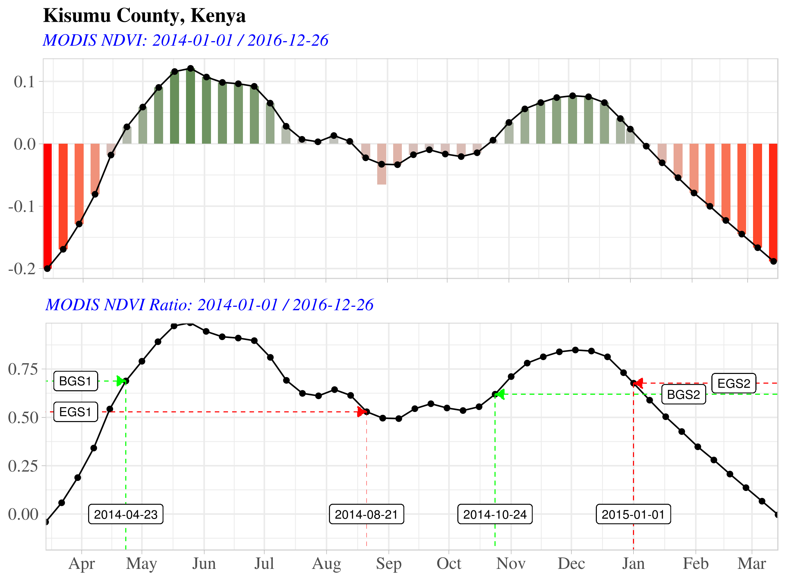
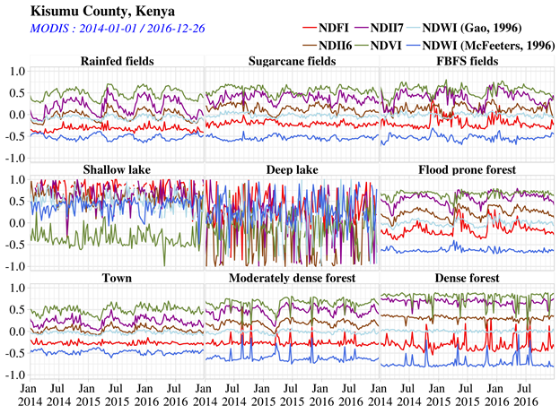
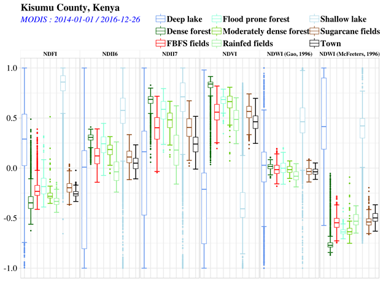
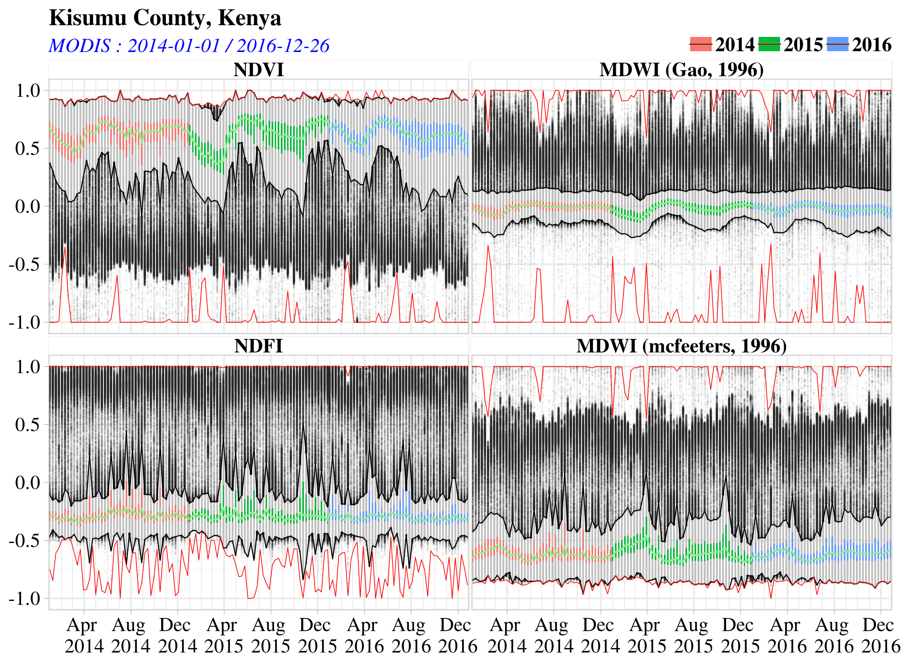
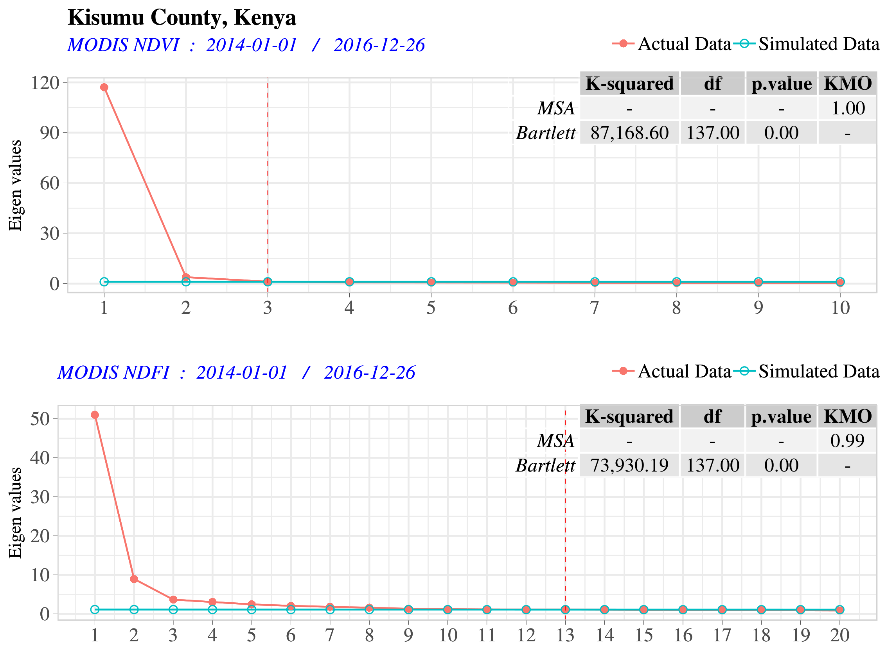
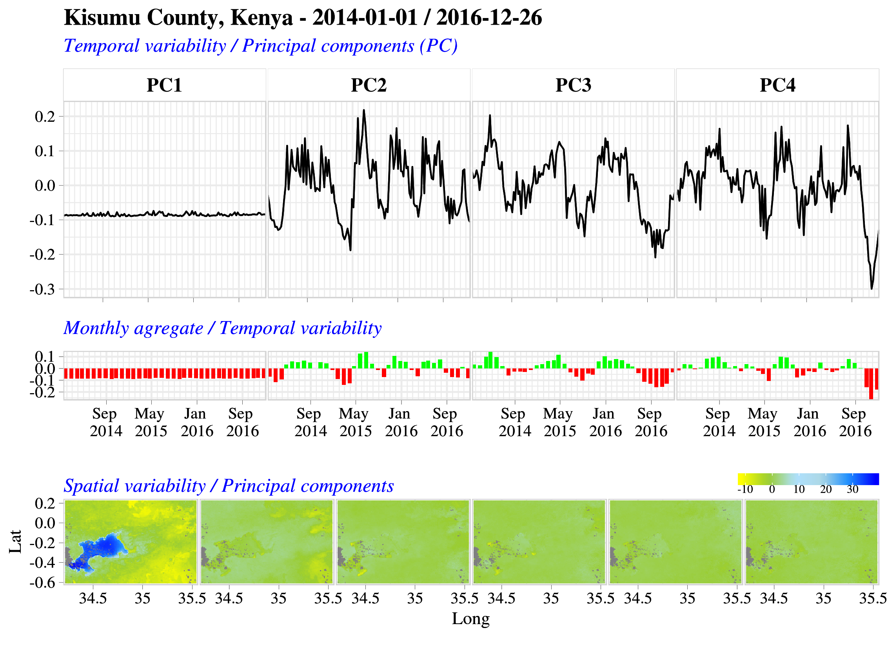
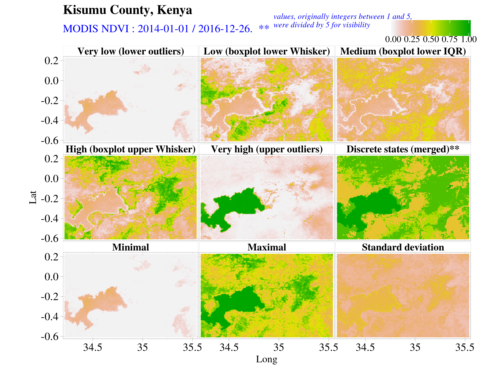
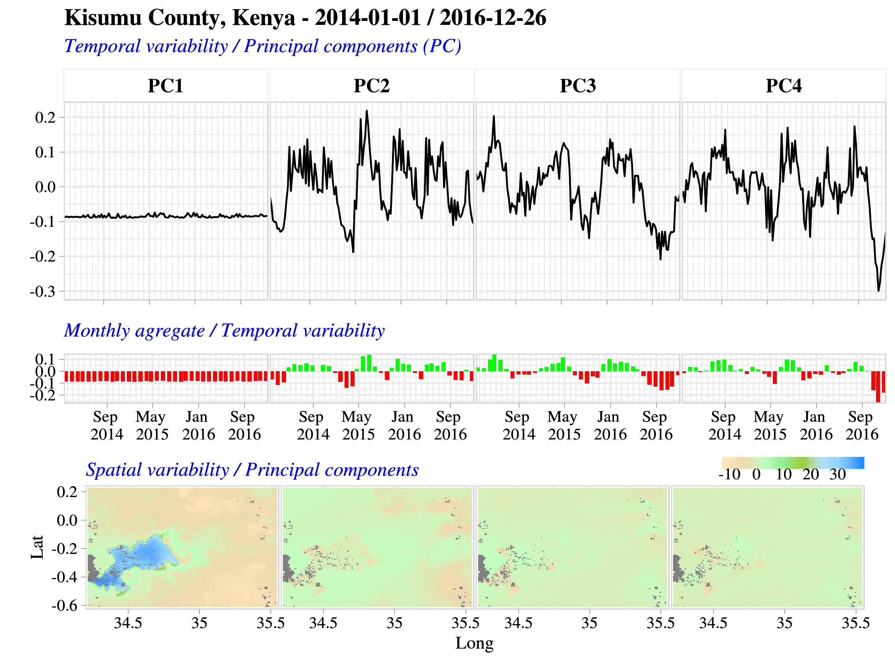
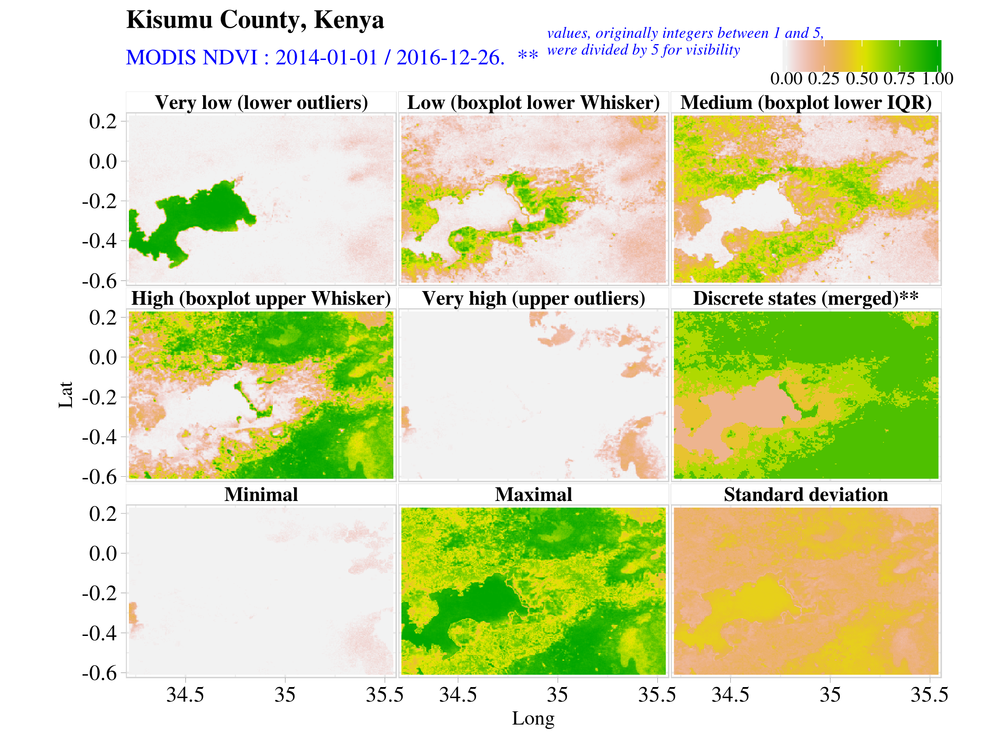

```{r setup, include=FALSE}
knitr::opts_chunk$set(echo = TRUE, tidy = 'formatR', cache = TRUE, dpi = 300)
```


# Introduction {#intro}

# Material and methods {#I}

## Making sense of data in the context {#I4}

### Phenological overview of the landscape texture {#I41}

We sampled approximatively 40% of pixels considering a regular grid sampling using the [`spSample`](https://www.rdocumentation.org/packages/sp/versions/1.3-1/topics/spsample) function from the `sp` package [@Bivand_et_al_2013; @Pebesma_Bivand_2005]. These time series of NDSIs were examined using boxplots. The NDSIs considered include the Normalized Difference Vegetation index [[NDVI](https://www.sciencedirect.com/science/article/pii/0034425779900130?via%3Dihub); @Rouse_et_al_1973; @Tucker_1979], the Normalized Difference Flood index [[NDFI](http://journals.plos.org/plosone/article/file?id=10.1371/journal.pone.0088741&type=printable); @Boschetti_et_al_2014], the Goa’s Normalized Difference Water index [NDWI; @Gao_1996; @Ji_et_al_2009], and the mcfeeters’ NDWI  [@Ji_et_al_2009; @McFeeters_1996]. These NDSIs were chosen due to their suitability in describing water and vegetation [@Boschetti_et_al_2014; @Gao_1996; @Ji_et_al_2009; @McFeeters_1996; @Tucker_1979]. 

### Spatio-temporal patterns {#I42}

The boxplots were supported with further principal components analysis (PCA) [@Mardia_et_al_1979; @Pearson_1901]  using a customized version of the [`rasterPCA`](https://www.rdocumentation.org/packages/RStoolbox/versions/0.2.4/topics/rasterPCA) function from the `RStoolbox` package [@Leutner_et_al_2019] making used of the [`prcomp`](https://www.rdocumentation.org/packages/kazaam/versions/0.1-0/topics/prcomp) function from the `base` package [@RCoreTeam_2018] and other low-level functions from the `raster` package [@Hijmans_2019]. The PCA, used to interpret the large dataset by creating a smaller number of components, was followed by other probabilistic estimations (see section \@ref(I5)) defining the spatial representations of the spatial data node states to be used in the BNs. These supporting analyses focus only on the [NDVI](https://www.sciencedirect.com/science/article/pii/0034425779900130?via%3Dihub) and [NDFI](http://journals.plos.org/plosone/article/file?id=10.1371/journal.pone.0088741&type=printable) but a comparative analysis connecting all the NDSIs across the main land uses is provided. The outputs were presented on the map (see Supplementary materials) to give insights on how the states of vegetation and water are spatially distributed. PCA allowed us to meaningfully interpret the large dataset by creating a smaller number of components.

## Derivation of spatial data nodes {#I5}

### General Procedure {#I51}

The general procedure, described in more details in the main paper material, uses the different boxplot ranges (instead of thresholds) to approach the problem using imprecise quantifiers where fuzzy logic can be used in forms of Likert-type scales 55 describing the scores of the spectral responses along a range; supporting the use of BNs. These ranges were used to group the data and estimate the probability of each pixel falling within each of these ranges (Figure \@ref(fig:fig5)). The procedure was applied to both time series and single layer data.

### Specific procedure {#I52}

#### Soil water content {#I521}

The node soil water content, as it says, estimates the probability of water in soil and is therefore related to soil water holding capacity. This was computed as a composite index by aggregating the [NDII6](https://www.sciencedirect.com/science/article/pii/0034425789900461?via%3Dihub) [@Hunt_and_Rock_1989],  the [NDII7](https://www.sciencedirect.com/science/article/pii/0034425789900461?via%3Dihub) [@Hunt_and_Rock_1989], the  [NDVI](https://www.sciencedirect.com/science/article/pii/0034425779900130?via%3Dihub) [@Tucker_1979], and the [NDFI](http://journals.plos.org/plosone/article/file?id=10.1371/journal.pone.0088741&type=printable) [@Boschetti_et_al_2014]. While the [NDII6](https://www.sciencedirect.com/science/article/pii/0034425789900461?via%3Dihub) and the [NDII7](https://www.sciencedirect.com/science/article/pii/0034425789900461?via%3Dihub) perform well in detecting a mixture in different compartments (e.g. plant water, soil water,  open water etc.) due to the presence of NIR and SWIR bands, the [NDFI](http://journals.plos.org/plosone/article/file?id=10.1371/journal.pone.0088741&type=printable) gives an estimate of flood conditions whereas the [NDVI](https://www.sciencedirect.com/science/article/pii/0034425779900130?via%3Dihub) assesses the presence and condition of vegetation. Combining these in one composite index may provide a powerful tool for ecological studies since one index can be extracted from another to provide a new metric [@Boschetti_et_al_2014]. For example, knowing that the [NDII6](https://www.sciencedirect.com/science/article/pii/0034425789900461?via%3Dihub) broadly assess soil and vegetation water content, one could extract the [NDVI](https://www.sciencedirect.com/science/article/pii/0034425779900130?via%3Dihub)  to estimate the soil water content. Likewise, the [NDFI](http://journals.plos.org/plosone/article/file?id=10.1371/journal.pone.0088741&type=printable) can be extracted to provide an estimate of vegetation water content. We used such assumption to estimate the soil water content using the Equation \@ref(eq:eq2). Such tricks where the original meaning of an index is altered by subtracting another index is commonly used in remote sensing and is by far the back bone of the spectral index theory.

\begin{equation} 
SWC_i = \frac{1}{2}\times ( \sum_{i=1}^{n} NDII6_i + \sum_{i=1}^{n}NDII7_i + 2\times \sum_{i=1}^{n}NDFI_i - 2\times \sum_{i=1}^{n}NDVI_i )
(\#eq:eq2)
\end{equation}

Where $SWC_i$ is the soil water content, and $n$ the total length of the time series.

For each of these 4 indices, we first computed the total over the time series. This is meant to estimate the total value scored in whatever the index measures. For example, we assumed that the sum of the [NDFI](http://journals.plos.org/plosone/article/file?id=10.1371/journal.pone.0088741&type=printable) values over the period of the 3 years considered in this study at a given pixel gives an estimate of the total water received by that pixel. After computing these total values scored, we then proceeded by summing-up the total value scored by the [NDII6](https://www.sciencedirect.com/science/article/pii/0034425789900461?via%3Dihub) and the [NDII7](https://www.sciencedirect.com/science/article/pii/0034425789900461?via%3Dihub) from which we extracted twice the total value scored by the [NDFI](http://journals.plos.org/plosone/article/file?id=10.1371/journal.pone.0088741&type=printable). From the resulting value, we then extracted twice the total value scored by the [NDVI](https://www.sciencedirect.com/science/article/pii/0034425779900130?via%3Dihub) (Equation \@ref(eq:eq2)). The idea is to reduce the influence of vegetation water from a total of water contained in soil and vegetation. So doing, the remaining water would mainly be due to the above and below-ground soil water. These estimates were improved by adding to each the scored value of the [NDFI](http://journals.plos.org/plosone/article/file?id=10.1371/journal.pone.0088741&type=printable) which is another way to estimate soil wetness. We used both the [NDII6](https://www.sciencedirect.com/science/article/pii/0034425789900461?via%3Dihub), the [NDII7](https://www.sciencedirect.com/science/article/pii/0034425789900461?via%3Dihub) and the [NDFI](http://journals.plos.org/plosone/article/file?id=10.1371/journal.pone.0088741&type=printable) because to take the advantage of the potential of the SWIR spectral domain as much as possible. This, however, is equivalent to doubling the real overall potential of the water content. To account for this effect, half  this value was considered after reducing the amount of water stored in vegetation which was done by subtracting twice the [NDVI](https://www.sciencedirect.com/science/article/pii/0034425779900130?via%3Dihub) to account for the influence of this vegetation water in both the [NDII6](https://www.sciencedirect.com/science/article/pii/0034425789900461?via%3Dihub) and the [NDII7](https://www.sciencedirect.com/science/article/pii/0034425789900461?via%3Dihub) (Equation \@ref(eq:eq2)).

#### Exposure to wetness {#I522}

This node estimates the expected total water for each cell. It was computed simply as the sum of the [NDFI](http://journals.plos.org/plosone/article/file?id=10.1371/journal.pone.0088741&type=printable) over the time series for each pixel. In this regard, it expresses the degree to which each pixel is relatively expose to surface water wetness. It is slightly different from the soil water content in the sense that it does not account for vegetation. Literally, this is mostly the surface soil water availability / potential regardless of whether it is used or not by vegetation. We postulate that a certain amount of water may be detected at a given pixel at some point in time without being sustained since it can runoff throughout porous soils shortly or stagnate nearly permanently under saturated or impermeable soils. Contrastingly, under soils with good water holding capacity, a relatively small amount of water can be sustained for a relatively longer period. This implies that the node exposure to wetness is more concerned about the hydrology than the actual agronomy although water exposure can be a good indicator of vegetation. It is, nonetheless, important to keep in mind that vegetation is almost always incompatible with permanently water-logged areas. 

#### Sensitivity to flood {#I523}

The node sensitivity to flood is computed as the absolute standard error of the [NDFI](http://journals.plos.org/plosone/article/file?id=10.1371/journal.pone.0088741&type=printable)  to estimate somewhat how fast the flood index is changing throughout the time series. This node describes the relationship between water and soil. Supposing that all soil surface water originates from rainfall, and considering that this rainfall is relatively locally constant, then the local spatial variability in wetness can be explained by the relationship between soil (including land cover and topography) and water. For example, from remote sensing point of view, dry but flood-prone soils are likely to be more sensitive to torrential rainfall event compared to permanently saturated and water-logged soils.

#### Vegetation sensitivity to water variation {#I524}

This node was also estimated as a composite index taking into account both the [NDFI](http://journals.plos.org/plosone/article/file?id=10.1371/journal.pone.0088741&type=printable)  and the [NDVI](https://www.sciencedirect.com/science/article/pii/0034425779900130?via%3Dihub).  Flood followed by a rapid increase in vegetation has been used as indicator for mapping FBFS-like areas such as flooded rice [@Boschetti_et_al_2014]. The node describes the relationship between water and vegetation using the ratio between these 2 metrics. For a given pixel, the idea conveyed by this node is simply the proportion of vegetation scored relative to amount of water received. Thus, it also implicitly gives an idea of the soil conditions because a pair of low value [NDVI](https://www.sciencedirect.com/science/article/pii/0034425779900130?via%3Dihub) (absence of vegetation) and high value [NDFI](http://journals.plos.org/plosone/article/file?id=10.1371/journal.pone.0088741&type=printable) (water presence) may imply the presence of encrusted or swampy soils where vegetation may be sensitive to water variation.

#### Power of tools {#I525}

The power of tools was estimated from the generic product quality assessment MODLAND-wide QA bands for each pixel and date in the time series. The MODLAND-wide QA provides a general and consistent assessment of the quality (usability and usefulness) of the MODIS products to inform the user on the quality, hence, the extent to which the results of any analysis is to be appreciated[@Roy_et_al_2002]. Many artefacts (e.g. aerosol loading, cloud, data processing algorithms, sensors failure, view angle, etc.) can introduce errors or uncertainties in remote sensing data, and it is therefore advised to consider such aspects prior to their use for subsequent analysis. While the power of tools can be estimated using band specific quality assessment, we choose to use the MODLAND-wide QA which includes most of the artefacts in the assessment.

```{r tab0,echo=FALSE}
library(kableExtra)
tabl <- do.call(rbind, list(
  
c("00", "0", "Pixel produced, good quality, not necessary to examine more detailed QA"),
c("01",	"1",	"Pixel produced, unreliable or unquantifiable quality, recommend examination of more detailed QA"),
c("10",	"2",	'Pixel not produced due to cloud effects'),
c("11", "3",	"Pixel not produced primarily due to reasons other than cloud"))

)

colnames(tabl) <- c("2-bit encoded per pixel QA code", 	"Decimal value", "Quality attribute meanings")

```

(ref:table1) Translation of 2-bit pixel level-QA in MODLAND [@Roy_et_al_2002].

```{r tab1,echo=FALSE}
knitr::kable(tabl,caption="(ref:table1)", format="latex", booktabs=TRUE)%>%
  kable_styling(latex_options="scale_down")%>% 
  row_spec(0,bold=TRUE,font_size = 14)
```

In the MODLAND-wide QA framework, four quality states are possible (Table \@ref(tab:tab1)) and the power of tools was estimated as the probability of being wrong accordingly. For each pixel throughout the time series, we remained sceptical to values greater than zero in Table \@ref(tab:tab1) and the probability of being wrong was computed by dividing the count of these values by the total length of the time series. The resulting raster layer was then discretised to provide the node to be used in the BNs following the single layer procedure described in main paper material. It is worth noting that most of the poor qualities are concentrated around water bodies, hence the node power of tools was used for dual purpose in the causal model despite the little spatial variability.

#### Slope and Flow accumulation {#I526}

Many approaches and algorithms for deriving hydrologic information from topography have been proposed in diverse conceptual forms with each having its strengths and limitations [see @Arge_et_al_2003; @Jenson_and_Domingue_1988; @Tarboton_1997]; mostly relying on what is known as the 3 steps conditioning procedures [@Arge_et_al_2003; @Jenson_and_Domingue_1988]. DEM conditionings are commonly used as prerequisites for computing various topographic structures such as upslope areas, specific catchment areas, girded networks or flow paths and are extensively discussed in the literature [see @Arge_et_al_2003; @Jenson_and_Domingue_1988; @OCallaghan_Mark_1984; @Tarboton_1997]. These are the filling of depressions in the original DEM, the derivation of flow directions and the computation of flow accumulation. In this paper, these were derived using [`TauDEM software version 5.3`](http://hydrology.usu.edu/taudem/taudem5/) [@Tarboton_1997, @Tarboton_2003; @Tarboton_et_al_1991; @Tesfa_et_al_2011; @Yang_et_al_2006] from within [`R`](https://cran.r-project.org/). Routines were sent via system calls from [`R`](https://cran.r-project.org/) to [`TauDEM`](http://hydrology.usu.edu/taudem/taudem5/) and throughputs are routed from [`TauDEM`](http://hydrology.usu.edu/taudem/taudem5/) to R to be further processed to discrete raster data following the single layer procedure described in the main paper material. [`TauDEM`](http://hydrology.usu.edu/taudem/taudem5/) routines along with the conceptual and algorithmic details on the DEM conditioning are beyond the scope of this paper. The reader is referred to  [`TauDEM website`](http://hydrology.usu.edu/taudem/taudem5/documentation.html) and related literature [e.g. @Arge_et_al_2003; @Jenson_and_Domingue_1988; @Tarboton_1997, @Tarboton_2003; @Tarboton_et_al_1991; @Tesfa_et_al_2011; @Wallis_et_al_2009].

The original void-filled SRTM DEM (section Sensor Characteristics in the main paper material) was used in the 3 steps normative conditioning procedure [@Jenson_and_Domingue_1988] to compute the slope and flow accumulation layers to account for the corresponding spatial data nodes in the BNs (see main paper material).  Our approach fully accommodates for simple and looping depressions and flat areas as suggested by Jenson &  Domingue [-@Jenson_and_Domingue_1988] and Tarboton [-@Tarboton_et_al_1991]. We computed the slope as the drop distance (tangent of the slope angle; see [`TauDEM website`](http://hydrology.usu.edu/taudem/taudem5/documentation.html)) from which we derived the D-infinity flow direction as the direction outwards water flows from that pixel based on the Single-flow-direction concept [@Arge_et_al_2003; @Tarboton_1997]. Based on the derived flow directions, the flow accumulation at each pixel was then calculated as the number of pixels draining into it.

#### Water presence {#I527}

The water presence node estimates the likelihood of encountering water on the ground given the 3 years times series considered in this study. Flood is perhaps the most important characteristic of FBFS, and therefore water signature may be captured by the sensor in these areas. We therefore used the [NDFI](http://journals.plos.org/plosone/article/file?id=10.1371/journal.pone.0088741&type=printable) to assess such cases across all pixels in the study area. This was done using the procedure described in the main paper material.

#### Temporal variation in vegetation {#I528}

The temporal variation in vegetation was estimated as pixel level vegetation anomalies using [NDVI](https://www.sciencedirect.com/science/article/pii/0034425779900130?via%3Dihub) based on an approach of vegetation phenology (Figure \@ref(fig:fig2)). Our approach consisted in estimating the length of the growing season from which was then extracted an average interpolated surface derived from it. This is based on the assumption that the vegetation period is relatively extended under FBFS-like settings where plants take advantages of residual moisture from previous flooding [@VanSteenbergen_et_al_2010]. In this case, these FBFS may be found in areas having unusually higher growing period relative to a general spatial trend.
 

```{r fig2, echo=FALSE, out.width = '100%', fig.cap="Vegetation seasonality in Kisumu County (Kenya)."}

```

EGS = End of growing season; BGS = Beginning of growing season; the indices (1 and 2) indicate the first and second seasons respectively.

The [NDVI](https://www.sciencedirect.com/science/article/pii/0034425779900130?via%3Dihub) has been used in many ways to study vegetation phenology [@DeLeeuw_et_al_2012; @Yu_et_al_2010; @Yu_et_al_2012].  We used the [NDVI](https://www.sciencedirect.com/science/article/pii/0034425779900130?via%3Dihub)  time series to first estimate the ratio (Figure \@ref(fig:fig2)) at which the vegetation density is changing throughout the year [@White_et_al_1997; @Yu_et_al_2010; @Yu_et_al_2012]. The [NDVI](https://www.sciencedirect.com/science/article/pii/0034425779900130?via%3Dihub) ratio was calculated using the Equation \@ref(eq:eq3) [@White_et_al_1997; @Yu_et_al_2010].

\begin{equation} 
NDVI_{ratio} =   \frac{NDVI-NDVI_{min}}{NDVI_{max} - NDVI_{min}}
(\#eq:eq3)
\end{equation}

Where $NDVI_{ratio}$ is the [NDVI](https://www.sciencedirect.com/science/article/pii/0034425779900130?via%3Dihub) ratio of the pixel throughout the time series ranging from 0 to 1, $NDVI$ is the [NDVI](https://www.sciencedirect.com/science/article/pii/0034425779900130?via%3Dihub) of that pixel at a given time step in the times series, $NDVI_{max}$ and $NDVI_{min}$ are respectively the maximal and the minimal [NDVI](https://www.sciencedirect.com/science/article/pii/0034425779900130?via%3Dihub) values scored by the pixel over the time series. 

The [NDVI](https://www.sciencedirect.com/science/article/pii/0034425779900130?via%3Dihub) ratio (Equation \@ref(eq:eq3)) is consistent since its value is normalised relative to itself. This ratio was derived considering the 3 years period considered in the study whereby the minimum and the maximal values were derived according to the phenological phases (Figure \@ref(fig:fig2)). An [NDVI](https://www.sciencedirect.com/science/article/pii/0034425779900130?via%3Dihub) ratio at a given development stage informs on the proportion of vegetation relative to the total attainable biomass regardless of the land cover type [@White_et_al_1997]. While this method can help to avoid the use of locally adopted thresholds [@White_et_al_1997] since a generic threshold above which the onset and cession of the rainy season can be consistently estimated, deciding which ratio value to consider as that common threshold is another question. To address this concern, we extracted the seasonal component of the time series from which individual seasons were separated. Based on the assumption that the [NDVI](https://www.sciencedirect.com/science/article/pii/0034425779900130?via%3Dihub) changes rapidly in the near onset and secession of the rainy season, we then scanned each season forwards and backwards questing for possible jumps (i.e. $\pm 3$ standard deviation) in the values of the [NDVI](https://www.sciencedirect.com/science/article/pii/0034425779900130?via%3Dihub) ratio. When scanning forwards, then a jump corresponds to the onset whereas the cessation is estimated scanning backwards. After locating the dates corresponding to these onset and cessation for each cell, their difference was calculated to estimate the length of the growing season for each season. These raster layers were aggregated to 5 km2 interpolation surface using the [`aggregate`](https://www.rdocumentation.org/packages/raster/versions/2.8-19/topics/aggregate) function from the `raster` package [@Hijmans_2019] to fit a thin plate spline regression model using the [`Tps`](https://www.rdocumentation.org/packages/fields/versions/9.6/topics/Tps) function from the `fields` package [@Nychka_et_al_2018]. The model was then used to interpolate each season using the [`interpolate`](https://www.rdocumentation.org/packages/raster/versions/2.8-19/topics/interpolate) from the `raster` package relative to the average interpolation surface [@Hijmans_2019; @Nychka_et_al_2018]. The anomalies were estimated as the difference between the length of the growing season and its interpolation. Finally, these anomalies were sum-up to provide a single estimate which was then discretised to provides nodes states for the Bayesian network as described in single layer procedure described in the main paper.

#### Flood at the beginning of the rainy season {#I529}

The beginning of the rainy season node was defined widely from the starting of the season to nearly the vegetation peak to account for early and late flooding. The node flood at the beginning of the rainy season, then, estimates the probability of getting flood during that critical period. Based on this assumption, we extracted, from the [NDFI](http://journals.plos.org/plosone/article/file?id=10.1371/journal.pone.0088741&type=printable) times series, all layers corresponding to the first 2 months from which the node states were derived using the multilayers procedure described in the main paper material.

# Results and discussion {#II}

## Comparative profiles of the NDSIs across different surface features {#II1}
### Comparative behavior of the NDSIs across biomes {#II11}

The temporal profile of different NDSIs across the main ecological systems is provided in Figure \@ref(fig:fig3).  The NDSIs seem to behave similarly across the 3 main agricultural systems (i.e. Rainfed fields, Sugarcane fields, FBFS fields) with more pronounced flood peaks under FBFS fields. These peaks are also observed under flood-prone forests where floods seem to be seasonal. Rainfed fields seems to have more communalities (i.e. NDSIs’ scores and temporal profile) with sugarcanes fields as do FBFS fields and flood prone forest although it is hard to distinguish between these 4 biomes. 


```{r fig3, echo=FALSE, out.width = '100%', fig.cap="Comparative analysis and behavior of the NDSIs across different surfaces in Kisumu County (Kenya)."}

```
While one may expect [NDFI](http://journals.plos.org/plosone/article/file?id=10.1371/journal.pone.0088741&type=printable) values above 0.5 at least under FBFS fields, the 3 water-related NDSIs (including the Gao NDWI, Mcfeeters NDWI), [NDFI](http://journals.plos.org/plosone/article/file?id=10.1371/journal.pone.0088741&type=printable) scored negative values across the 3 different agricultural systems making thresholds specification difficult. The profile of vegetation ([NDVI](https://www.sciencedirect.com/science/article/pii/0034425779900130?via%3Dihub), [NDII6](https://www.sciencedirect.com/science/article/pii/0034425789900461?via%3Dihub), [NDII7](https://www.sciencedirect.com/science/article/pii/0034425789900461?via%3Dihub)) under rainfed and FBFS fields seems to present a more pronounced seasonality contrary to sugarcane fields owing to their longer growing season resulting in moisture stability (Gao NDWI). This vegetation seasonality along with the extended length of the growing season becomes clearer under flood prone forest. Interestingly, flood prone forest seems to be different from FBFS fields with regards to vegetation density and open water stability. While both FBFS fields and flood prone forest scored positive [NDVI](https://www.sciencedirect.com/science/article/pii/0034425779900130?via%3Dihub) values reaching up to 0.75, the [NDVI](https://www.sciencedirect.com/science/article/pii/0034425779900130?via%3Dihub) values under flood prone forest rarely drop below 0.5 contrary to FBFS where these values can drop to 0.25. Under lakes systems (shallow and deep lakes), the signatures of the different NDSIs is rather confusing except in the case of [NDVI](https://www.sciencedirect.com/science/article/pii/0034425779900130?via%3Dihub) which seems to be unique under shallow lake. While vegetation is high in the littoral zone, there seems to be a permanent mixture of vegetation and water in the deep water suggesting possible Eutrophication of Lake Victoria. Forest biomes are possibly distinguishable looking at the relative scores of the different NDSIs and their temporal profiles. Flood-prone and moderately dense forests are more seasonal in vegetation than dense forests exhibiting constant moisture over time. In general, sudden drop in vegetation seems to be associated with sudden increase in water signature under both dense and moderately dense forests while no such association is observed under flood-prone forest and towns suggesting the presence of open waters that are often masked by tree canopies. While vegetation ([NDVI](https://www.sciencedirect.com/science/article/pii/0034425779900130?via%3Dihub), [NDII6](https://www.sciencedirect.com/science/article/pii/0034425789900461?via%3Dihub), [NDII7](https://www.sciencedirect.com/science/article/pii/0034425789900461?via%3Dihub)) decrease from dense forest to town through moderately dense forest as expected, the opposite trend is observed with open water. Nonetheless, the soil moisture (Gao NDWI) across the 3 biomes seems to be constant. Overall, most of the NDSIs behave similarly and open water stability or the length of the growing season can be misleading in delineating FBFS fields in the area. Soil moisture (Gao NDWI) seems to be constant over time with little difference across biomes suggesting the presence of good soils for FBFS in the areas.

### Comparative distribution of the NDSIs values across different surfaces {#II12}

Looking at the distribution of the different NDSIs across the different biomes (Figure \@ref(fig:fig4)), it is clearly difficult to derive sharp threshold values for delineating most of the biomes, particularly the FBFS fields. The response of open water with regards to the different NDSIs seems to be rather odd, possibly due to the quality of the data since poor-quality data were associated with water bodies. Based the [NDFI](http://journals.plos.org/plosone/article/file?id=10.1371/journal.pone.0088741&type=printable), the [NDVI](https://www.sciencedirect.com/science/article/pii/0034425779900130?via%3Dihub) and the Mcfeeters’ MDWI, FBFS fields can only be differentiated from shallow lake but the amount of noise is yet to be substantial considering the ranges overlapping of outliers. Considering the [NDII6](https://www.sciencedirect.com/science/article/pii/0034425789900461?via%3Dihub), the [NDII7](https://www.sciencedirect.com/science/article/pii/0034425789900461?via%3Dihub) and the Gao’s NDWI, little can be done to distinguish FBFS fields from the other biomes due to the general lack statistical difference.


```{r fig4, echo=FALSE, out.width = '100%', fig.cap="Comparative distribution of the NDSIs values across different surfaces in Kisumu County (Kenya)."}

```
The best statistical difference based on the [NDFI](http://journals.plos.org/plosone/article/file?id=10.1371/journal.pone.0088741&type=printable) seems to be between the signature of the shallow lake and the rainfed fields. However, the majority of these rainfed fields seems to experience flooding owing to their overlaps with both FBFS fields and deep lack. This is also observed with the Mcfeeters’ MDWI. In a nutshell, there is redundancy in the scores of the NDSIs across the main biomes encountered in the study areas, hence they might be misleading for specifying thresholds. Consequently, there is a general lack of statistical evidence for deriving threshold values for delineating FBFS fields from the other type of ecological systems.

## Phenological overview of the landscape texture {#II2}

The average trend (represented by the interquartile range or the green medians line) depicted the phenological nature of the vegetation in the study areas with 2 annual phenological phases. The first phase seems to start from the beginning of April and ends during the period end of August – beginning of October whereas the second starts during the period beginning of September to the middle of October and ends in the middle of March. This main trend seems to isolate the croplands in relation with rainfall seasonality in the area (Figure \@ref(fig:fig5)).

The Outliers seems also to describe further phenological differences in vegetation across different type of biomes in the areas. Further examination of these outliers (not shown here) as separate datasets resulted in further temporal patterns in the [NDVI](https://www.sciencedirect.com/science/article/pii/0034425779900130?via%3Dihub) values which can also be seen in Figure \@ref(fig:fig5) (black and red lines). The first pattern (upmost outlier in black) seems to describe relatively high vegetation spots with [NDVI](https://www.sciencedirect.com/science/article/pii/0034425779900130?via%3Dihub) values ranging from 0.5 to 1 during the period February – May. These could be due to data irregularities (sensor oversaturation during data recording, poorly corrected data, etc.) or more intuitively a sudden increase in vegetation due to the short rains in areas with relatively dense vegetation such as forests. In areas with permanent vegetation, changes in the greenness at the onset of the rainy season can be more rapid compared to agricultural fields where a certain time is required for crops to emerge and regreen the landscape. This is plausible considering that these outliers disappear when considered within the context of the upmost trend (upper whisker and upmost black line). The second pattern (lower outliers, and black line), accounting for vegetation indices in-between negative 0.25 and 0.5 seems to be positively correlated with the main pattern contrary to the third pattern (lower outliers and red line) describing vegetation indices below negative 0.25. while it is hard to tell the land use type described by the second pattern of these outliers, the third one is likely to describe water and water bodies. Overall, the study area is heterogenous and composed of several distinctive biomes with specific phenology and vegetation density, with some of these correlated over time.
 
```{r fig5, echo=FALSE, out.width = '100%', fig.cap="Boxplot of the temporal variability in water and vegetation in Kisumu county, Kenya."}

```
## Spatio-temporal variability in water and vegetation {#II3}
The analysis of the NDSIs across the main existing land use / land cover provide little guidance to specify the boundaries of FBFS fields. Despite the differences in water and vegetation density (Figure \@ref(fig:fig5)), it was interesting to look at the main type of landscape existing in the areas and the extent to which their ecology can be appreciated in the context of seasonality. The PCA suggests that the first 3 components best describe the essential of the variability in vegetation supporting the possibility of data redundancy stated earlier (section \@ref(II12)) whereas up to 13 were required for flood supporting the unpredictable nature of floods (Figure \@ref(fig:fig6)).

 
```{r fig6, echo=FALSE, out.width = '100%', fig.cap="Scree plot of the first meaningful principal components along with the KMO and Bartlett's Test of sphericity"}

```

The spatio-temporal patterns of water and vegetation based on the 8 days MODIS composite in the study area presented in Figure \@ref(fig:fig7) and Figure \@ref(fig:fig9) respectively. The temporal variability describes the cross-pixels dominant variation over time attributed to the PCs depicted by the PCA. These are also presented as monthly aggregates to provide lumped view of the area. The Spatial patterns resulting from the scores of these PCs is also provided as maps. Based on these results, 


 
```{r fig7, echo=FALSE, out.width = '100%', fig.cap="Dominants spatial and temporal characteristics of flood in Kisumu county, Kenya."}

```

```{r fig8, echo=FALSE, out.width = '100%', fig.cap="Probability of water by ranges in Kisumu county, Kenya."}

```

```{r fig9, echo=FALSE, out.width = '100%', fig.cap="Dominants spatial and temporal characteristics of vegetation in Kisumu county, Kenya."}

```

```{r fig10, echo=FALSE, out.width = '100%', fig.cap="Probability of vegetation by ranges in Kisumu county, Kenya."}

```

\clearpage

# References
